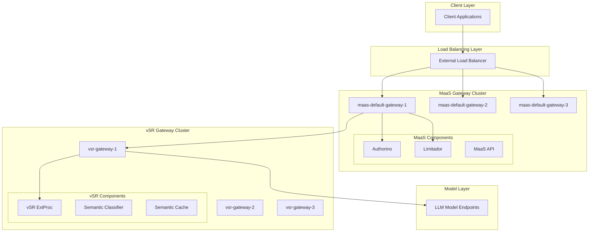
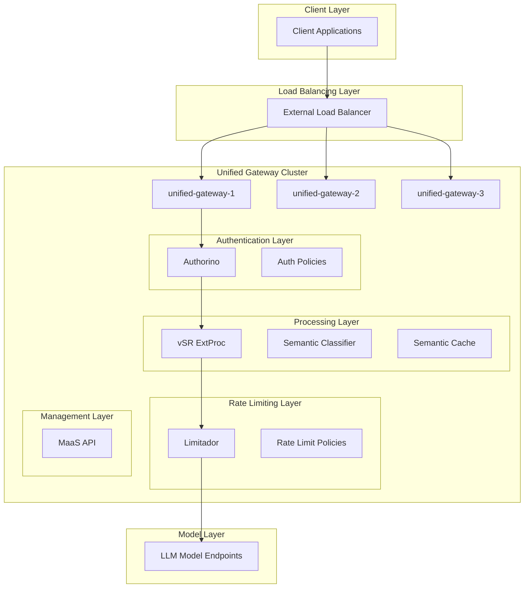
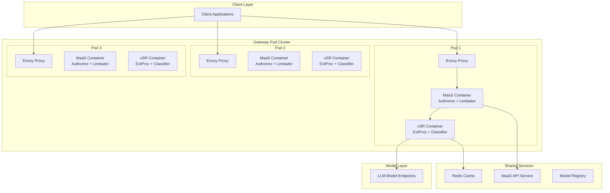
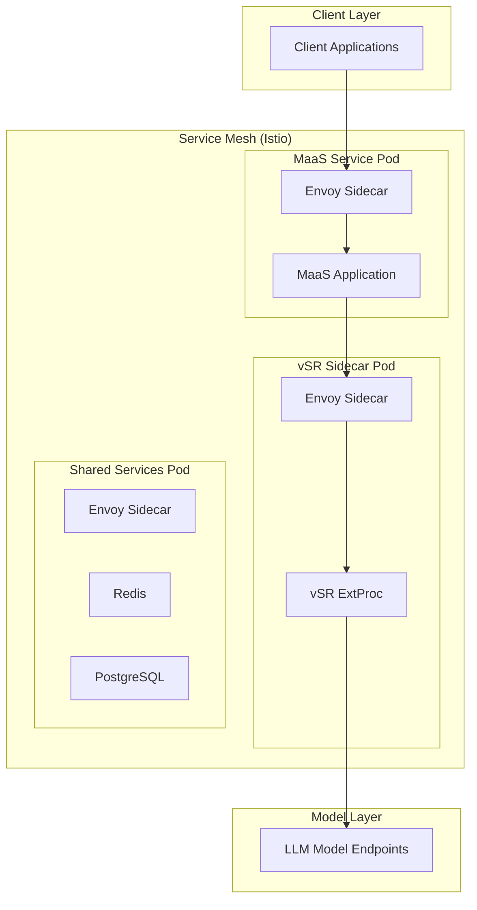

# Gateway Consolidation Options

**Document**: Deployment Architecture Patterns  
**Date**: December 2025  
**Related**: [Main Design Proposal](design-proposal-vsr-maas-integration.md)

## Overview

This document analyzes the different architectural patterns for deploying the integrated vSR-MaaS system, examining the trade-offs between maintaining separate gateways versus consolidating them into a unified deployment.

## Architecture Options

### Option 1: Dual Gateway Architecture (Current Approach)

Maintains separate deployment units for MaaS and vSR, each with their own gateway infrastructure.



#### Benefits
- **🔄 Independent Scaling**: Each gateway cluster can scale independently based on load patterns
- **🔧 Service Isolation**: Failures in one gateway don't affect the other
- **⚙️ Technology Independence**: Can use different gateway technologies optimized for each use case
- **🚀 Deployment Flexibility**: Can upgrade MaaS and vSR components independently
- **📊 Clear Metrics Separation**: Easier to monitor and troubleshoot each component separately

#### Drawbacks
- **🔗 Network Complexity**: Additional network hops between gateways add latency
- **📈 Resource Overhead**: Two separate gateway clusters require more infrastructure
- **🔧 Operational Complexity**: Need to manage two separate gateway configurations
- **🌐 Service Discovery**: Complex inter-gateway service discovery and health checking
- **💰 Higher Infrastructure Costs**: Separate clusters require dedicated resources

#### Implementation Example

```yaml
# MaaS Gateway Deployment
apiVersion: gateway.networking.k8s.io/v1
kind: Gateway
metadata:
  name: maas-default-gateway
  namespace: maas-system
spec:
  gatewayClassName: istio
  listeners:
  - name: https
    hostname: maas.example.com
    port: 443
    protocol: HTTPS
    tls:
      mode: Terminate
      certificateRefs:
      - name: maas-tls-cert

---
# vSR Gateway Deployment  
apiVersion: gateway.networking.k8s.io/v1
kind: Gateway
metadata:
  name: vsr-semantic-gateway
  namespace: vsr-system
spec:
  gatewayClassName: istio
  listeners:
  - name: https
    hostname: semantic.example.com
    port: 443
    protocol: HTTPS
    tls:
      mode: Terminate
      certificateRefs:
      - name: vsr-tls-cert
```

### Option 2: Unified Gateway Architecture

Consolidates both MaaS and vSR capabilities into a single gateway infrastructure.



#### Benefits
- **⚡ Reduced Latency**: Single gateway eliminates inter-service network hops
- **💰 Cost Efficiency**: Shared infrastructure reduces resource requirements
- **🔧 Simplified Operations**: Single gateway configuration and management
- **📊 Unified Observability**: Centralized metrics, logging, and tracing
- **🔗 Simplified Networking**: No complex service-to-service communication
- **🚀 Atomic Deployments**: Deploy entire integrated system as a unit

#### Drawbacks
- **⚖️ Scaling Constraints**: All components must scale together
- **🎯 Single Point of Failure**: Gateway failure affects all functionality
- **🔧 Complex Configuration**: Single gateway must handle multiple concerns
- **🚀 Deployment Coupling**: Cannot deploy MaaS and vSR updates independently
- **📊 Mixed Resource Requirements**: Different components may have conflicting resource needs

#### Implementation Example

```yaml
# Unified Gateway with Multiple Concerns
apiVersion: gateway.networking.k8s.io/v1
kind: Gateway
metadata:
  name: unified-maas-vsr-gateway
  namespace: unified-system
spec:
  gatewayClassName: istio
  listeners:
  - name: inference-https
    hostname: api.example.com
    port: 443
    protocol: HTTPS
    tls:
      mode: Terminate
      certificateRefs:
      - name: unified-tls-cert

---
# Unified HTTPRoute handling both concerns
apiVersion: gateway.networking.k8s.io/v1
kind: HTTPRoute
metadata:
  name: unified-route
  namespace: unified-system
spec:
  parentRefs:
  - name: unified-maas-vsr-gateway
  rules:
  # Token management routes
  - matches:
    - path:
        type: PathPrefix
        value: /maas-api
    backendRefs:
    - name: maas-api-service
      port: 8080
      
  # Inference routes through full pipeline
  - matches:
    - path:
        type: PathPrefix
        value: /v1/chat/completions
    - path:
        type: PathPrefix  
        value: /v1/models
    filters:
    - type: ExtensionRef
      extensionRef:
        group: networking.istio.io
        kind: EnvoyFilter
        name: vsr-extproc-filter
    backendRefs:
    - name: model-service
      port: 8000
```

### Option 3: Hybrid Container Architecture

Deploys MaaS and vSR components as co-located containers within the same pod, sharing resources while maintaining logical separation.



#### Benefits
- **🔗 Local Communication**: Containers communicate via localhost, minimizing latency
- **📊 Resource Sharing**: Shared CPU, memory, and network resources within pods
- **🚀 Simplified Deployment**: Deploy as single Kubernetes deployment
- **⚖️ Balanced Scaling**: Components scale together but can have different resource allocations
- **🔧 Service Mesh Integration**: Works well with service mesh sidecar patterns

#### Drawbacks
- **🎯 Resource Contention**: Containers compete for pod resources
- **🔧 Complex Pod Configuration**: Multiple containers require careful resource management
- **🔄 Restart Coupling**: Container restart affects the entire pod
- **📊 Mixed Observability**: Need to distinguish metrics/logs from different containers

### Option 4: Sidecar Architecture with Service Mesh

Leverages service mesh capabilities with vSR as a sidecar to MaaS services.



#### Benefits
- **🔒 Security**: mTLS between all components automatically
- **📊 Rich Observability**: Automatic metrics, tracing, and logging
- **🌐 Traffic Management**: Advanced routing, load balancing, and fault injection
- **🔧 Policy Enforcement**: Uniform policy application across all services
- **⚖️ Independent Scaling**: Each service can scale independently

#### Drawbacks
- **📈 Complexity**: Service mesh adds operational overhead
- **📊 Resource Overhead**: Sidecar containers consume additional resources
- **🔧 Learning Curve**: Requires service mesh expertise
- **🔗 Network Overhead**: Additional proxy hops between services

## Recommendation Matrix

| **Criteria** | **Dual Gateway** | **Unified Gateway** | **Hybrid Container** | **Service Mesh** |
|--------------|------------------|---------------------|----------------------|------------------|
| **Latency** | ⭐⭐⭐ | ⭐⭐⭐⭐⭐ | ⭐⭐⭐⭐ | ⭐⭐⭐ |
| **Resource Efficiency** | ⭐⭐ | ⭐⭐⭐⭐ | ⭐⭐⭐⭐⭐ | ⭐⭐ |
| **Operational Simplicity** | ⭐⭐ | ⭐⭐⭐⭐ | ⭐⭐⭐ | ⭐⭐ |
| **Scalability** | ⭐⭐⭐⭐⭐ | ⭐⭐ | ⭐⭐⭐ | ⭐⭐⭐⭐⭐ |
| **Fault Isolation** | ⭐⭐⭐⭐⭐ | ⭐⭐ | ⭐⭐ | ⭐⭐⭐⭐ |
| **Development Velocity** | ⭐⭐⭐⭐ | ⭐⭐ | ⭐⭐⭐ | ⭐⭐⭐ |
| **Infrastructure Cost** | ⭐⭐ | ⭐⭐⭐⭐⭐ | ⭐⭐⭐⭐ | ⭐⭐ |

## Implementation Recommendations

### For Development/Testing Environments
**Recommended**: **Hybrid Container Architecture**
- Simplest to deploy and manage
- Resource efficient for smaller loads
- Fast iteration and development cycles
- Easy debugging with co-located components

### For Production Environments

#### Small to Medium Scale (< 1000 RPS)
**Recommended**: **Unified Gateway Architecture**
- Cost-effective resource utilization
- Simplified operations and monitoring
- Acceptable latency for most use cases
- Single deployment unit reduces complexity

#### Large Scale (> 1000 RPS)
**Recommended**: **Service Mesh Architecture** 
- Independent scaling of components
- Rich observability and security features
- Proven at enterprise scale
- Advanced traffic management capabilities

#### Multi-Tenant SaaS
**Recommended**: **Dual Gateway Architecture**
- Clear tenant isolation boundaries
- Independent scaling per service type
- Different SLAs for different components
- Easier compliance and auditing

## Migration Path

### Phase 1: Start with Unified Gateway
1. Deploy integrated system as single gateway
2. Validate functionality and performance
3. Establish monitoring and alerting
4. Optimize resource allocation

### Phase 2: Evaluate Scaling Needs  
1. Monitor resource contention
2. Identify scaling bottlenecks
3. Measure latency requirements
4. Assess operational complexity

### Phase 3: Scale Architecture
1. **If latency/resource issues**: Move to Hybrid Container
2. **If scaling issues**: Move to Service Mesh or Dual Gateway
3. **If operational issues**: Simplify back to Unified Gateway

This graduated approach allows teams to start simple and evolve the architecture based on real-world operational experience and requirements.