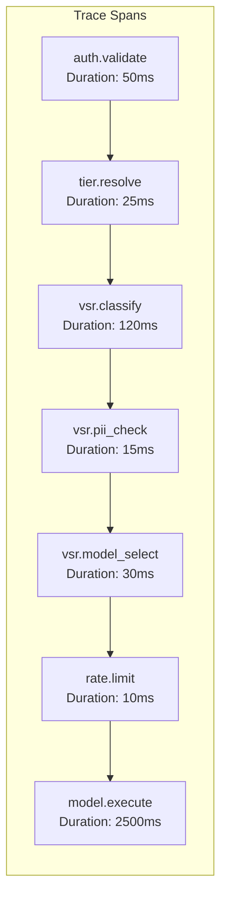

# Monitoring and Observability

**Document**: Observability Strategy for Integrated vSR-MaaS Platform  
**Date**: December 2025  
**Related**: [Main Design Proposal](design-proposal-vsr-maas-integration.md)

## Overview

This document outlines the comprehensive observability strategy for the integrated vSR-MaaS platform, detailing current monitoring capabilities in both systems and the enhanced observability framework for the unified architecture.

## Current State Analysis

### 1. MaaS Platform Monitoring (Today)

#### 1.1 Core Metrics
```yaml
# Current MaaS metrics
maas_api_requests_total:
  description: "Total API requests to MaaS endpoints"
  labels: [method, endpoint, status_code, tier]

maas_token_generation_duration:
  description: "Time to generate service account tokens"
  labels: [tier, namespace]

maas_tier_mapping_cache_hits:
  description: "Cache hit ratio for tier mapping lookups"
  labels: [tier]

limitador_rate_limit_violations:
  description: "Rate limit violations by tier and user"
  labels: [tier, user_id, limit_type]

authorino_auth_duration:
  description: "Authentication processing time"
  labels: [auth_method, result]
```

#### 1.2 Infrastructure Metrics
```yaml
# Gateway and RHCL metrics
gateway_request_duration:
  description: "Request processing time through gateway"
  labels: [gateway_name, route, status]

kuadrant_policy_evaluation_duration:
  description: "Time to evaluate Kuadrant policies"
  labels: [policy_type, result]

rhoai_model_inference_duration:
  description: "Model inference time"
  labels: [model_name, status]

rhoai_model_queue_depth:
  description: "Number of queued inference requests"
  labels: [model_name]
```

#### 1.3 Business Metrics
```yaml
# Usage and billing metrics
maas_token_usage_total:
  description: "Token consumption by tier and model"
  labels: [tier, model_name, user_id]

maas_cost_tracking:
  description: "Cost attribution per user and model"
  labels: [user_id, tier, model_name, time_window]

maas_tier_capacity_utilization:
  description: "Capacity utilization per tier"
  labels: [tier, resource_type]
```

### 2. vSR Platform Monitoring (Today)

#### 2.1 Routing Metrics
```yaml
# vSR semantic routing metrics
vsr_classification_accuracy:
  description: "Classification confidence scores"
  labels: [category, model_used]

vsr_routing_decisions_total:
  description: "Total routing decisions made"
  labels: [category, selected_model, confidence_range]

vsr_fallback_usage_ratio:
  description: "Ratio of fallback model usage"
  labels: [primary_model, fallback_model, reason]

vsr_cache_hit_ratio:
  description: "Semantic cache hit ratio"
  labels: [category, cache_type]
```

#### 2.2 Performance Metrics
```yaml
# vSR performance metrics
vsr_extproc_processing_duration:
  description: "ExtProc processing time"
  labels: [component, operation]

vsr_classification_duration:
  description: "Time for semantic classification"
  labels: [classifier_type, category]

vsr_pii_detection_duration:
  description: "PII detection processing time"
  labels: [pii_types_detected]

vsr_model_selection_duration:
  description: "Time to select optimal model"
  labels: [category, selection_method]
```

#### 2.3 Quality Metrics
```yaml
# vSR quality and security metrics
vsr_pii_detections_total:
  description: "PII detection events"
  labels: [pii_type, action_taken]

vsr_jailbreak_attempts_total:
  description: "Jailbreak attempts detected"
  labels: [confidence_score, action_taken]

vsr_model_accuracy_feedback:
  description: "Model accuracy feedback from users"
  labels: [category, selected_model, feedback_score]
```

## Integrated Architecture Monitoring

### 3. Enhanced Observability Framework

#### 3.1 End-to-End Request Tracing



#### 3.2 Unified Metrics Schema

```yaml
# Integrated platform metrics
integrated_request_flow_duration:
  description: "End-to-end request processing time"
  labels: [user_tier, category, selected_model, cache_hit, fallback_used]
  spans:
    - auth_duration
    - tier_resolution_duration
    - classification_duration
    - pii_check_duration
    - model_selection_duration
    - rate_limit_check_duration
    - model_execution_duration

integrated_cost_optimization:
  description: "Cost savings through intelligent routing"
  labels: [tier, original_model, selected_model, savings_amount]

integrated_user_experience:
  description: "User experience quality metrics"
  labels: [tier, category, model_used, satisfaction_score]

integrated_security_events:
  description: "Security events across the platform"
  labels: [event_type, component, severity, action_taken]
```

### 4. Component-Specific Enhanced Monitoring

#### 4.1 Enhanced Authentication & Authorization Monitoring

```yaml
# Enhanced auth metrics for integrated system
auth_policy_evaluation_detailed:
  description: "Detailed auth policy evaluation"
  labels: [policy_name, rule_name, evaluation_result, duration]

semantic_routing_access_checks:
  description: "Access checks for semantic routing capability"
  labels: [user_id, tier, access_granted, reason]

model_rbac_evaluations:
  description: "Model-specific RBAC evaluations"
  labels: [user_id, model_name, access_result, permission_type]

tier_budget_tracking:
  description: "Real-time budget tracking per tier"
  labels: [user_id, tier, budget_remaining, budget_consumed]
```

#### 4.2 Enhanced Semantic Routing Monitoring

```yaml
# Enhanced vSR metrics with authorization context
semantic_classification_with_context:
  description: "Classification accuracy with user context"
  labels: [category, tier, model_available, confidence, final_selection]

authorization_aware_model_selection:
  description: "Model selection considering user permissions"
  labels: [category, tier, requested_model, selected_model, selection_reason]

fallback_chain_execution:
  description: "Fallback chain execution details"
  labels: [primary_model, fallback_models_tried, final_model, reason_chain]

semantic_cache_efficiency_by_tier:
  description: "Cache efficiency segmented by user tier"
  labels: [tier, category, cache_hit_ratio, cost_savings]
```

#### 4.3 Enhanced Rate Limiting Monitoring

```yaml
# Enhanced rate limiting with model awareness
model_aware_rate_limiting:
  description: "Rate limiting decisions with model context"
  labels: [tier, selected_model, estimated_cost, limit_applied, decision]

adaptive_throttling_events:
  description: "Adaptive throttling and fallback events"
  labels: [tier, trigger_reason, fallback_model, cost_impact]

budget_exhaustion_predictions:
  description: "Budget exhaustion risk assessment"
  labels: [user_id, tier, time_to_exhaustion, recommended_action]

rate_limit_bypass_attempts:
  description: "Attempts to bypass rate limiting"
  labels: [user_id, tier, bypass_method, detection_method]
```

### 5. Business Intelligence Dashboards

#### 5.1 Executive Dashboard

```yaml
# High-level business metrics
platform_adoption_metrics:
  - total_active_users
  - requests_per_day
  - revenue_per_tier
  - cost_optimization_savings

service_quality_metrics:
  - average_response_time
  - success_rate_by_tier
  - user_satisfaction_scores
  - fallback_usage_impact

resource_efficiency_metrics:
  - compute_cost_per_request
  - model_utilization_rates
  - cache_efficiency_gains
  - infrastructure_optimization
```

#### 5.2 Operations Dashboard

```yaml
# Operational health metrics
system_health_overview:
  - component_availability
  - error_rates_by_component
  - resource_utilization
  - capacity_planning_metrics

performance_monitoring:
  - p95_response_times
  - throughput_trends
  - bottleneck_identification
  - scaling_recommendations

security_monitoring:
  - authentication_failures
  - authorization_violations
  - pii_exposure_incidents
  - jailbreak_attempt_trends
```

#### 5.3 Product Dashboard

```yaml
# Product and user experience metrics
user_behavior_analytics:
  - category_distribution_by_tier
  - model_preference_trends
  - feature_adoption_rates
  - user_journey_analysis

model_performance_analytics:
  - accuracy_by_category
  - user_feedback_correlation
  - fallback_satisfaction_impact
  - cost_vs_quality_analysis

platform_optimization_insights:
  - classification_accuracy_trends
  - cache_efficiency_by_category
  - optimal_model_routing_analysis
  - tier_upgrade_conversion_rates
```

### 6. Alerting Strategy

#### 6.1 Critical Alerts (PagerDuty Integration)

```yaml
critical_alerts:
  - name: AuthenticationSystemDown
    condition: up{service="authorino"} == 0
    for: 1m
    severity: critical
    description: "Authentication system unavailable"
    
  - name: SemanticRouterUnresponsive
    condition: vsr_extproc_up == 0
    for: 2m
    severity: critical
    description: "Semantic routing system unresponsive"
    
  - name: ModelEndpointFailure
    condition: rate(model_request_failures_total[5m]) > 0.5
    for: 3m
    severity: critical
    description: "High model endpoint failure rate"
    
  - name: RateLimitSystemFailure
    condition: limitador_up == 0
    for: 1m
    severity: critical
    description: "Rate limiting system failure"
```

#### 6.2 Warning Alerts (Slack Integration)

```yaml
warning_alerts:
  - name: HighFallbackUsage
    condition: vsr_fallback_usage_ratio > 0.6
    for: 5m
    severity: warning
    description: "High fallback model usage detected"
    
  - name: CacheHitRateDropped
    condition: vsr_cache_hit_ratio < 0.7
    for: 10m
    severity: warning
    description: "Semantic cache hit rate dropped"
    
  - name: BudgetExhaustionRisk
    condition: budget_utilization_ratio > 0.8
    for: 5m
    severity: warning
    description: "Budget exhaustion risk for tier"
    
  - name: ClassificationAccuracyDrop
    condition: vsr_classification_accuracy < 0.85
    for: 15m
    severity: warning
    description: "Classification accuracy below threshold"
```

#### 6.3 Informational Alerts (Dashboard Updates)

```yaml
informational_alerts:
  - name: TierUsageAnomaly
    condition: abs(rate(maas_requests_by_tier[1h]) - rate(maas_requests_by_tier[1h] offset 24h)) > 0.3
    severity: info
    description: "Unusual tier usage pattern detected"
    
  - name: NewModelPerformanceData
    condition: increase(vsr_model_accuracy_feedback_total[1h]) > 100
    severity: info
    description: "Sufficient feedback data for model performance analysis"
```

### 7. Observability Implementation

#### 7.1 Technology Stack

```yaml
observability_stack:
  metrics:
    collection: prometheus
    storage: prometheus + thanos
    visualization: grafana
    
  logging:
    collection: fluent-bit
    processing: fluent-d
    storage: elasticsearch
    visualization: kibana
    
  tracing:
    collection: envoy + otel-collector
    storage: jaeger
    visualization: jaeger-ui
    
  alerting:
    engine: prometheus-alertmanager
    integrations: [pagerduty, slack, webhook]
```

#### 7.2 Data Retention Policies

```yaml
retention_policies:
  metrics:
    raw_metrics: 15d
    aggregated_5m: 90d
    aggregated_1h: 1y
    
  logs:
    debug_logs: 7d
    info_logs: 30d
    error_logs: 90d
    audit_logs: 1y
    
  traces:
    detailed_traces: 7d
    sampled_traces: 30d
    error_traces: 90d
```

### 8. Performance Monitoring SLIs/SLOs

#### 8.1 Service Level Indicators

```yaml
service_level_indicators:
  availability:
    description: "Platform availability"
    measurement: "successful_requests / total_requests"
    target: 99.9%
    
  latency:
    description: "End-to-end response time"
    measurement: "p95 response time for successful requests"
    target: < 3000ms
    
  quality:
    description: "Classification accuracy"
    measurement: "correct_classifications / total_classifications"
    target: > 90%
    
  efficiency:
    description: "Cache hit ratio"
    measurement: "cache_hits / total_requests"
    target: > 70%
```

#### 8.2 Error Budgets

```yaml
error_budgets:
  monthly_availability:
    target: 99.9%
    budget: 43.2m  # 43.2 minutes downtime per month
    
  weekly_latency:
    target: 95% of requests < 3s
    budget: 5% slow requests per week
    
  daily_classification:
    target: 90% accuracy
    budget: 10% misclassification per day
```

This comprehensive observability framework ensures complete visibility into the integrated vSR-MaaS platform, enabling proactive monitoring, rapid issue resolution, and continuous optimization of both performance and user experience.