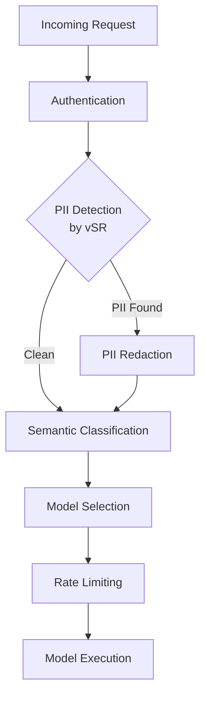
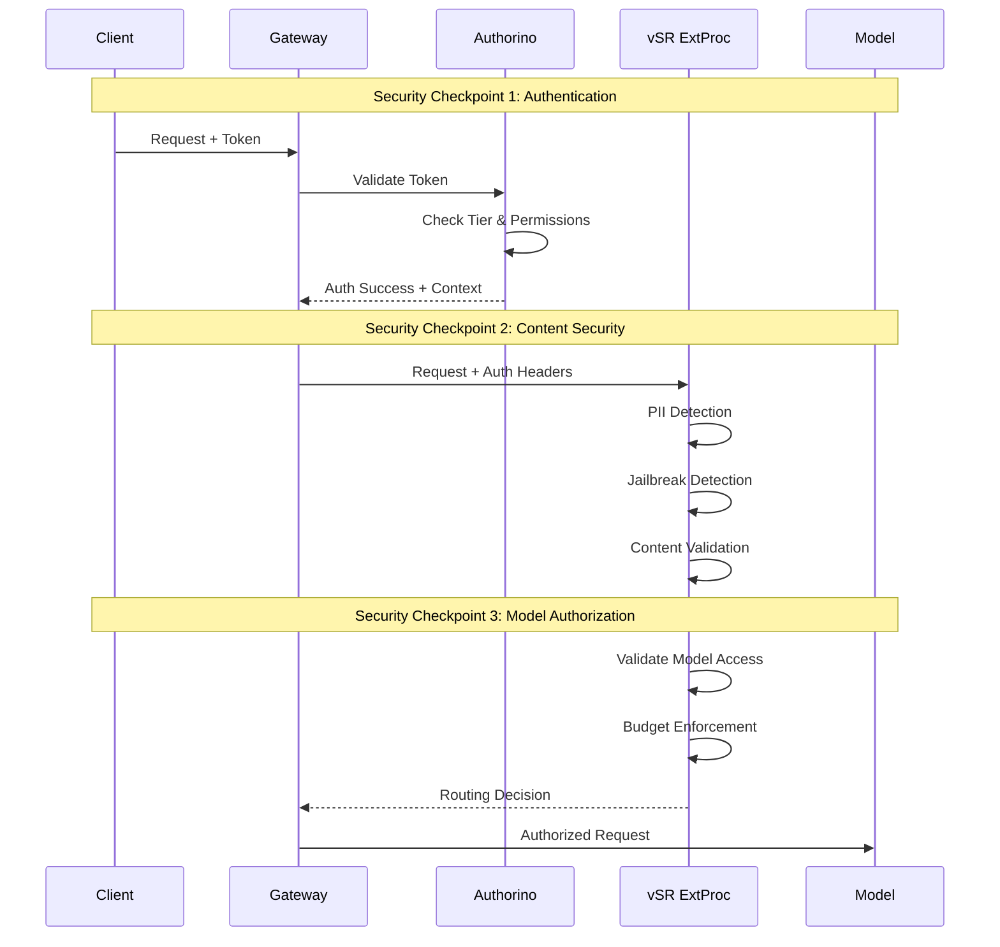

# Security Considerations

**Document**: Security Analysis for vSR-MaaS Integration  
**Date**: December 2025  
**Related**: [Main Design Proposal](design-proposal-vsr-maas-integration.md)

## Overview

This document provides a comprehensive security analysis for the integration of vLLM Semantic Router with the Models-as-a-Service platform. The integration maintains the security posture of both systems while introducing new security considerations specific to semantic routing and intelligent model selection.

## Security Architecture

### PII Protection in Integrated Flow

The integrated architecture maintains robust PII protection through multiple layers:



**Key PII Protection Features:**

1. **Early Detection**: PII scanning occurs immediately after authentication, before any model processing
2. **Configurable Policies**: Per-tier PII policies with allow/deny lists for specific PII types
3. **Content Redaction**: Automatic redaction or rejection of requests containing prohibited PII
4. **Audit Trail**: Complete logging of PII detection events and policy decisions

### Authorization Flow Security

The proposed Authorization-First flow ensures comprehensive security controls:



## Security Controls

### 1. Authentication and Authorization

**Multi-Layer Authentication:**
- **Service Account Tokens**: Kubernetes-native token validation via Authorino
- **Tier Resolution**: Dynamic tier mapping based on user group membership
- **RBAC Enforcement**: Fine-grained permissions for model access

**Authorization Context Validation:**
```yaml
authorization:
  semantic-routing-access:
    kubernetesSubjectAccessReview:
      user:
        expression: auth.identity.user.username
      authorizationGroups:
        expression: auth.identity.user.groups
      resourceAttributes:
        group:
          value: semantic-router.vllm.ai
        resource:
          value: semanticRouting
        verb:
          value: use
```

### 2. Content Security

**PII Protection:**
- **Detection Engine**: ModernBERT-based PII classification with configurable policies
- **Policy Enforcement**: Tier-specific PII handling rules
- **Content Filtering**: Automatic redaction or request rejection

**Jailbreak Prevention:**
- **Prompt Injection Detection**: AI-based detection of malicious prompts
- **Content Validation**: Multi-layer content analysis before model execution
- **Security Filters**: Configurable security policies per model tier

### 3. Model Access Security

**Tier-Based Access Control:**
```go
func (r *AuthorizedOpenAIRouter) validateModelAccess(authContext *AuthContext, selectedModel string) error {
    // Check if selected model is in user's allowed models
    if !slices.Contains(authContext.AllowedModels, selectedModel) {
        return errors.New("model not authorized for user tier")
    }
    
    // Validate cost constraints
    modelCost := r.getModelCost(selectedModel)
    if modelCost > authContext.MaxCost {
        return errors.New("model exceeds cost budget")
    }
    
    return nil
}
```

**Budget Enforcement:**
- **Cost Tracking**: Real-time tracking of model usage costs
- **Budget Limits**: Per-tier and per-user budget enforcement
- **Fallback Protection**: Automatic fallback to cheaper models when budgets are exceeded

### 4. Data Isolation and Privacy

**Tenant Isolation:**
- **Namespace Separation**: Tier-based namespace isolation for service accounts
- **Token Scoping**: Service account tokens scoped to specific namespaces and models
- **Cache Isolation**: Semantic cache respects tenant boundaries

**Data Protection:**
```go
type SecureSemanticCache struct {
    cache map[string]map[string]interface{} // tenant -> cache_key -> data
    
    // Tenant-aware cache operations
    Get(tenantID, key string) interface{}
    Set(tenantID, key string, value interface{})
    Invalidate(tenantID string) // Clear all data for tenant
}
```

### 5. Audit and Monitoring

**Security Logging:**
- **Authentication Events**: All token validation and authorization decisions
- **Routing Decisions**: Complete audit trail of model selection and routing
- **Security Violations**: PII detection, jailbreak attempts, unauthorized access
- **Cost Tracking**: Budget usage and limit enforcement events

**Monitoring Integration:**
```yaml
# Prometheus metrics for security monitoring
metrics:
  - name: vsr_auth_failures_total
    help: "Total number of authentication failures"
    labels: [tier, reason]
  
  - name: vsr_pii_detections_total
    help: "Total number of PII detection events"
    labels: [tier, pii_type, action]
  
  - name: vsr_unauthorized_model_access_total
    help: "Total number of unauthorized model access attempts"
    labels: [tier, requested_model, user_id]
```

## Security Best Practices

### 1. Token Management

**Service Account Token Security:**
- **Short TTL**: 4-hour token expiration with automatic refresh
- **Audience Scoping**: Tokens scoped to specific gateway audiences
- **Rotation**: Regular rotation of service account tokens
- **Revocation**: Immediate token revocation on security events

### 2. Network Security

**Network Policies:**
```yaml
apiVersion: networking.k8s.io/v1
kind: NetworkPolicy
metadata:
  name: vsr-security-policy
spec:
  podSelector:
    matchLabels:
      app: semantic-router
  policyTypes:
  - Ingress
  - Egress
  ingress:
  - from:
    - namespaceSelector:
        matchLabels:
          name: openshift-ingress
    ports:
    - protocol: TCP
      port: 50051
  egress:
  - to:
    - namespaceSelector:
        matchLabels:
          name: model-serving
    ports:
    - protocol: TCP
      port: 8080
```

### 3. Security Configuration

**vSR Security Configuration:**
```yaml
security:
  pii_detection:
    enabled: true
    strict_mode: true
    policies:
      enterprise:
        allow_by_default: false
        allowed_types: ["ORGANIZATION", "LOCATION"]
      premium:
        allow_by_default: false
        allowed_types: ["ORGANIZATION"]
      free:
        allow_by_default: false
        allowed_types: []
  
  jailbreak_protection:
    enabled: true
    confidence_threshold: 0.8
    action: "reject"  # reject, redact, or allow
  
  authorization:
    require_tier_validation: true
    enforce_budget_limits: true
    validate_model_access: true
```

### 4. Incident Response

**Security Incident Handling:**
1. **Automated Response**: Immediate blocking of suspicious requests
2. **Alert Generation**: Real-time alerts for security violations
3. **Evidence Collection**: Comprehensive logging for forensic analysis
4. **Recovery Procedures**: Automated recovery and system hardening

**Compliance and Governance:**
- **GDPR Compliance**: PII detection and handling procedures
- **SOC 2 Type II**: Audit trail and security controls documentation
- **HIPAA Compliance**: Healthcare data protection for medical models

## Threat Modeling

### Threat Vectors

1. **Token Compromise**: Stolen or leaked service account tokens
   - **Mitigation**: Short TTL, audience scoping, rotation policies

2. **Model Access Bypass**: Attempts to access unauthorized models
   - **Mitigation**: RBAC enforcement, budget validation, audit logging

3. **PII Exfiltration**: Attempts to extract PII through model responses
   - **Mitigation**: PII detection, content filtering, response scanning

4. **Cost-based Attacks**: Attempts to exhaust user budgets
   - **Mitigation**: Rate limiting, cost tracking, budget enforcement

5. **Prompt Injection**: Malicious prompts to manipulate model behavior
   - **Mitigation**: Jailbreak detection, content validation, security filters

### Risk Assessment Matrix

| Threat | Probability | Impact | Risk Level | Mitigation Status |
|--------|-------------|--------|------------|-------------------|
| Token Compromise | Medium | High | High | ✅ Implemented |
| Model Access Bypass | Low | Medium | Medium | ✅ Implemented |
| PII Exfiltration | Medium | High | High | ✅ Implemented |
| Cost-based Attacks | Medium | Medium | Medium | ✅ Implemented |
| Prompt Injection | High | Medium | High | ✅ Implemented |

## Security Testing and Validation

### Automated Security Testing

```bash
# Security test suite for vSR-MaaS integration
pytest tests/security/test_auth_bypass.py
pytest tests/security/test_pii_detection.py
pytest tests/security/test_token_validation.py
pytest tests/security/test_budget_enforcement.py
pytest tests/security/test_model_access_control.py
```

### Penetration Testing Scope

1. **Authentication Testing**: Token validation, authorization bypass attempts
2. **Content Security Testing**: PII detection accuracy, jailbreak prevention
3. **Model Access Testing**: Unauthorized model access, privilege escalation
4. **Budget Testing**: Cost limit bypass, budget exhaustion attacks
5. **Network Security Testing**: Network policy validation, traffic interception

This security framework ensures that the vSR-MaaS integration maintains enterprise-grade security while enabling intelligent semantic routing capabilities.