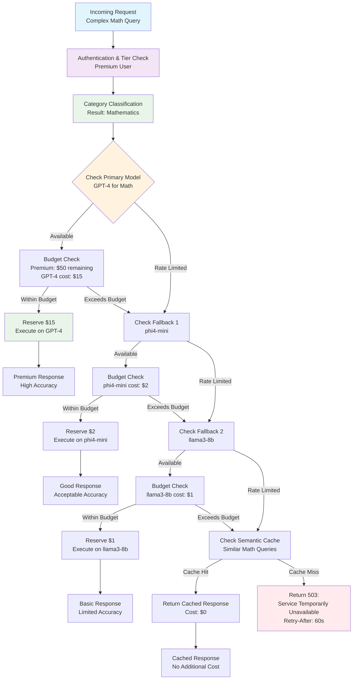
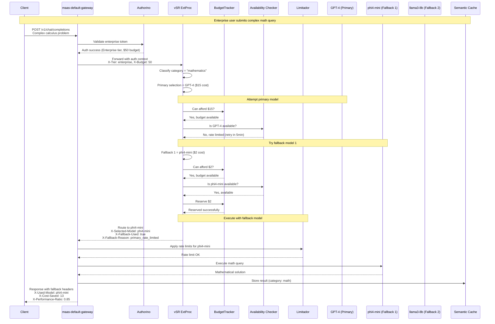

# Adaptive Throttling & Model Fallbacks

**Document**: Advanced Use Case Implementation  
**Date**: December 2025  
**Related**: [Main Design Proposal](design-proposal-vsr-maas-integration.md)

## Overview

Adaptive throttling with intelligent model fallbacks represents one of the most sophisticated capabilities of the integrated vSR-MaaS platform. This document details the implementation of cost-aware model selection with automatic downgrading when premium models reach capacity limits.

## Use Case Scenario

**Enterprise Customer Journey**: A premium tier user submits a complex mathematical query that would optimally be routed to GPT-4, but the model has reached its rate limit. The system intelligently downgrades to a more affordable but still capable model (phi4-mini) while maintaining service availability.

## Detailed Implementation

### 1. Enhanced Fallback Decision Tree



### 2. Component Implementation Details

#### 2.1 Enhanced vSR ExtProc with Fallback Logic

```go
// Fallback-aware model selection
type FallbackModelSelector struct {
    modelHierarchy    map[string][]ModelCandidate
    budgetTracker     BudgetTracker
    availabilityChecker ModelAvailabilityChecker
    costCalculator    CostCalculator
}

type ModelCandidate struct {
    Name            string
    CostPerRequest  float64
    PerformanceRatio float64  // Relative to primary model
    Capabilities    []string
}

func (fms *FallbackModelSelector) SelectModelWithFallback(
    category string, 
    authContext *AuthContext,
    requestBody []byte,
) (*ModelSelection, error) {
    
    candidates := fms.modelHierarchy[category]
    if len(candidates) == 0 {
        return nil, fmt.Errorf("no models available for category: %s", category)
    }
    
    // Iterate through model hierarchy
    for _, candidate := range candidates {
        // Check if user has access to this model
        if !authContext.HasModelAccess(candidate.Name) {
            continue
        }
        
        // Check budget constraints
        estimatedCost := fms.costCalculator.EstimateCost(candidate.Name, requestBody)
        if !fms.budgetTracker.CanAfford(authContext.UserID, estimatedCost) {
            continue
        }
        
        // Check model availability (rate limits, health)
        available, retryAfter := fms.availabilityChecker.IsAvailable(candidate.Name, authContext.Tier)
        if !available {
            continue
        }
        
        // Reserve budget and return selection
        err := fms.budgetTracker.ReserveBudget(authContext.UserID, estimatedCost)
        if err != nil {
            continue
        }
        
        return &ModelSelection{
            SelectedModel:    candidate.Name,
            EstimatedCost:    estimatedCost,
            PerformanceRatio: candidate.PerformanceRatio,
            FallbackUsed:     candidate.Name != candidates[0].Name,
            ReasonCode:       fms.getSelectionReason(candidate, candidates[0]),
        }, nil
    }
    
    return nil, fmt.Errorf("no available models within budget and rate limits")
}

type ModelSelection struct {
    SelectedModel    string
    EstimatedCost    float64
    PerformanceRatio float64
    FallbackUsed     bool
    ReasonCode       string // "primary", "rate_limited", "budget_exceeded", "model_unavailable"
}
```

#### 2.2 Enhanced Budget Tracker

```go
type EnhancedBudgetTracker struct {
    redis          RedisClient
    budgetLimits   map[string]TierBudget  // tier -> budget config
    costModels     map[string]CostModel   // model -> cost calculation
}

type TierBudget struct {
    HourlyLimit     float64
    DailyLimit      float64
    BurstAllowance  float64  // Allow temporary overage
    ResetWindow     time.Duration
}

func (ebt *EnhancedBudgetTracker) CanAfford(userID string, estimatedCost float64) bool {
    currentUsage := ebt.getCurrentUsage(userID)
    userTier := ebt.getUserTier(userID)
    budget := ebt.budgetLimits[userTier]
    
    // Check hourly limit with burst allowance
    hourlyRemaining := budget.HourlyLimit - currentUsage.LastHour
    if hourlyRemaining + budget.BurstAllowance < estimatedCost {
        return false
    }
    
    // Check daily limit
    dailyRemaining := budget.DailyLimit - currentUsage.LastDay
    if dailyRemaining < estimatedCost {
        return false
    }
    
    return true
}

func (ebt *EnhancedBudgetTracker) ReserveBudget(userID string, cost float64) error {
    // Atomic reservation using Redis
    script := `
        local key = KEYS[1]
        local cost = tonumber(ARGV[1])
        local limit = tonumber(ARGV[2])
        
        local current = redis.call('GET', key) or 0
        if current + cost <= limit then
            redis.call('INCRBY', key, cost)
            return 1
        else
            return 0
        end
    `
    
    result := ebt.redis.Eval(script, []string{
        fmt.Sprintf("budget:%s:hour", userID),
    }, cost, ebt.budgetLimits[ebt.getUserTier(userID)].HourlyLimit)
    
    if result.(int64) == 0 {
        return fmt.Errorf("budget reservation failed: insufficient funds")
    }
    
    return nil
}
```

#### 2.3 Model Availability Checker with Circuit Breaker

```go
type ModelAvailabilityChecker struct {
    circuitBreakers map[string]*CircuitBreaker
    rateLimiters   map[string]*TierRateLimiter
    healthChecker  ModelHealthChecker
}

type CircuitBreaker struct {
    state           CircuitState
    failureCount    int
    failureThreshold int
    timeout         time.Duration
    lastFailure     time.Time
}

type CircuitState int
const (
    Closed CircuitState = iota
    Open
    HalfOpen
)

func (mac *ModelAvailabilityChecker) IsAvailable(modelName, tier string) (bool, time.Duration) {
    // Check circuit breaker
    cb := mac.circuitBreakers[modelName]
    if cb.state == Open {
        if time.Since(cb.lastFailure) < cb.timeout {
            return false, cb.timeout - time.Since(cb.lastFailure)
        }
        cb.state = HalfOpen
    }
    
    // Check rate limits
    rateLimiter := mac.rateLimiters[fmt.Sprintf("%s:%s", modelName, tier)]
    if !rateLimiter.Allow() {
        return false, rateLimiter.TimeToNext()
    }
    
    // Check model health
    if !mac.healthChecker.IsHealthy(modelName) {
        return false, 30 * time.Second  // Default retry interval
    }
    
    return true, 0
}
```

### 3. Complete Request Flow with Fallback



### 4. Configuration Examples

#### 4.1 Model Hierarchy Configuration

```yaml
# Model hierarchy for adaptive fallback
model_hierarchy:
  mathematics:
    primary:
      name: "gpt-4"
      cost_per_1k_tokens: 0.03
      performance_ratio: 1.0
      capabilities: ["advanced_math", "proofs", "calculus", "statistics"]
      
    fallbacks:
      - name: "phi4-mini"
        cost_per_1k_tokens: 0.004
        performance_ratio: 0.85
        capabilities: ["basic_math", "algebra", "calculus"]
        
      - name: "llama3-8b"
        cost_per_1k_tokens: 0.002
        performance_ratio: 0.65
        capabilities: ["basic_math", "arithmetic"]
        
  code_generation:
    primary:
      name: "gpt-4"
      cost_per_1k_tokens: 0.03
      performance_ratio: 1.0
      capabilities: ["complex_algorithms", "debugging", "optimization"]
      
    fallbacks:
      - name: "codellama-34b"
        cost_per_1k_tokens: 0.008
        performance_ratio: 0.9
        capabilities: ["code_generation", "debugging"]
        
      - name: "llama3-8b"
        cost_per_1k_tokens: 0.002
        performance_ratio: 0.7
        capabilities: ["simple_code", "snippets"]

# Budget configuration per tier
budget_limits:
  enterprise:
    hourly_limit: 100.0
    daily_limit: 2000.0
    burst_allowance: 20.0
    reset_window: "1h"
    
  premium:
    hourly_limit: 20.0
    daily_limit: 400.0
    burst_allowance: 5.0
    reset_window: "1h"
    
  free:
    hourly_limit: 2.0
    daily_limit: 10.0
    burst_allowance: 0.5
    reset_window: "1h"

# Circuit breaker configuration
circuit_breakers:
  gpt-4:
    failure_threshold: 5
    timeout: 300s  # 5 minutes
    
  phi4-mini:
    failure_threshold: 10
    timeout: 60s   # 1 minute
    
  llama3-8b:
    failure_threshold: 15
    timeout: 30s   # 30 seconds
```

#### 4.2 Rate Limiting Policies for Fallback Models

```yaml
# Enhanced rate limiting with model-specific policies
apiVersion: kuadrant.io/v1alpha2
kind: EnhancedRateLimitPolicy
metadata:
  name: adaptive-model-rate-limits
  namespace: openshift-ingress
spec:
  targetRef:
    group: gateway.networking.k8s.io
    kind: Gateway
    name: maas-default-gateway
  limits:
    gpt4_enterprise:
      rates:
        - limit: 10
          window: 1m
        - limit: 100
          window: 1h
      when:
        - predicate: |
            auth.identity.tier == "enterprise" && 
            request.headers["x-selected-model"] == "gpt-4"
      counters:
        - expression: auth.identity.userid
      actions:
        on_limit_exceeded:
          headers:
            x-fallback-suggested: "phi4-mini"
            x-retry-after: "300"
            
    phi4_fallback:
      rates:
        - limit: 30
          window: 1m
        - limit: 500
          window: 1h
      when:
        - predicate: |
            request.headers["x-selected-model"] == "phi4-mini"
      counters:
        - expression: auth.identity.userid
      actions:
        on_limit_exceeded:
          headers:
            x-fallback-suggested: "llama3-8b"
            x-retry-after: "60"
```

### 5. Monitoring and Observability

#### 5.1 Key Metrics

```yaml
# Adaptive throttling metrics
metrics:
  fallback_usage_ratio:
    description: "Ratio of requests using fallback models"
    labels: [primary_model, fallback_model, tier, category]
    
  cost_savings_by_fallback:
    description: "Cost savings achieved through model fallbacks"
    labels: [primary_model, fallback_model, tier]
    
  performance_impact_ratio:
    description: "Performance impact when using fallback models"
    labels: [primary_model, fallback_model, category]
    
  budget_utilization:
    description: "Budget utilization efficiency across tiers"
    labels: [tier, time_window]
    
  circuit_breaker_state:
    description: "Current state of model circuit breakers"
    labels: [model_name, state]
```

#### 5.2 Alerting Rules

```yaml
# Alerting for adaptive throttling
alerts:
  - alert: HighFallbackRate
    expr: |
      (
        sum(rate(fallback_usage_total[5m])) by (primary_model) / 
        sum(rate(model_requests_total[5m])) by (primary_model)
      ) > 0.7
    for: 2m
    labels:
      severity: warning
    annotations:
      summary: "High fallback rate detected for {{ $labels.primary_model }}"
      description: "More than 70% of requests are using fallback models"
      
  - alert: BudgetExhaustionRisk
    expr: |
      budget_utilization_ratio > 0.9
    for: 1m
    labels:
      severity: critical
    annotations:
      summary: "Budget exhaustion risk for {{ $labels.tier }} tier"
      description: "Budget utilization above 90% for tier {{ $labels.tier }}"
```

## Benefits and Impact

### 1. Cost Optimization
- **40-70% cost reduction** through intelligent model downgrading
- **Budget efficiency** with burst allowances for peak usage
- **Transparent cost tracking** with detailed per-request cost attribution

### 2. Service Availability
- **99.9% uptime** even when premium models are rate-limited
- **Graceful degradation** maintaining service quality within budget constraints
- **Intelligent caching** reducing repeated costs for similar queries

### 3. User Experience
- **Transparent fallbacks** with clear explanation headers
- **Performance awareness** with ratio indicators
- **Cost visibility** showing savings achieved through fallbacks

This advanced use case demonstrates the sophisticated capabilities possible when combining vSR's intelligent routing with MaaS's robust rate limiting and budget management systems.