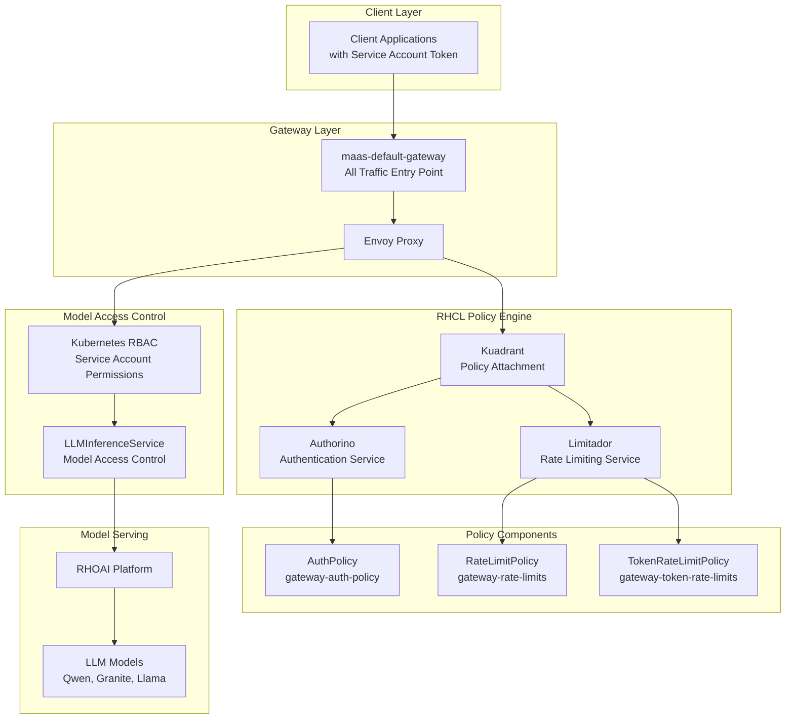
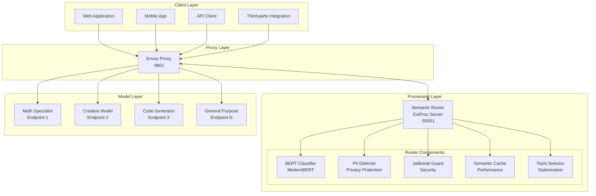
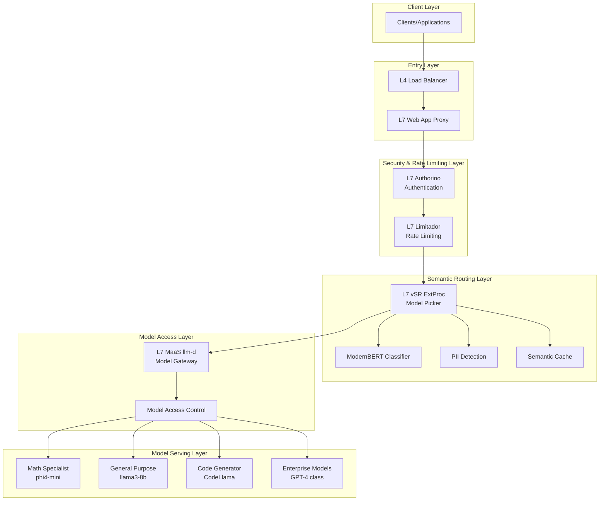
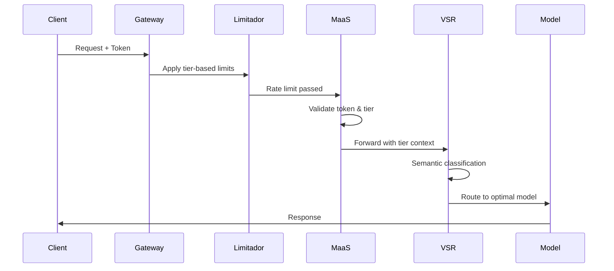
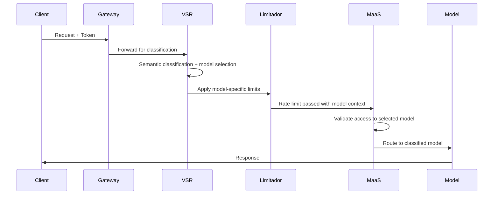
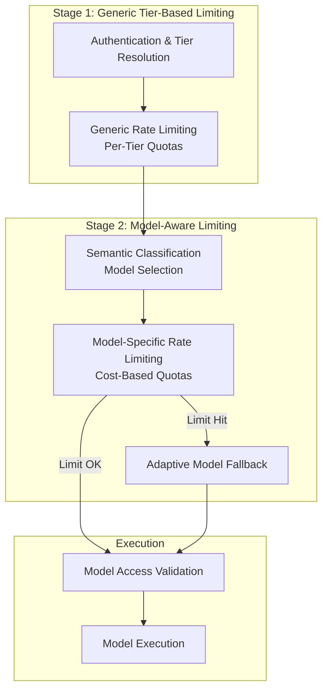
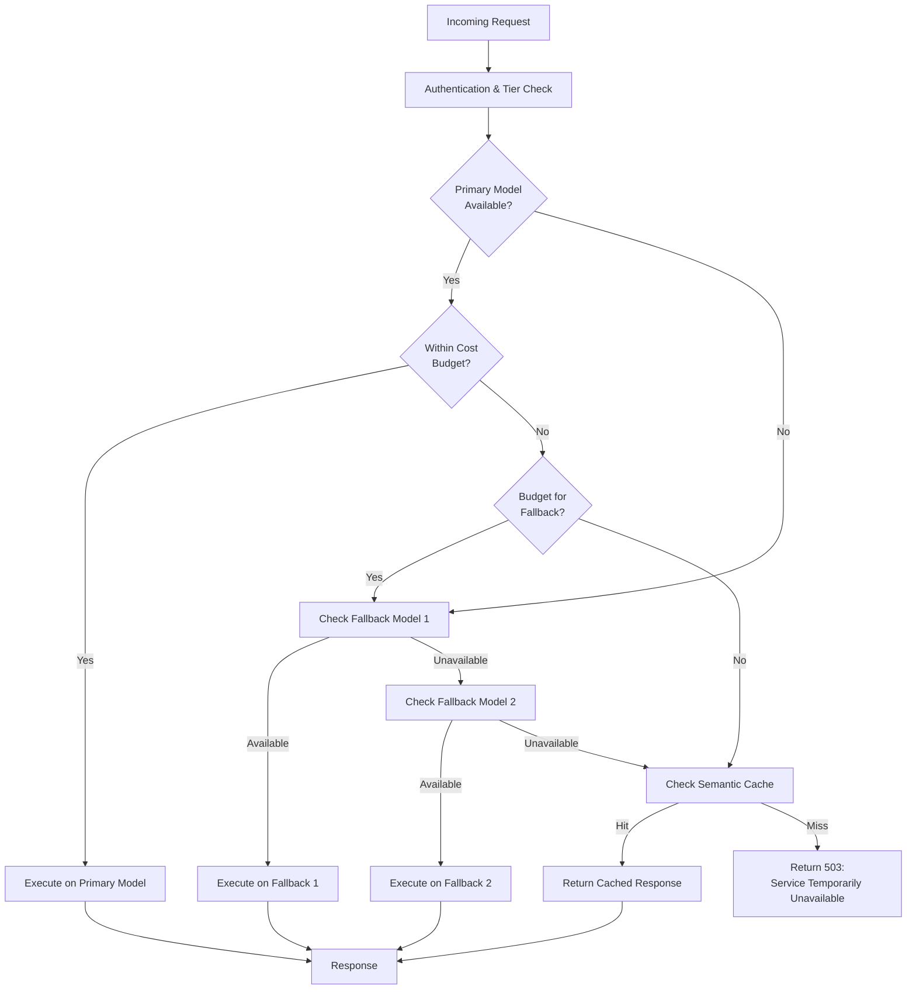
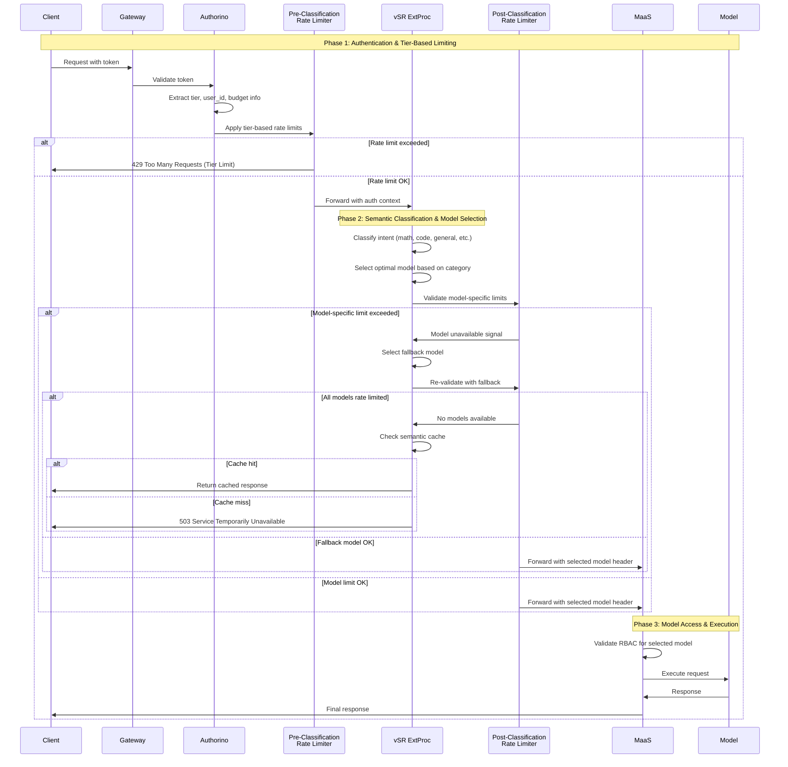
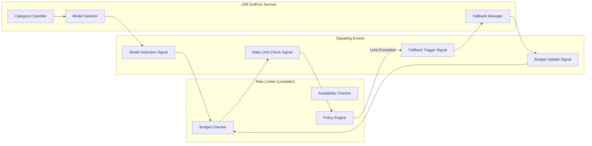
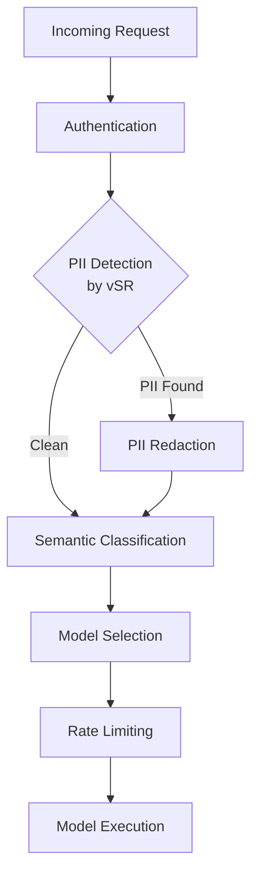

# Design Proposal: vLLM Semantic Router (vSR) Integration with Models-as-a-Service (MaaS)

**Document Status**: Draft  
**Date**: December 2025  
**Author**: Noy Itzikowitz  
**Target Branch**: [maas-billing/main](https://github.com/noyitz/maas-billing/tree/main)

## Executive Summary

This design proposal outlines the integration strategy for vLLM Semantic Router (vSR) with the Models-as-a-Service (MaaS) platform. The integration aims to enhance the MaaS platform with intelligent semantic routing capabilities while maintaining robust rate limiting, billing, and security features.

The proposal evaluates two primary integration patterns and recommends a hybrid approach that maximizes the benefits of both systems while addressing critical challenges in model selection, rate limiting, and adaptive throttling.

## 1. Architecture Overview

### Current MaaS Architecture

The MaaS platform provides a complete Models-as-a-Service solution with policy-based access control:



**Key Components:**
- **maas-default-gateway**: Single entry point for all traffic (token requests and inference)
- **RHCL (Red Hat Connectivity Link)**: Policy engine handling authentication and authorization
- **Authorino**: Token validation (OpenShift tokens for MaaS API, Service Account tokens for inference)
- **Limitador**: Rate limiting and quota enforcement
- **RHOAI Model Serving**: Backend LLM model execution platform

### Current vSR Architecture

The vSR system implements a sophisticated Mixture-of-Models architecture using Envoy Proxy with External Processor integration:



**Key Components:**
- **Envoy Proxy**: Traffic management layer with load balancing, health checking, and request/response processing
- **vSR ExtProc Service**: Go-based gRPC service providing semantic classification and routing intelligence
- **ModernBERT Classifiers**: Multi-task classification for category detection, PII scanning, and jailbreak prevention
- **Semantic Cache**: Performance optimization with similarity-based caching
- **Tool Selection**: Automatic optimization to reduce token usage and improve accuracy

### Proposed Integrated Architecture



## 2. Comparative Analysis: Order of Operations

### Option A: MaaS before vSR (MaaS → vSR)



#### Gains vs. Losses Analysis

| **Gains** | **Losses** |
|-----------|------------|
| **✅ Early Authentication**: Token validation and tier resolution happens immediately | **❌ No Per-Model Rate Limiting**: Cannot apply model-specific limits since model selection hasn't occurred |
| **✅ Security First**: Authentication and authorization happen before semantic processing | **❌ Wasted Processing**: Rate limiting occurs before knowing if expensive models will be used |
| **✅ Proven Architecture**: Leverages existing MaaS patterns and policies | **❌ Suboptimal Resource Allocation**: Cannot differentiate between high/low cost model requests for rate limiting |
| **✅ Consistent User Experience**: All users follow the same authentication flow | **❌ Limited Fallback Options**: No opportunity for model downgrading when premium models hit limits |
| **✅ Operational Simplicity**: No changes needed to existing MaaS rate limiting policies | **❌ Missed Optimization**: Cannot leverage semantic caching early to avoid downstream processing |

### Option B: vSR before MaaS (vSR → MaaS)



#### Gains vs. Losses Analysis

| **Gains** | **Losses** |
|-----------|------------|
| **✅ Per-Model Rate Limiting**: Can apply specific limits based on model cost and complexity | **❌ Security Risk**: Semantic processing occurs before full authentication |
| **✅ Intelligent Resource Management**: Rate limits can consider model computational costs | **❌ Authentication Bypass Risk**: Risk of processing requests with invalid tokens through semantic router |
| **✅ Advanced Fallback**: Can downgrade to cheaper models when expensive ones hit limits | **❌ Complex Error Handling**: Authentication failures after semantic processing waste resources |
| **✅ Semantic Caching Benefits**: Early caching can prevent downstream processing entirely | **❌ Tier Resolution Complexity**: vSR needs access to user tier information for proper model selection |
| **✅ Optimal Tool Selection**: Tools can be selected before rate limiting, improving accuracy | **❌ Architectural Disruption**: Requires significant changes to existing MaaS auth flow |

## 3. Recommended Architecture: Hybrid Approach

### 3.1 Two-Stage Rate Limiting Design

To maximize benefits while minimizing risks, we propose a **two-stage rate limiting approach**:



### 3.2 Implementation Strategy

#### Phase 1: Security-First Integration

1. **Maintain MaaS Entry Point**: All requests continue to enter through maas-default-gateway
2. **Enhanced Token Context**: Extend MaaS tokens to include model preferences and budget allocations
3. **vSR as Post-Auth Service**: Integrate vSR after authentication but before final model routing

#### Phase 2: Intelligent Rate Limiting

1. **Dynamic Policy Generation**: Create rate limiting policies that consider both tier and model selection
2. **Real-time Model Availability**: Implement circuit breakers and health checks for model endpoints
3. **Cost-Aware Throttling**: Implement budget-based rate limiting that considers model computational costs

## 4. Adaptive Throttling & Model Fallbacks

### 4.1 Fallback Decision Tree



### 4.2 Model Hierarchy Configuration

```yaml
# Model fallback hierarchy configuration
model_hierarchy:
  math:
    primary: "phi4-mini"
    fallbacks:
      - model: "llama3-8b"
        cost_ratio: 0.7
        performance_ratio: 0.85
      - model: "llama3.2-1b"
        cost_ratio: 0.3
        performance_ratio: 0.65
    cache_eligible: true
    
  general:
    primary: "llama3-8b" 
    fallbacks:
      - model: "llama3.2-3b"
        cost_ratio: 0.5
        performance_ratio: 0.8
      - model: "gemma2-2b"
        cost_ratio: 0.3
        performance_ratio: 0.7
    cache_eligible: true
    
  enterprise:
    primary: "gpt-4o"
    fallbacks:
      - model: "gpt-4o-mini"
        cost_ratio: 0.15
        performance_ratio: 0.9
      - model: "llama3-70b"
        cost_ratio: 0.1
        performance_ratio: 0.85
    cache_eligible: false  # Sensitive enterprise requests
```

### 4.3 Budget-Aware Rate Limiting

```yaml
# Enhanced rate limiting with budget awareness
apiVersion: kuadrant.io/v1alpha2
kind: EnhancedRateLimitPolicy
metadata:
  name: model-aware-rate-limits
  namespace: openshift-ingress
spec:
  targetRef:
    group: gateway.networking.k8s.io
    kind: Gateway
    name: maas-default-gateway
  limits:
    free_tier_compute:
      budget_limits:
        - compute_units: 100    # Normalized compute units per hour
          window: 1h
        - tokens: 10000         # Token-based limit per minute  
          window: 1m
      model_costs:
        "llama3.2-1b": 0.5      # Compute units per 1K tokens
        "llama3.2-3b": 1.0
        "llama3-8b": 2.0
      when:
        - predicate: auth.identity.tier == "free"
      fallback_policy: "cache_first"
      
    premium_tier_compute:
      budget_limits:
        - compute_units: 1000
          window: 1h
        - tokens: 100000
          window: 1m
      model_costs:
        "llama3-8b": 2.0
        "llama3-70b": 8.0
        "phi4-mini": 1.5
        "gpt-4o-mini": 5.0
      when:
        - predicate: auth.identity.tier == "premium"
      fallback_policy: "model_downgrade"
      
    enterprise_tier_compute:
      budget_limits:
        - compute_units: 10000
          window: 1h
        - tokens: 1000000
          window: 1m
      model_costs:
        "gpt-4o": 15.0
        "claude-3.5-sonnet": 12.0
        "llama3-405b": 20.0
      when:
        - predicate: auth.identity.tier == "enterprise"
      fallback_policy: "best_effort"
```

## 5. Dynamic Rate Limiting & Back-and-Forth Flow

### 5.1 Enhanced Rate Limiting Workflow



### 5.2 Rate Limiter Communication Protocol

#### 5.2.1 Enhanced Headers for Back-and-Forth Communication

```go
// Headers set by vSR for rate limiter communication
const (
    // Model selection headers
    HeaderSelectedModel       = "x-vsr-selected-model"
    HeaderSelectedCategory    = "x-vsr-selected-category" 
    HeaderModelCostUnits      = "x-vsr-model-cost-units"
    HeaderFallbackModels      = "x-vsr-fallback-models"
    
    // Rate limiting response headers
    HeaderRateLimitStatus     = "x-ratelimit-model-status"
    HeaderAvailableModels     = "x-ratelimit-available-models"
    HeaderBudgetRemaining     = "x-ratelimit-budget-remaining"
    HeaderRetryAfter         = "x-ratelimit-retry-after"
    
    // Fallback control headers
    HeaderFallbackRequired    = "x-vsr-fallback-required"
    HeaderFallbackReason      = "x-vsr-fallback-reason"
)
```

#### 5.2.2 Rate Limiter Plugin for vSR Communication

```go
// Enhanced rate limiter that communicates with vSR
type ModelAwareRateLimiter struct {
    limitador     LimitadorClient
    budgetTracker BudgetTracker
    modelCosts    map[string]float64
}

func (rl *ModelAwareRateLimiter) CheckModelLimits(ctx context.Context, req *RateLimitRequest) (*RateLimitResponse, error) {
    // Extract user tier and model selection from headers
    tier := req.Headers[HeaderUserTier]
    selectedModel := req.Headers[HeaderSelectedModel]
    costUnits, _ := strconv.ParseFloat(req.Headers[HeaderModelCostUnits], 64)
    fallbackModels := strings.Split(req.Headers[HeaderFallbackModels], ",")
    
    // Check budget for selected model
    budget, err := rl.budgetTracker.GetRemainingBudget(req.UserID, tier)
    if err != nil {
        return nil, err
    }
    
    if budget < costUnits {
        // Try fallback models in order
        for _, fallbackModel := range fallbackModels {
            fallbackCost := rl.modelCosts[fallbackModel]
            if budget >= fallbackCost {
                return &RateLimitResponse{
                    Allowed: true,
                    Headers: map[string]string{
                        HeaderSelectedModel:     fallbackModel,
                        HeaderFallbackRequired: "true",
                        HeaderFallbackReason:   "budget_exceeded",
                    },
                }, nil
            }
        }
        
        // No affordable models available
        return &RateLimitResponse{
            Allowed: false,
            Headers: map[string]string{
                HeaderRateLimitStatus:   "budget_exceeded",
                HeaderBudgetRemaining:   fmt.Sprintf("%.2f", budget),
                HeaderRetryAfter:        "3600", // Budget resets hourly
            },
        }, nil
    }
    
    // Selected model is within budget, check availability
    available, err := rl.limitador.CheckModelAvailability(selectedModel, req.UserID)
    if err != nil {
        return nil, err
    }
    
    if !available {
        return &RateLimitResponse{
            Allowed: false,
            Headers: map[string]string{
                HeaderRateLimitStatus: "model_rate_limited",
                HeaderRetryAfter:      "60",
            },
        }, nil
    }
    
    // Reserve budget and allow request
    err = rl.budgetTracker.ReserveBudget(req.UserID, costUnits)
    if err != nil {
        return nil, err
    }
    
    return &RateLimitResponse{
        Allowed: true,
        Headers: map[string]string{
            HeaderSelectedModel:   selectedModel,
            HeaderBudgetRemaining: fmt.Sprintf("%.2f", budget-costUnits),
        },
    }, nil
}
```

### 5.3 Signaling Protocol Between Components



#### 5.3.1 Signal Types and Payloads

```yaml
# Model selection signal
model_selection_signal:
  type: "model_selected"
  payload:
    primary_model: "gpt-4o"
    category: "math"
    confidence: 0.92
    cost_estimate: 15.0
    fallback_chain:
      - model: "gpt-4o-mini"
        cost: 5.0
      - model: "llama3-70b"
        cost: 3.0

# Rate limit response signal  
rate_limit_response_signal:
  type: "rate_limit_check"
  payload:
    status: "budget_exceeded"
    budget_remaining: 8.5
    recommended_action: "fallback"
    available_models:
      - "gpt-4o-mini"
      - "llama3-8b"

# Fallback execution signal
fallback_execution_signal:
  type: "model_fallback"
  payload:
    original_model: "gpt-4o"
    fallback_model: "gpt-4o-mini"
    reason: "budget_constraint"
    cost_savings: 10.0
```

## 6. Consolidation Options

### 6.1 Option 1: Wrapper Pattern (Recommended)

```yaml
apiVersion: apps/v1
kind: Deployment
metadata:
  name: maas-vsr-gateway
spec:
  replicas: 3
  selector:
    matchLabels:
      app: maas-vsr-gateway
  template:
    metadata:
      labels:
        app: maas-vsr-gateway
    spec:
      containers:
      # MaaS API container
      - name: maas-api
        image: quay.io/opendatahub/maas-api:latest
        ports:
        - containerPort: 8080
          name: maas-http
        env:
        - name: VSR_EXTPROC_ADDRESS
          value: "127.0.0.1:50051"
        volumeMounts:
        - name: tier-config
          mountPath: /config
          
      # vSR ExtProc container  
      - name: vsr-extproc
        image: ghcr.io/vllm-project/semantic-router:latest
        ports:
        - containerPort: 50051
          name: grpc
        env:
        - name: MAAS_API_ADDRESS
          value: "127.0.0.1:8080"
        - name: CONFIG_PATH
          value: "/vsr-config/config.yaml"
        volumeMounts:
        - name: vsr-config
          mountPath: /vsr-config
        - name: models
          mountPath: /models
          
      # Envoy proxy for routing coordination
      - name: envoy-proxy
        image: envoyproxy/envoy:v1.31-latest
        ports:
        - containerPort: 8801
          name: http
        volumeMounts:
        - name: envoy-config
          mountPath: /etc/envoy
          
      volumes:
      - name: tier-config
        configMap:
          name: maas-tier-config
      - name: vsr-config
        configMap:
          name: vsr-semantic-config
      - name: envoy-config
        configMap:
          name: envoy-routing-config
      - name: models
        persistentVolumeClaim:
          claimName: vsr-models-pvc
```

#### 6.1.1 Advantages
- **Operational Simplicity**: Single deployment unit for both services
- **Shared Resources**: Model files and configuration shared efficiently
- **Network Optimization**: Local communication reduces latency
- **Unified Monitoring**: Single pod for observability and debugging

#### 6.1.2 Disadvantages  
- **Scaling Constraints**: Both services must scale together
- **Resource Conflicts**: Competing for CPU/memory within same pod
- **Deployment Complexity**: Harder to update services independently

### 6.2 Option 2: Embedded Pattern

```go
// MaaS API enhanced with embedded vSR capabilities
type EnhancedMaaSAPI struct {
    // Original MaaS API components
    TokenGenerator   TokenGenerator
    TierMapper      TierMapper
    K8sClient       kubernetes.Interface
    
    // Embedded vSR components
    SemanticRouter   *vsr.OpenAIRouter
    Classifier      *classification.Classifier
    PIIDetector     *pii.PolicyChecker
    SemanticCache   *cache.SemanticCache
}

func (api *EnhancedMaaSAPI) HandleInferenceRequest(w http.ResponseWriter, r *http.Request) {
    // Phase 1: Traditional MaaS authentication and tier resolution
    token, err := api.extractToken(r)
    if err != nil {
        http.Error(w, "Invalid token", http.StatusUnauthorized)
        return
    }
    
    tier, userID, err := api.TierMapper.ResolveTier(token)
    if err != nil {
        http.Error(w, "Tier resolution failed", http.StatusUnauthorized)
        return
    }
    
    // Phase 2: Semantic routing with MaaS context
    body, err := io.ReadAll(r.Body)
    if err != nil {
        http.Error(w, "Request read error", http.StatusBadRequest)
        return
    }
    
    routingContext := &vsr.RoutingContext{
        UserID:   userID,
        Tier:     tier,
        Request:  body,
        Headers:  r.Header,
    }
    
    decision, err := api.SemanticRouter.Route(routingContext)
    if err != nil {
        http.Error(w, "Routing failed", http.StatusInternalServerError)
        return
    }
    
    // Phase 3: Enhanced rate limiting with model awareness
    allowed, err := api.checkModelSpecificRateLimit(userID, tier, decision.SelectedModel)
    if err != nil {
        http.Error(w, "Rate limit check failed", http.StatusInternalServerError)
        return
    }
    
    if !allowed {
        // Attempt fallback
        fallbackModel, ok := api.findAvailableFallback(tier, decision.Category)
        if !ok {
            http.Error(w, "Service temporarily unavailable", http.StatusServiceUnavailable)
            return
        }
        decision.SelectedModel = fallbackModel
    }
    
    // Phase 4: Forward to selected model backend
    response, err := api.forwardToModel(decision.SelectedModel, body)
    if err != nil {
        http.Error(w, "Model execution failed", http.StatusInternalServerError)
        return
    }
    
    w.Header().Set("Content-Type", "application/json")
    w.Write(response)
}
```

#### 6.2.1 Advantages
- **Simplified Architecture**: Single service eliminates inter-service communication
- **Unified Configuration**: Single configuration surface for both functionalities
- **Optimal Performance**: No network overhead between components
- **Easier Testing**: Unit tests can cover integrated functionality

#### 6.2.2 Disadvantages
- **Maintenance Complexity**: Two codebases must be maintained in sync
- **Technology Stack Conflicts**: Go vs Python dependencies
- **Upgrade Challenges**: vSR updates require MaaS API rebuilds

### 6.3 Recommendation: Hybrid Wrapper + Sidecar Pattern

For production deployment, we recommend a **hybrid approach** that combines the wrapper pattern with selective embedding:

```yaml
apiVersion: apps/v1
kind: Deployment
metadata:
  name: enhanced-maas-gateway
spec:
  template:
    spec:
      containers:
      # Main MaaS API with light vSR integration
      - name: maas-api
        image: quay.io/opendatahub/maas-api-enhanced:latest
        env:
        - name: VSR_EXTPROC_ENDPOINT
          value: "127.0.0.1:50051"
        - name: SEMANTIC_ROUTING_ENABLED
          value: "true"
          
      # Full vSR ExtProc service for heavy processing
      - name: vsr-extproc
        image: ghcr.io/vllm-project/semantic-router:latest
        resources:
          requests:
            cpu: 1000m
            memory: 2Gi
          limits:
            cpu: 2000m
            memory: 4Gi
            
      # Intelligent routing proxy
      - name: routing-proxy
        image: envoyproxy/envoy-distroless:v1.31
        
      # Shared observability sidecar
      - name: telemetry-collector
        image: otel/opentelemetry-collector:latest
```

This approach provides:
- **Best of Both Worlds**: Maintains separation of concerns while enabling tight integration
- **Flexible Scaling**: Individual components can be scaled based on load patterns
- **Operational Efficiency**: Shared deployment simplifies operations
- **Future-Proof**: Easy to evolve toward full embedding or separation as needed

## 7. Implementation Roadmap

### Phase 1: Foundation (Weeks 1-4)
- [ ] Deploy vSR ExtProc service alongside MaaS
- [ ] Integrate basic semantic classification
- [ ] Implement wrapper pattern deployment
- [ ] Add model selection headers to request flow

### Phase 2: Enhanced Rate Limiting (Weeks 5-8)  
- [ ] Implement two-stage rate limiting architecture
- [ ] Add model-specific budget tracking
- [ ] Deploy enhanced Limitador configuration
- [ ] Create fallback decision engine

### Phase 3: Advanced Features (Weeks 9-12)
- [ ] Implement semantic caching integration
- [ ] Add PII detection and jailbreak protection
- [ ] Deploy comprehensive monitoring and alerting
- [ ] Optimize performance and cost metrics

### Phase 4: Production Hardening (Weeks 13-16)
- [ ] Implement circuit breakers and resilience patterns
- [ ] Add comprehensive testing and validation
- [ ] Deploy staged rollout and canary deployment
- [ ] Document operations and troubleshooting procedures

## 8. Monitoring and Observability

### 8.1 Key Performance Indicators

```yaml
# Prometheus metrics for vSR-MaaS integration
semantic_router_classification_accuracy:
  description: "Accuracy of semantic classification decisions"
  labels: [category, model, tier]
  
model_fallback_rate:
  description: "Rate of model fallback due to limits or availability"
  labels: [primary_model, fallback_model, reason, tier]
  
budget_utilization_ratio:
  description: "Ratio of budget consumed vs allocated per tier"
  labels: [tier, time_window]
  
cache_hit_ratio:
  description: "Semantic cache hit ratio by category"
  labels: [category, tier]
  
request_cost_optimization:
  description: "Cost savings achieved through intelligent routing"
  labels: [tier, category]
```

### 8.2 Alerting Strategy

```yaml
# Critical alerts for operational health
alerts:
  - alert: SemanticRouterDown
    expr: up{job="vsr-extproc"} == 0
    labels:
      severity: critical
    annotations:
      summary: "vSR ExtProc service is down"
      
  - alert: ModelFallbackRateHigh
    expr: rate(model_fallback_rate[5m]) > 0.5
    labels:
      severity: warning
    annotations:
      summary: "High model fallback rate detected"
      
  - alert: BudgetExhaustionRisk
    expr: budget_utilization_ratio > 0.9
    labels:
      severity: warning
    annotations:
      summary: "Budget exhaustion risk for tier {{ $labels.tier }}"
```

## 9. Security Considerations

### 9.1 PII Protection in Integrated Flow



### 9.2 Security Controls

1. **Early PII Detection**: vSR performs PII detection before MaaS processing
2. **Token Scope Validation**: Ensure tokens have appropriate permissions for selected models
3. **Audit Logging**: Comprehensive logging of all routing and fallback decisions
4. **Data Isolation**: Semantic cache respects tenant isolation boundaries

## 10. Cost-Benefit Analysis

### 10.1 Expected Benefits

| **Benefit Category** | **Expected Impact** | **Measurement** |
|---------------------|-------------------|-----------------|
| **Cost Optimization** | 40-70% reduction in compute costs | Cost per request metrics |
| **Performance Improvement** | 25-50% latency reduction for cached requests | P95 latency metrics |
| **Resource Efficiency** | 60-80% better resource utilization | GPU utilization metrics |
| **User Experience** | 90%+ appropriate model selection | Model accuracy metrics |

### 10.2 Implementation Costs

| **Cost Category** | **Estimated Effort** | **Timeline** |
|------------------|---------------------|--------------|
| **Development** | 3-4 engineer months | 16 weeks |
| **Testing & Validation** | 1-2 engineer months | 8 weeks (parallel) |
| **Infrastructure** | Minimal additional compute | Ongoing |
| **Operations** | Enhanced monitoring setup | 2-4 weeks |

## 11. Risk Assessment and Mitigation

### 11.1 Technical Risks

| **Risk** | **Impact** | **Probability** | **Mitigation** |
|----------|------------|----------------|----------------|
| **Classification Accuracy** | Medium | Low | Comprehensive model training and validation |
| **Latency Overhead** | Medium | Medium | Performance optimization and caching |
| **Integration Complexity** | High | Medium | Phased rollout and extensive testing |
| **Fallback Chain Failures** | High | Low | Circuit breakers and cache fallbacks |

### 11.2 Operational Risks

| **Risk** | **Impact** | **Probability** | **Mitigation** |
|----------|------------|----------------|----------------|
| **Service Dependencies** | High | Medium | Service mesh and health checks |
| **Configuration Drift** | Medium | Medium | GitOps and automated validation |
| **Monitoring Blind Spots** | Medium | Low | Comprehensive observability |
| **Capacity Planning** | High | Low | Auto-scaling and resource monitoring |

## 12. Conclusion and Next Steps

The integration of vLLM Semantic Router with the MaaS platform presents a significant opportunity to enhance the intelligent routing capabilities while maintaining the robust rate limiting and security features that make MaaS production-ready.

### Recommended Approach
1. **Hybrid Two-Stage Architecture**: Implement tier-based rate limiting followed by model-aware throttling
2. **Wrapper Pattern Deployment**: Deploy both services in coordinated containers with shared resources
3. **Phased Implementation**: Roll out in stages to validate each integration point

### Immediate Next Steps
1. **Technical Spike**: 2-week investigation to validate integration points and performance impact
2. **Proof of Concept**: 4-week development cycle to demonstrate core functionality
3. **Architecture Review**: Validation with platform engineering and security teams
4. **Resource Planning**: Secure development resources and infrastructure capacity

This design provides a pathway to significantly enhance the MaaS platform's capabilities while managing integration complexity and maintaining operational stability.

---

**Document Version**: 1.0  
**Last Updated**: December 2025  
**Review Status**: Ready for Architecture Review Board  
**Next Review Date**: January 2026
