# Design Proposal: vLLM Semantic Router (vSR) Integration with Models-as-a-Service (MaaS)

**Document Status**: Draft  
**Date**: December 2025  
**Author**: Noy Itzikowitz  
**Target Branch**: [maas-billing/main](https://github.com/noyitz/maas-billing/tree/main)

## Executive Summary

This design proposal outlines the integration strategy for vLLM Semantic Router (vSR) with the Models-as-a-Service (MaaS) platform. The integration aims to enhance the MaaS platform with intelligent semantic routing capabilities while maintaining robust rate limiting, billing, and security features.

The proposal evaluates two primary integration patterns and recommends a hybrid approach that maximizes the benefits of both systems while addressing critical challenges in model selection, rate limiting, and adaptive throttling.

## 1. Architecture Overview

### Current MaaS Architecture

The MaaS platform provides a complete Models-as-a-Service solution with policy-based access control:

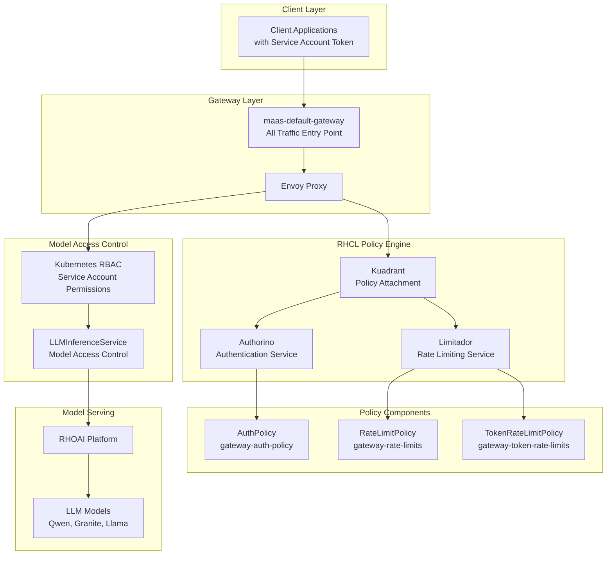

**Key Components:**
- **maas-default-gateway**: Single entry point for all traffic (token requests and inference)
- **RHCL (Red Hat Connectivity Link)**: Policy engine handling authentication and authorization
- **Authorino**: Token validation (OpenShift tokens for MaaS API, Service Account tokens for inference)
- **Limitador**: Rate limiting and quota enforcement
- **RHOAI Model Serving**: Backend LLM model execution platform

#### Model Inference Request Flow

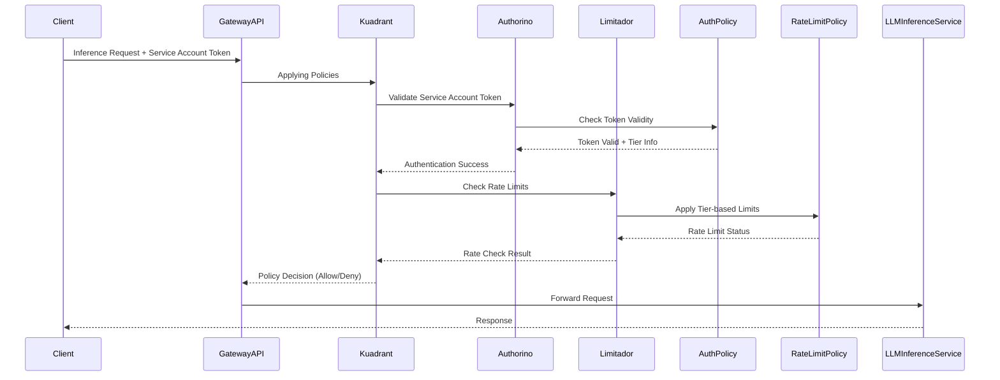

### Current vSR Architecture

The vSR system implements a sophisticated Mixture-of-Models architecture using Envoy Proxy with External Processor integration:

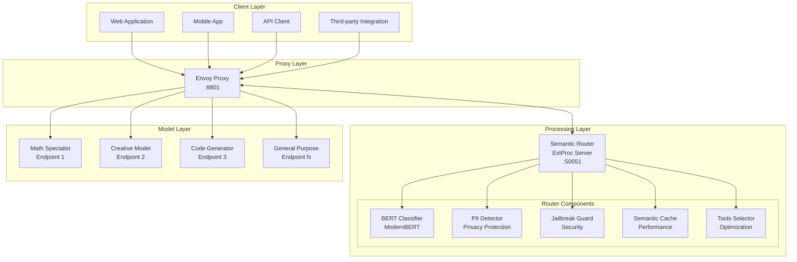

**Key Components:**
- **Envoy Proxy**: Traffic management layer with load balancing, health checking, and request/response processing
- **vSR ExtProc Service**: Go-based gRPC service providing semantic classification and routing intelligence
- **ModernBERT Classifiers**: Multi-task classification for category detection, PII scanning, and jailbreak prevention
- **Semantic Cache**: Performance optimization with similarity-based caching
- **Tool Selection**: Automatic optimization to reduce token usage and improve accuracy

#### Request Processing Pipeline

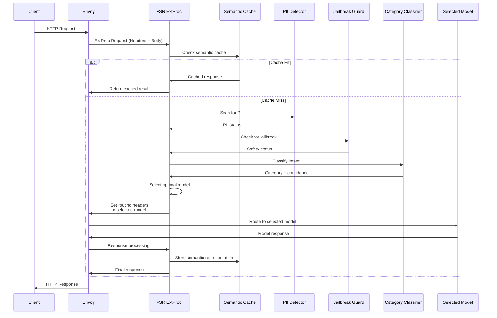


## 2. Authorization (AuthZ) Analysis

### 2.1 MaaS Authorization Architecture

MaaS implements a comprehensive authorization system using Authorino with multi-layered access control:

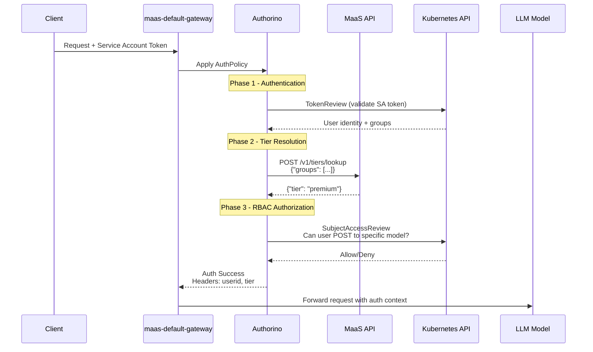

**Key Authorization Components:**
- **Authentication**: Kubernetes TokenReview validates Service Account tokens
- **Tier Resolution**: MaaS API maps user groups to subscription tiers (free/premium/enterprise)
- **RBAC Authorization**: Kubernetes SubjectAccessReview checks model-specific permissions
- **Context Injection**: Auth metadata (userid, tier) added to request headers

### 2.2 vSR Authorization Architecture 

vSR currently operates as a pure routing layer without built-in authorization:

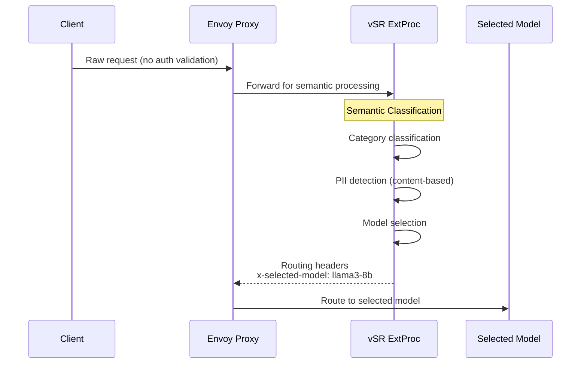

**Key Characteristics:**
- **No Built-in AuthZ**: vSR assumes requests are pre-authorized
- **Content-based Security**: PII detection and jailbreak prevention based on request content
- **Model Selection**: Intelligent routing based on semantic analysis
- **Stateless Design**: No user context or session management

## 3. Comparative Analysis: Order of Operations

### Option A: MaaS before vSR (MaaS → vSR)

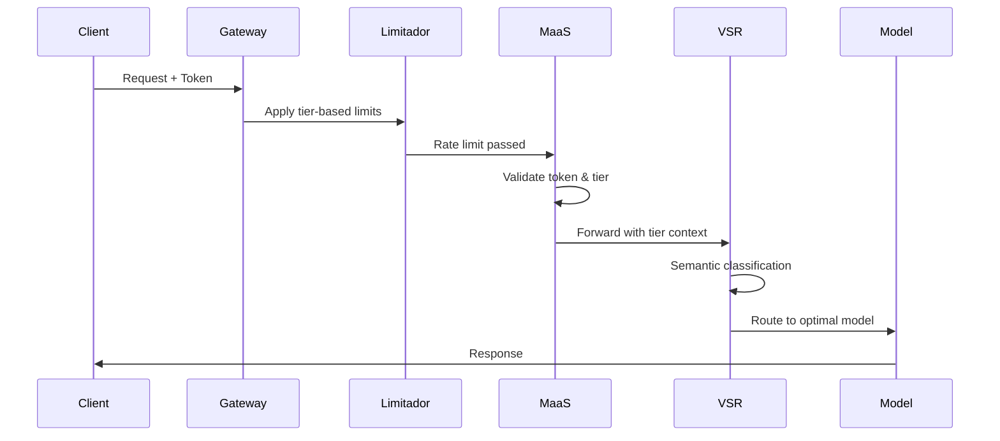

#### Gains vs. Losses Analysis

| **Gains** | **Losses** |
|-----------|------------|
| **✅ Early Authentication**: Token validation and tier resolution happens immediately | **❌ No Per-Model Rate Limiting**: Cannot apply model-specific limits since model selection hasn't occurred |
| **✅ Security First**: Authentication and authorization happen before semantic processing | **❌ Wasted Processing**: Rate limiting occurs before knowing if expensive models will be used |
| **✅ Proven Architecture**: Leverages existing MaaS patterns and policies | **❌ Suboptimal Resource Allocation**: Cannot differentiate between high/low cost model requests for rate limiting |
| **✅ Consistent User Experience**: All users follow the same authentication flow | **❌ Limited Fallback Options**: No opportunity for model downgrading when premium models hit limits |
| **✅ Operational Simplicity**: No changes needed to existing MaaS rate limiting policies | **❌ Missed Optimization**: Cannot leverage semantic caching early to avoid downstream processing |

### Option B: vSR before MaaS (vSR → MaaS)

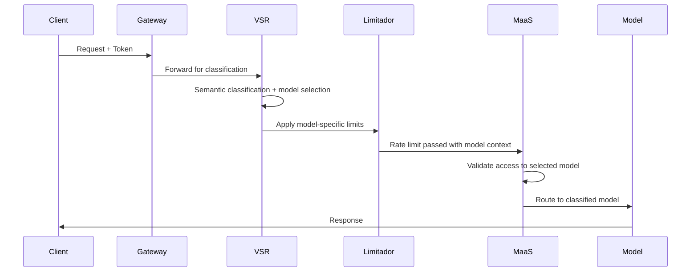

#### Gains vs. Losses Analysis

| **Gains** | **Losses** |
|-----------|------------|
| **✅ Per-Model Rate Limiting**: Can apply specific limits based on model cost and complexity | **❌ Security Risk**: Semantic processing occurs before full authentication |
| **✅ Intelligent Resource Management**: Rate limits can consider model computational costs | **❌ Authentication Bypass Risk**: Risk of processing requests with invalid tokens through semantic router |
| **✅ Advanced Fallback**: Can downgrade to cheaper models when expensive ones hit limits | **❌ Complex Error Handling**: Authentication failures after semantic processing waste resources |
| **✅ Semantic Caching Benefits**: Early caching can prevent downstream processing entirely | **❌ Tier Resolution Complexity**: vSR needs access to user tier information for proper model selection |
| **✅ Optimal Tool Selection**: Tools can be selected before rate limiting, improving accuracy | **❌ Architectural Disruption**: Requires significant changes to existing MaaS auth flow |

## 4. Proposed Solution

Based on the analysis of both options, we recommend the **Authorization-First Integrated Architecture** that combines the security benefits of Option A with the intelligent routing capabilities of Option B.

### 4.1 Recommended Flow: Auth → vSR → MaaS Rate Limiting

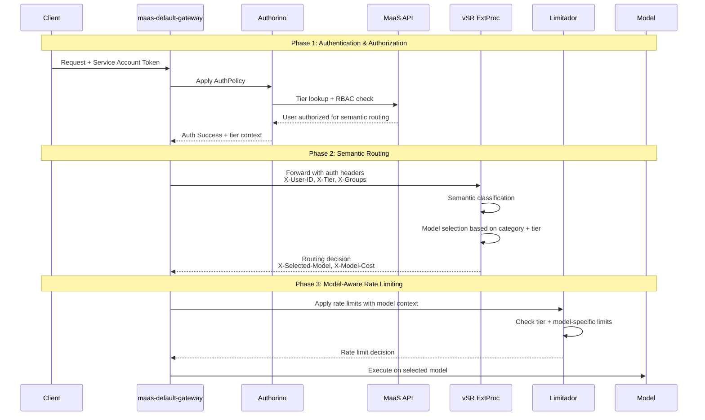

### 4.2 Integrated Architecture

Based on the analysis of both options, we propose the **Authorization-First Integrated Architecture** that combines the security benefits of Option A with the intelligent routing capabilities of Option B:

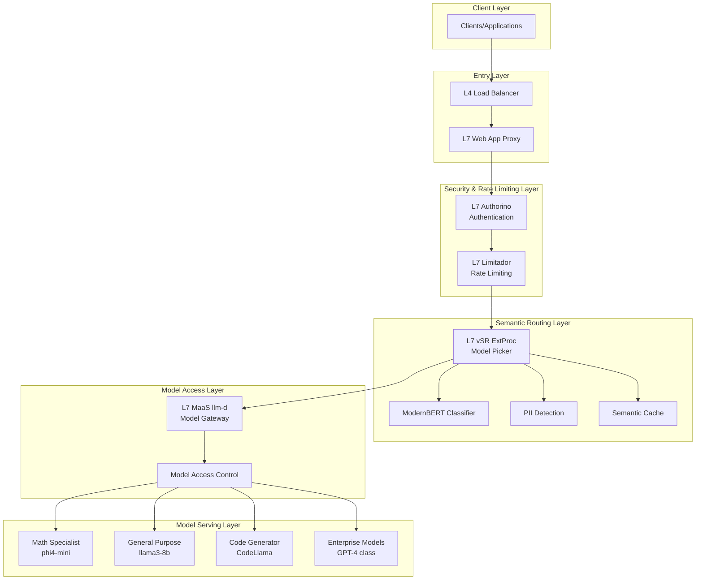

**Key Design Principles:**
- **Security First**: Full authentication and authorization before semantic processing
- **Intelligent Routing**: vSR operates with full user context and permissions
- **Model-Aware Rate Limiting**: Rate limits applied after model selection with cost awareness
- **Clear Separation**: Each component focuses on its core responsibility

### 2.5 Enhanced Authorization Policy Configuration

To support the Authorization-First flow, we need an enhanced AuthPolicy that grants semantic routing access:

```yaml
# Enhanced AuthPolicy for vSR integration
apiVersion: kuadrant.io/v1
kind: AuthPolicy
metadata:
  name: enhanced-gateway-auth-policy
  namespace: openshift-ingress
spec:
  targetRef:
    group: gateway.networking.k8s.io
    kind: Gateway
    name: maas-default-gateway
  rules:
    metadata:
      # Tier resolution (existing)
      matchedTier:
        http:
          url: http://maas-api.maas-api.svc.cluster.local:8080/v1/tiers/lookup
          contentType: application/json
          method: POST
          body:
            expression: '{ "groups": auth.identity.user.groups }'
        cache:
          key:
            selector: auth.identity.user.username
          ttl: 300
      
      # New: Model capabilities lookup
      allowedModels:
        http:
          url: http://maas-api.maas-api.svc.cluster.local:8080/v1/models/allowed
          contentType: application/json  
          method: POST
          body:
            expression: '{ "tier": auth.metadata.matchedTier["tier"], "groups": auth.identity.user.groups }'
        cache:
          key:
            selector: "{auth.identity.user.username}:{auth.metadata.matchedTier.tier}"
          ttl: 600
            
    authentication:
      service-accounts:
        kubernetesTokenReview:
          audiences:
            - maas-default-gateway-sa
        defaults:
          userid:
            expression: 'auth.identity.user.username.split(":")[3]'
        cache:
          key:
            selector: context.request.http.headers.authorization.@case:lower
          ttl: 600
          
    authorization:
      # Basic tier access (existing)
      tier-access:
        cache:
          key:
            selector: "{auth.identity.user.username}:{request.path}"
          ttl: 60
        kubernetesSubjectAccessReview:
          user:
            expression: auth.identity.user.username
          authorizationGroups:
            expression: auth.identity.user.groups
          resourceAttributes:
            group:
              value: serving.kserve.io
            resource:
              value: llminferenceservices
            verb:
              value: post
      
      # New: Semantic routing access control
      semantic-routing-access:
        cache:
          key:
            selector: "{auth.identity.user.username}:semantic-routing"
          ttl: 300
        kubernetesSubjectAccessReview:
          user:
            expression: auth.identity.user.username
          authorizationGroups:
            expression: auth.identity.user.groups
          resourceAttributes:
            group:
              value: semantic-router.vllm.ai
            resource:
              value: semanticRouting
            namespace:
              value: default
            verb:
              value: use
              
    response:
      success:
        filters:
          identity:
            json:
              properties:
                userid:
                  expression: auth.identity.userid
                tier:
                  expression: auth.metadata.matchedTier["tier"]
                allowedModels:
                  expression: auth.metadata.allowedModels["models"]
                maxCostPerRequest:
                  expression: auth.metadata.matchedTier["maxCostPerRequest"]
```

### 2.6 vSR ExtProc Enhancement for Authorization Context

vSR needs to be enhanced to understand and respect authorization context:

```go
// Enhanced vSR ExtProc with authorization awareness
type AuthorizedOpenAIRouter struct {
    *openai.OpenAIRouter
    
    // Authorization context processors
    tierProcessor     TierProcessor
    modelValidator    ModelValidator
    budgetTracker     BudgetTracker
}

func (r *AuthorizedOpenAIRouter) ProcessRequestHeaders(headers map[string]string) (*RoutingDecision, error) {
    // Extract authorization context
    authContext := &AuthContext{
        UserID:       headers["X-User-ID"],
        Tier:         headers["X-Tier"], 
        AllowedModels: parseModels(headers["X-Allowed-Models"]),
        MaxCost:      parseFloat(headers["X-Max-Cost-Per-Request"]),
    }
    
    // Validate user has semantic routing access
    if !r.hasSemanticRoutingPermission(authContext) {
        return nil, errors.New("user not authorized for semantic routing")
    }
    
    // Perform semantic classification with tier context
    category, confidence, err := r.Classifier.ClassifyWithTier(body, authContext.Tier)
    if err != nil {
        return nil, err
    }
    
    // Select model based on category + tier constraints
    selectedModel, cost, err := r.selectModelForTier(category, authContext)
    if err != nil {
        return nil, err
    }
    
    return &RoutingDecision{
        Category:      category,
        SelectedModel: selectedModel,
        EstimatedCost: cost,
        UserContext:   authContext,
    }, nil
}

func (r *AuthorizedOpenAIRouter) selectModelForTier(category string, auth *AuthContext) (string, float64, error) {
    // Get models for category
    candidates := r.getModelsForCategory(category)
    
    // Filter by user's allowed models
    allowedCandidates := r.filterByAllowedModels(candidates, auth.AllowedModels)
    if len(allowedCandidates) == 0 {
        return "", 0, errors.New("no allowed models for category")
    }
    
    // Select best model within cost budget
    for _, model := range allowedCandidates {
        if model.CostPerRequest <= auth.MaxCost {
            return model.Name, model.CostPerRequest, nil
        }
    }
    
    // Fallback to cheapest allowed model
    return allowedCandidates[len(allowedCandidates)-1].Name, allowedCandidates[len(allowedCandidates)-1].CostPerRequest, nil
}
```

## 5. Advanced Use Cases and Implementation Details

The core design proposal above provides the foundation for the integrated vSR-MaaS platform. The following sections detail advanced use cases, deployment options, and operational considerations.

### 5.1 Adaptive Throttling & Model Fallbacks

For detailed implementation of intelligent model fallbacks with cost-aware throttling, see:
**[📋 Adaptive Throttling & Model Fallbacks](adaptive-throttling-and-model-fallbacks.md)**

This document covers:
- Enterprise-grade fallback decision trees with budget constraints
- Component implementation details for budget tracking and circuit breakers
- Complete sequence diagrams for fallback scenarios
- Configuration examples for model hierarchy and rate limiting policies
- Monitoring and alerting strategies for adaptive systems

### 5.2 Gateway Consolidation Options

For comprehensive analysis of deployment architecture patterns, see:
**[📋 Gateway Consolidation Options](gateway-consolidation-options.md)**

This document analyzes:
- Dual Gateway vs Unified Gateway architectures
- Hybrid Container and Service Mesh deployment patterns  
- Performance, cost, and operational trade-offs
- Implementation examples for each architecture
- Recommendation matrix and migration strategies

### 5.3 Monitoring and Observability

For complete observability strategy and implementation, see:
**[📋 Monitoring and Observability](monitoring-and-observability.md)**

This document details:
- Current monitoring capabilities in MaaS and vSR systems
- Enhanced metrics framework for the integrated platform
- End-to-end tracing and distributed monitoring
- Business intelligence dashboards and alerting strategies
- SLIs/SLOs and error budget management

## 6. Security Considerations

### 6.1 PII Protection in Integrated Flow

The integrated architecture maintains robust PII protection through multiple layers:

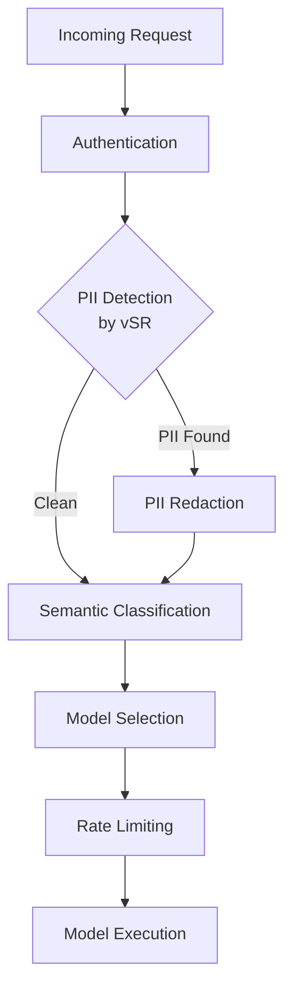

### 6.2 Security Controls

1. **Early PII Detection**: vSR performs PII detection before MaaS processing
2. **Token Scope Validation**: Ensure tokens have appropriate permissions for selected models
3. **Audit Logging**: Comprehensive logging of all routing and fallback decisions
4. **Data Isolation**: Semantic cache respects tenant isolation boundaries

### 6.3 Authorization Flow Security

The proposed Authorization-First flow ensures:
- **Authentication before Processing**: No semantic analysis occurs without valid authentication
- **Tier-Based Access Control**: Model selection respects user tier and permissions
- **Model-Specific RBAC**: Fine-grained access control for individual models
- **Budget Enforcement**: Prevents unauthorized access to expensive models

---

**Document Version**: 2.0  
**Last Updated**: December 2025  
**Review Status**: Ready for Architecture Review Board  
**Next Review Date**: January 2026
