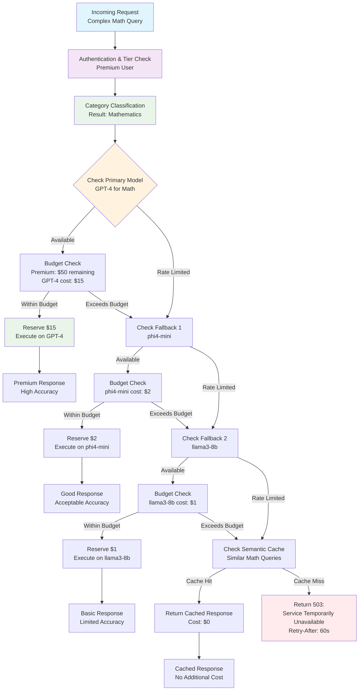
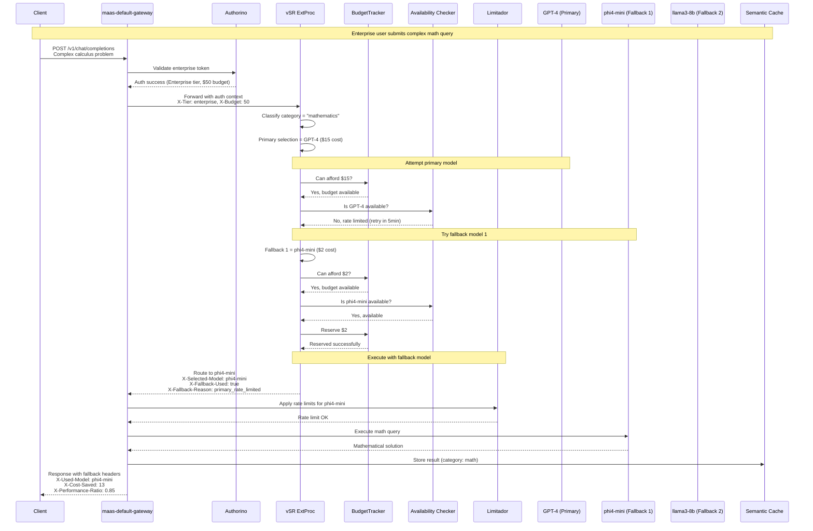

# Adaptive Throttling & Model Fallbacks

**Document**: Advanced Use Case Overview  
**Date**: December 2025  
**Related**: [Main Design Proposal](design-proposal-vsr-maas-integration.md)

## Overview

Adaptive throttling with intelligent model fallbacks represents one of the most sophisticated capabilities of the integrated vSR-MaaS platform. This feature enables cost-aware model selection with automatic downgrading when premium models reach capacity limits, ensuring service availability while optimizing costs.

## Use Case Scenario

**Enterprise Customer Journey**: A premium tier user submits a complex mathematical query that would optimally be routed to GPT-4, but the model has reached its rate limit. The system intelligently downgrades to a more affordable but still capable model (phi4-mini) while maintaining service availability.

## Scenario Description

### 1. Fallback Decision Flow

### 2. Request Flow with Fallback

## Expected Benefits

### 1. Cost Optimization
- **40-70% cost reduction** through intelligent model downgrading
- **Budget efficiency** with burst allowances for peak usage
- **Transparent cost tracking** with detailed per-request cost attribution

### 2. Service Availability
- **99.9% uptime** even when premium models are rate-limited
- **Graceful degradation** maintaining service quality within budget constraints
- **Intelligent caching** reducing repeated costs for similar queries

### 3. User Experience
- **Transparent fallbacks** with clear explanation headers
- **Performance awareness** with ratio indicators
- **Cost visibility** showing savings achieved through fallbacks

## Implementation Status

**Status**: To Be Determined (TBD)

The detailed implementation of this advanced use case, including:
- Component architecture and Go code implementations
- Configuration examples and YAML policies
- Monitoring metrics and alerting rules
- Testing strategies and validation procedures

Will be designed and implemented in subsequent phases of the vSR-MaaS integration project.