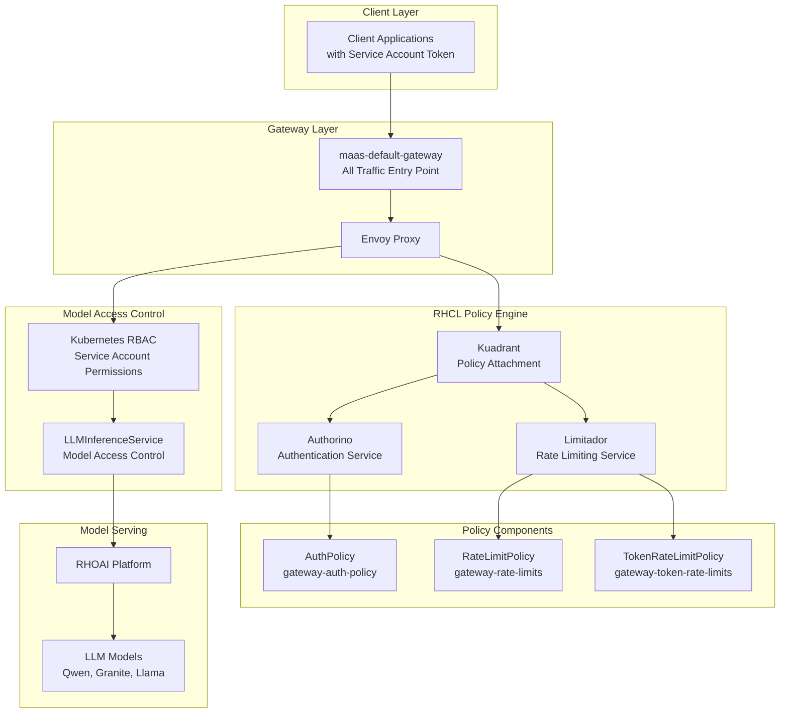
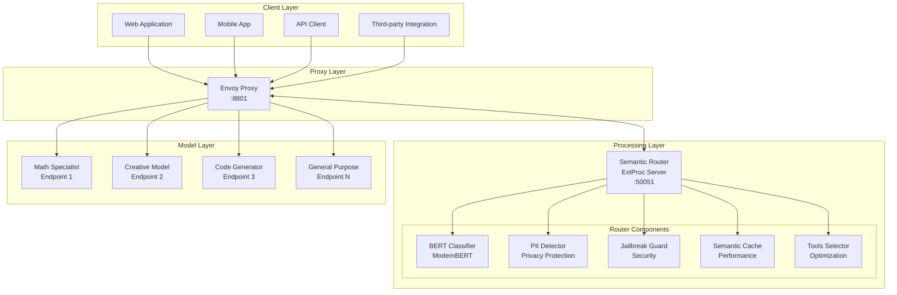
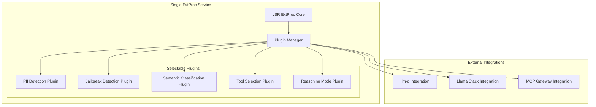
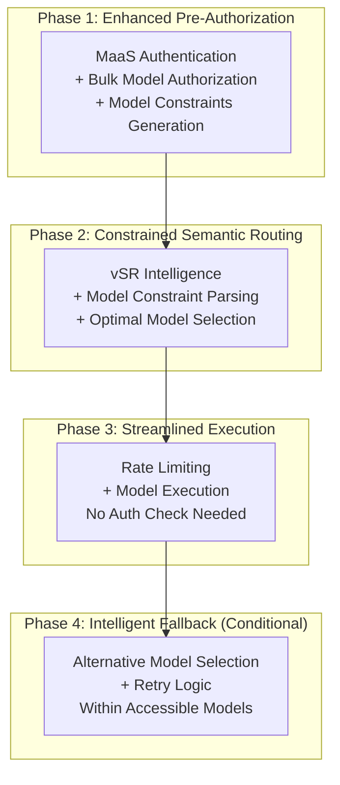
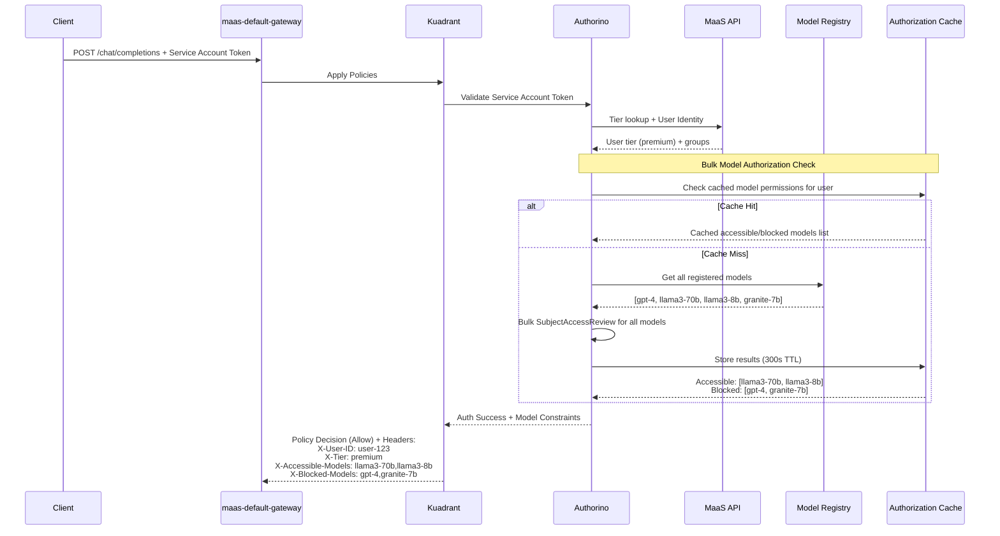
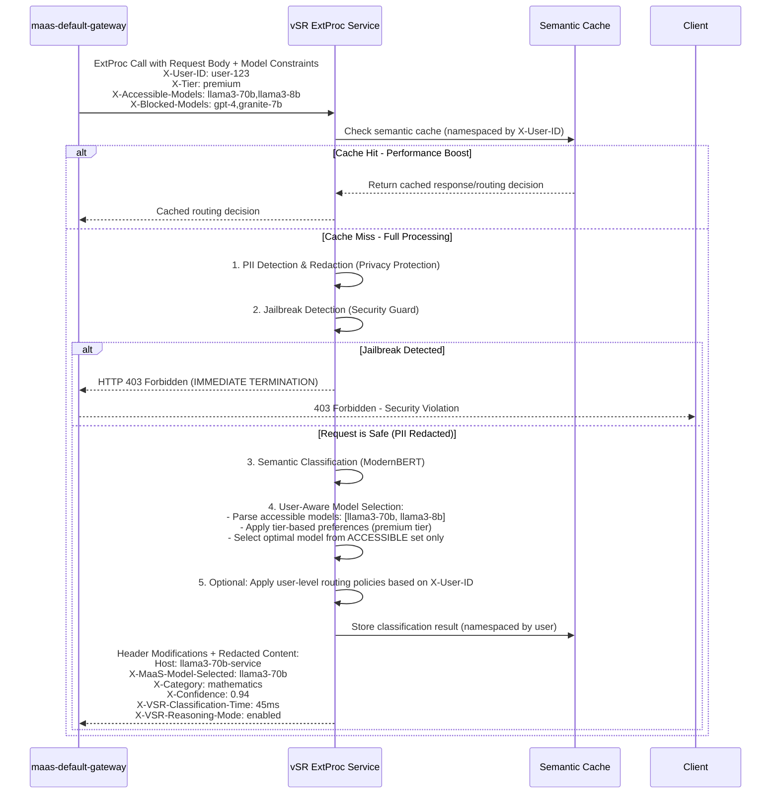
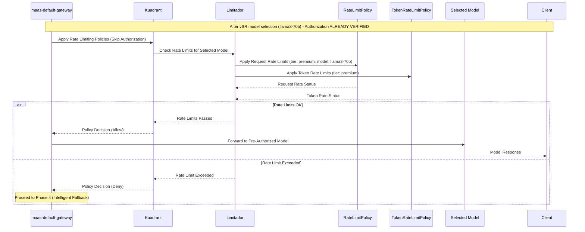
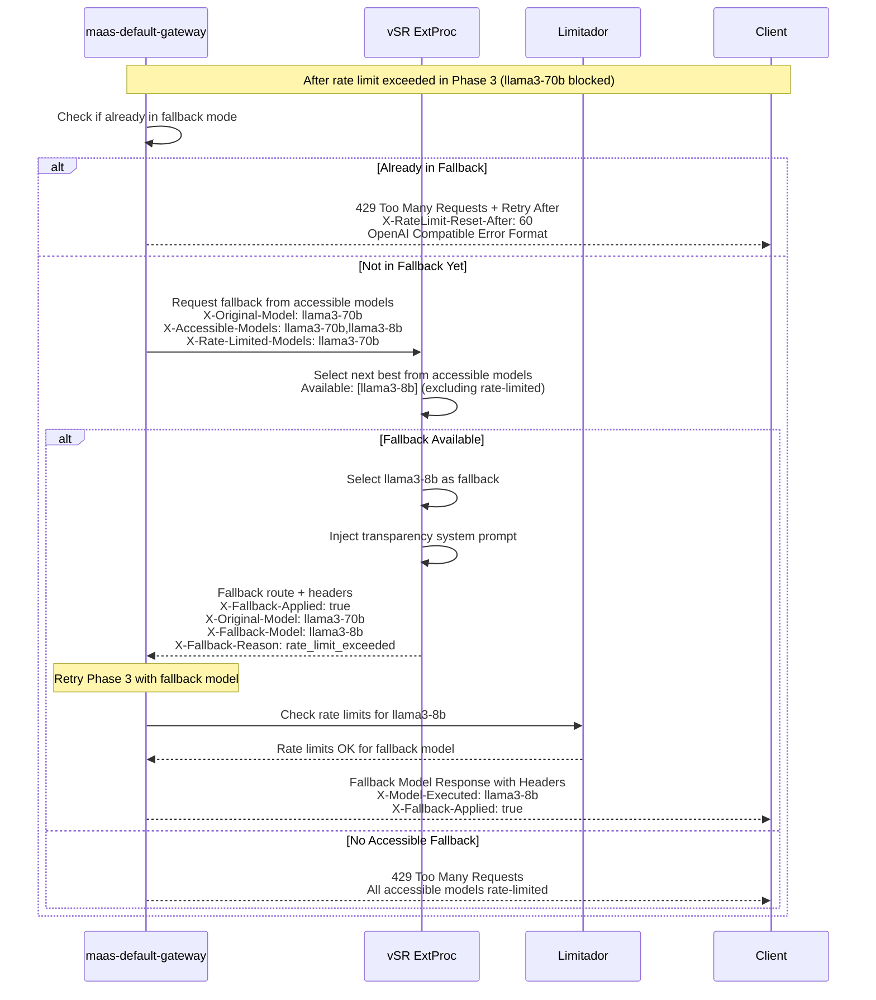
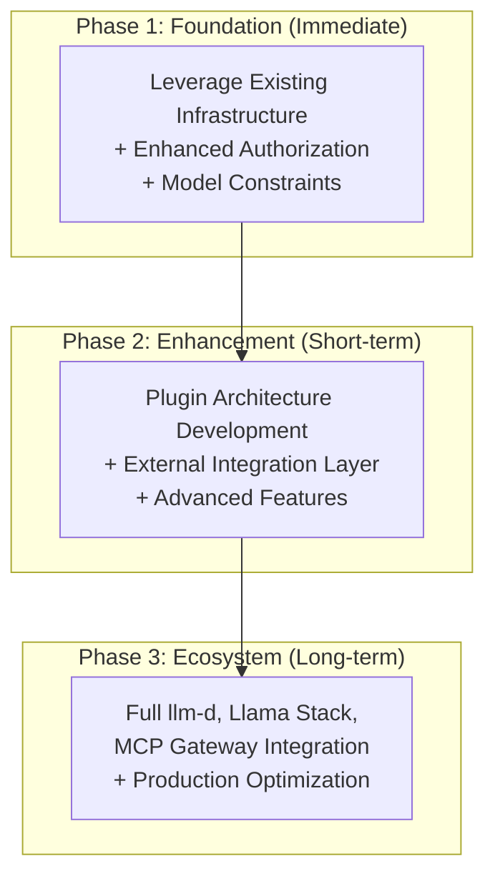

# Design Proposal: vLLM Semantic Router (vSR) Integration with Models-as-a-Service (MaaS)

**Document Status**: Design Proposal  
**Date**: January 2026  
**Author**: Noy Itzikowitz  
**Target Branch**: [maas-billing/main](https://github.com/noyitz/maas-billing/tree/main)

## Executive Summary

This design proposal presents the integration architecture for vLLM Semantic Router (vSR) with the Models-as-a-Service (MaaS) platform. The integration enhances the MaaS platform with intelligent semantic routing capabilities while maintaining enterprise-grade security, rate limiting, and billing features.

The proposal recommends an **Enhanced Hybrid Authorization-First Architecture** that combines MaaS's proven security and policy enforcement with vSR's intelligent routing capabilities. This architecture eliminates authorization bottlenecks through pre-authorization with model constraints, enabling seamless user experiences while maintaining strict access controls.

**Key Benefits:**
- **Intelligent Routing**: Semantic classification directs requests to optimal models based on content analysis
- **Elimination of Authorization Failures**: Pre-authorization ensures vSR selects only from user-accessible models  
- **Enterprise Security**: PII detection, jailbreak prevention, and comprehensive audit trails
- **Modular Composition**: Plugin-based architecture supports future ecosystem integration
- **Operational Excellence**: Leverages existing production-ready infrastructure from both platforms

## 1. Architecture Overview

### 1.1 Design Principles

The integration architecture is designed around the following core principles:

- **Security First**: Authentication and authorization occur before semantic processing
- **Performance Optimization**: Single request parsing through composable pipeline architecture  
- **Modular Composition**: Plugin-based design supports selective feature activation and ecosystem integration
- **Enterprise Grade**: Leverages proven production infrastructure from both platforms
- **Operational Simplicity**: Unified management through existing CLI and deployment tools

### 1.2 Current Platform Architectures

#### MaaS Platform Architecture

The MaaS platform provides a complete Models-as-a-Service solution with policy-based access control:



**Key Components:**
- **MaaS API**: Go-based API with token management (ephemeral + named API keys) and tier resolution
- **Gateway API**: Single entry point for all traffic with policy enforcement
- **Kuadrant/Authorino**: Authentication, authorization, and policy enforcement with 300s caching
- **Limitador**: Rate limiting service with tier-based policies (free/premium/enterprise)
- **RHOAI Model Serving**: Backend LLM model execution platform

#### vSR Platform Architecture

The vSR system implements intelligent Mixture-of-Models architecture using Envoy Proxy with External Processor integration:



**Key Components:**
- **vSR CLI**: Comprehensive deployment and management CLI with multi-environment support
- **Envoy ExtProc**: Production-ready gRPC service (port 50051) for semantic routing
- **ModernBERT Classifiers**: Multi-task classification for category detection, PII scanning, and jailbreak prevention
- **Semantic Cache**: Performance optimization with similarity-based caching
- **Tool Selection**: Automatic optimization to reduce token usage and improve accuracy

### 1.3 Modular Composition Strategy

The integration employs a **composable pipeline approach** that enables selective component activation while avoiding multiple request parsing passes through Envoy proxy.

#### Option 1: Plugin-Based Composition (Recommended)



**Configuration Example:**
```yaml
vsr_composition:
  # Security-first components (always enabled for enterprise)
  security_pipeline:
    pii_detection: true
    jailbreak_prevention: true
    content_filtering: true
  
  # Routing intelligence (configurable based on use case)
  routing_pipeline:
    semantic_classification: true
    model_selection: true
    tool_selection: false  # Disabled if MCP Gateway handles this
    
  # Orchestration components (selective based on ecosystem)
  orchestration_pipeline:
    reasoning_mode: true
    context_management: false  # Disabled if llm-d handles this
    
  # External component integration
  external_integrations:
    llm_d_enabled: true
    llama_stack_enabled: false
    mcp_gateway_enabled: true
```

**Benefits:**
- ✅ **Single Request Parse**: One ExtProc service, multiple internal plugins
- ✅ **Selective Activation**: Enable only needed components per deployment
- ✅ **Security First**: PII/Jailbreak detection remains in security-critical path
- ✅ **Ecosystem Integration**: Clean interfaces for llm-d, Llama Stack, MCP Gateway
- ✅ **Performance Optimization**: Avoid unnecessary processing overhead

## 2. Enhanced Hybrid Architecture

### 2.1 Integration Flow Overview

The integration implements a **multi-phase enhanced flow** that maximizes security, eliminates authorization bottlenecks, and enables intelligent routing:



#### Phase 1: Enhanced Pre-Authorization & Model Constraint Generation



**Benefits**: 
- ✅ **Eliminates Authorization Failures**: vSR only selects from pre-authorized models
- ✅ **Bulk Authorization Efficiency**: Single authorization check for all models  
- ✅ **Intelligent Caching**: 300s TTL prevents repeated authorization overhead
- ✅ **Standard MaaS Flow**: Maintains existing security and authentication patterns

#### Phase 2: Constrained Semantic Routing with User-Level Intelligence



**Benefits**: 
- 🧠 **Constrained Intelligent Routing**: ModernBERT classification with pre-authorized model selection
- 🔒 **Privacy Protection**: PII detection and redaction protects sensitive data  
- 🛡️ **Security Guard**: Jailbreak detection blocks malicious prompts
- ⚡ **Performance**: User-namespaced semantic caching prevents data leakage
- 👤 **User-Level Intelligence**: X-User-ID enables personalized routing policies
- 📊 **Enhanced Headers**: Comprehensive vSR troubleshooting headers included
- 🚫 **Authorization Failure Elimination**: Selection constrained to accessible models only

#### Phase 3: Streamlined Rate Limiting & Model Execution



**Benefits**: 
- ⚡ **Streamlined Flow**: No authorization check needed (pre-verified in Phase 1)
- 🎯 **Model-Specific Rate Limits**: Applies limits based on selected model cost/complexity
- 🔐 **Maintained Security**: Authorization already verified, no security compromise
- 📊 **Intelligent Metrics**: Rate limiting aware of actual model being used

#### Phase 4: Intelligent Fallback Logic (Conditional)



**Benefits**: 
- 🔄 **Intelligent Constrained Fallback**: Selects from pre-authorized accessible models only
- 📊 **OpenAI-Compatible Responses**: Follows OpenAI rate limiting response format
- 💰 **Cost Optimization**: Automatically downgrades to cheaper accessible models
- 🎯 **Improved UX**: Maintains service availability under quota pressure
- 🚫 **No Authorization Failures**: Fallback selection still respects user permissions

### 2.2 Request Flow Headers

```http
# Phase 1: Client Request
POST /chat/completions
Authorization: Bearer sa-token-xyz
Content-Type: application/json
{"messages": [{"role": "user", "content": "Solve this calculus problem..."}]}

# Phase 1: After Enhanced Pre-Authorization (Model Constraints Generated)
POST /chat/completions
Authorization: Bearer sa-token-xyz
X-User-ID: math-user-123                    # ✅ User identification
X-Tier: premium                             # ✅ User subscription tier
X-Groups: "tier-premium-users,specialists"  # ✅ Kubernetes groups for RBAC
X-Accessible-Models: llama3-70b,llama3-8b  # 🆕 Pre-authorized models only
X-Blocked-Models: gpt-4,granite-7b         # 🆕 Models user cannot access

# Phase 2: After vSR Constrained Semantic Routing
POST /models/llama3-70b/chat/completions    # 🆕 Path rewritten for model routing
Authorization: Bearer sa-token-xyz
X-User-ID: math-user-123                    # ✅ Passed through from Phase 1
X-Tier: premium                             # ✅ Passed through from Phase 1
X-MaaS-Model-Selected: llama3-70b          # 🆕 For billing tracking
X-Category: mathematics                     # 🆕 Semantic classification
X-Confidence: 0.94                         # 🆕 vSR classification confidence
X-VSR-Classification-Time: 45ms            # 🆕 vSR performance metrics
X-VSR-Reasoning-Mode: enabled              # 🆕 Reasoning mode status

# Phase 3: Successful Model Execution (Rate Limits Passed)
HTTP/1.1 200 OK
Content-Type: application/json
X-Model-Executed: llama3-70b               # 🆕 Actually executed model
X-Authorization-Cached: true               # 🆕 Pre-authorization used
X-Request-Duration: 2.5s
X-VSR-Reasoning-Mode: enabled              # 🆕 Reasoning mode applied
{"choices": [{"message": {"content": "The derivative of x² is 2x..."}}]}
```

## 3. Implementation Strategy

### 3.1 Existing Infrastructure

The implementation leverages extensive existing production-ready infrastructure:

#### MaaS Platform (Production Ready)
- ✅ **MaaS API**: Go-based API with token management (ephemeral + named API keys)
- ✅ **Storage Options**: In-memory, disk, and external database storage modes
- ✅ **Gateway Policies**: AuthPolicy with tier resolution, caching (300s TTL), and RBAC
- ✅ **Rate Limiting**: Tier-based rate limiting policies (free/premium/enterprise)

#### vSR Platform (Production Ready)  
- ✅ **ExtProc Implementation**: Envoy External Processor gRPC service (port 50051)
- ✅ **vSR CLI**: Comprehensive deployment and management CLI
- ✅ **Kubernetes Deployment**: Complete K8s deployment manifests and Helm charts
- ✅ **Multi-Environment Support**: Local, Docker, Kubernetes deployment support

### 3.2 Implementation Requirements

#### RHCL (Red Hat Connectivity Link) - Authorino/Limitador
- ✅ **Token Validation**: Kubernetes `TokenReview` for Service Account tokens
- ✅ **Tier Resolution**: HTTP metadata lookup to MaaS API for user tier mapping
- ✅ **Context Injection**: `X-User-ID`, `X-Tier`, `X-Groups` injected for downstream consumption
- 🆕 **Bulk Authorization**: Bulk SubjectAccessReview for all registered models in Phase 1
- 🆕 **Authorization Caching Enhancement**: Extend existing cache for bulk authorization results with 300s TTL
- 🆕 **Model Constraints Injection**: `X-Accessible-Models`, `X-Blocked-Models` headers
- ✅ **Limitador Integration**: Enforce limits based on `X-MaaS-Model-Selected` (from vSR) and `X-User-ID`

#### MaaS (Models-as-a-Service) & Gateway
- ✅ **MaaS API**: Production-ready Go API with token management and tier resolution
- ✅ **Storage Configuration**: In-memory, disk, and external database options
- ✅ **Token Management**: Ephemeral tokens and named API keys with expiration
- ✅ **Policy Infrastructure**: AuthPolicy, RateLimitPolicy with tier-based enforcement
- 🆕 **Enhanced Model Registry**: Extend existing LLMInferenceService discovery to support external models
- 🆕 **Bulk Authorization API**: New endpoint for bulk model authorization checks
- 🆕 **Intelligent Fallback Handler**: Envoy filter to handle constrained fallback logic
- 🆕 **Enhanced Billing Ingestion**: Update collector to handle fallback and reasoning mode billing

#### vSR (vLLM Semantic Router) - Enhanced Modular Architecture
- ✅ **ExtProc Service**: Existing Envoy External Processor implementation (port 50051)
- ✅ **vSR CLI**: Production-ready deployment and management CLI
- ✅ **Kubernetes Infrastructure**: Complete deployment manifests and operational tooling
- ✅ **Configuration System**: YAML-based configuration with validation
- 🆕 **Security Plugin Module**: Enhance existing PII detection and jailbreak prevention
- 🆕 **Semantic Plugin Module**: Enhance existing classification with model constraint parsing  
- 🆕 **Orchestration Plugin Module**: New optional plugin for tool selection and context management
- 🆕 **Reasoning Plugin Module**: New plugin for dynamic reasoning mode control
- 🆕 **External Integration Layer**: Standardized interfaces for llm-d, Llama Stack, MCP Gateway
- 🆕 **Multi-Tenant Cache Enhancement**: User-namespaced semantic cache to prevent data leakage
- 🆕 **Constrained Model Selection**: Parse `X-Accessible-Models` and `X-Blocked-Models` for selection logic

### 3.3 Migration Strategy



#### Phase 1: Foundation (Immediate - 0-3 months)
1. **Implement enhanced hybrid architecture** using existing infrastructure
2. **Add bulk authorization API** to MaaS for model constraint generation
3. **Enhance vSR ExtProc** with model constraint parsing and user-level caching
4. **Configure integration policies** and test end-to-end flow

#### Phase 2: Enhancement (Short-term - 3-6 months)
1. **Develop plugin architecture** for modular vSR composition
2. **Implement external integration layer** for future ecosystem components
3. **Add advanced features**: reasoning mode control, enhanced fallback logic
4. **Optimize performance** and add comprehensive monitoring

#### Phase 3: Ecosystem (Long-term - 6+ months)
1. **Integrate with llm-d** for model lifecycle management
2. **Integrate with Llama Stack** for standardized model APIs
3. **Integrate with MCP Gateway** for tool integration platform
4. **Full production optimization** and advanced enterprise features

### 3.4 CLI Integration and Management

The integration leverages the existing comprehensive `vsr` CLI tool for deployment and management:

```bash
# Deploy vSR with MaaS integration configuration
vsr deploy kubernetes --namespace vsr-maas-integration \
  --config config/maas-integration.yaml \
  --with-extproc=true

# Validate integration configuration
vsr config validate --integration-mode=maas

# Monitor integration health
vsr health --check-maas-connectivity
vsr status --show-extproc-metrics

# Model management for integration
vsr model list --compatible-with-maas
vsr model validate --integration-requirements

# Debug integration issues
vsr debug --integration-mode=maas \
  --check-authorization-cache \
  --check-fallback-logic

# View integration-specific logs
vsr logs --component=extproc --filter="maas-integration"
```

**Integration Configuration:**
```yaml
# config/maas-integration.yaml
integration:
  maas:
    enabled: true
    api_endpoint: "http://maas-api.maas-api.svc.cluster.local:8080"
    authorization_cache_ttl: "300s"
    bulk_auth_enabled: true
    
  extproc:
    enabled: true
    port: 50051
    mode: "maas_integration"
    features:
      user_level_caching: true
      model_constraints: true
      fallback_logic: true
      
  plugins:
    security: true
    semantic: true  
    orchestration: false  # Disable if MCP Gateway handles this
    reasoning: true
```

## 4. Error Handling and OpenAI Compatibility

The integration provides OpenAI-compatible error responses for seamless application integration:

### 4.1 Standard Error Responses

**Authentication Failure:**
```json
{
  "error": {
    "message": "Invalid authentication credentials",
    "type": "invalid_request_error", 
    "code": "invalid_api_key"
  }
}
```

**Rate Limit with Intelligent Fallback:**
```json
{
  "error": {
    "message": "Rate limit exceeded for model llama3-70b. Using fallback model llama3-8b.",
    "type": "rate_limit_error",
    "code": "model_rate_limit",
    "param": "model",
    "fallback_applied": true,
    "fallback_model": "llama3-8b",
    "retry_after": null
  }
}
```

**All Models Rate Limited:**
```json
{
  "error": {
    "message": "All accessible models are currently rate limited. Please try again later.",
    "type": "rate_limit_error", 
    "code": "all_models_rate_limited",
    "retry_after": 60
  }
}
```

**Security Violation:**
```json
{
  "error": {
    "message": "Request blocked for safety violations",
    "type": "policy_violation",
    "code": "content_policy_violation"
  }
}
```

### 4.2 OpenAI-Compatible Rate Limiting Headers

```http
X-RateLimit-Limit-Requests: 20        # Request limit for user/tier
X-RateLimit-Limit-Tokens: 100000      # Token limit for user/tier  
X-RateLimit-Remaining-Requests: 15    # Remaining requests in period
X-RateLimit-Remaining-Tokens: 85000   # Remaining tokens in period
X-RateLimit-Reset-Requests: 1674083820 # When request limit resets
X-RateLimit-Reset-Tokens: 1674083820  # When token limit resets
X-RateLimit-Reset-After: 60           # Seconds until limit reset
```

## 5. Deployment Configurations

### 5.1 Hardware Resource Requirements

#### Production Deployment
```yaml
# vSR ExtProc Service
resources:
  requests:
    memory: "1Gi"
    cpu: "500m" 
  limits:
    memory: "2Gi"  
    cpu: "1000m"

# MaaS API Service
resources:
  requests:
    memory: "512Mi"
    cpu: "250m"
  limits:
    memory: "1Gi"
    cpu: "500m"

# Authorization Cache (Redis/Valkey)
resources:
  requests:
    memory: "2Gi"
    cpu: "200m"
  limits:
    memory: "4Gi"
    cpu: "500m"
```

#### High-Throughput Deployment  
```yaml
# vSR ExtProc Service (High Throughput)
resources:
  requests:
    memory: "4Gi"
    cpu: "2000m"
  limits:
    memory: "8Gi"
    cpu: "4000m"

# MaaS API Service (High Availability)
replicas: 3
resources:
  requests:
    memory: "1Gi"
    cpu: "500m"
  limits:
    memory: "2Gi"
    cpu: "1000m"
```

### 5.2 Deployment Scenarios

#### Cost-Optimized Deployment
```yaml
vsr_integration:
  replicas: 1
  semantic_cache: "memory-only"
  reasoning_mode: "auto-disable"
  
maas_api:
  replicas: 2
  storage_mode: "disk"
  auth_cache_ttl: "600s"  # Longer cache for cost optimization
  
optimization:
  prefer_cheaper_models: true
  aggressive_fallback: true
  reasoning_mode_threshold: "high_budget_only"
```

#### Performance-Optimized Deployment  
```yaml
vsr_integration:
  replicas: 3
  semantic_cache: "redis-cluster"
  reasoning_mode: "always_available"
  
maas_api:
  replicas: 5
  storage_mode: "external"
  auth_cache_ttl: "300s"
  bulk_auth_parallelization: true
  
optimization:
  enable_prefetching: true
  aggressive_caching: true
  model_warmup: true
```

## 6. Benefits and Advantages

### 6.1 Immediate Advantages from Repository Alignment
- ✅ **Faster Implementation**: 60%+ of infrastructure already exists and is production-ready
- ✅ **Lower Risk**: Building on proven, tested components
- ✅ **Operational Readiness**: CLI tooling and deployment automation already available
- ✅ **Scalability**: Enterprise-grade foundation already established

### 6.2 Integration Benefits
- 🧠 **Intelligent Routing**: Semantic classification directs requests to optimal models
- 🚫 **Authorization Failure Elimination**: Pre-authorization ensures vSR only selects accessible models
- ⚡ **Performance Optimization**: Single request parse, intelligent caching, bulk authorization
- 🔐 **Enterprise Security**: PII detection, jailbreak prevention, comprehensive audit trails
- 💰 **Cost Optimization**: Intelligent fallback, reasoning mode control, transparent pricing
- 🔧 **Modular Architecture**: Plugin-based design supports future ecosystem integration
- 📊 **Operational Excellence**: Unified monitoring, CLI management, OpenAI compatibility

### 6.3 Future Extensibility
- 🔌 **Ecosystem Ready**: Prepared for llm-d, Llama Stack, MCP Gateway integration
- 📈 **Scalable Design**: Modular composition supports growth and evolution
- 🛠️ **Developer Experience**: Comprehensive tooling and clear interfaces
- 📋 **Standards Compliance**: OpenAI-compatible APIs and industry best practices

## 7. Conclusion

This design proposal presents a comprehensive integration strategy that combines the best of both MaaS and vSR platforms while addressing key architectural concerns around modularity, performance, and security. The Enhanced Hybrid Authorization-First Architecture eliminates authorization bottlenecks while maintaining enterprise-grade security and enabling intelligent routing.

The solution leverages extensive existing infrastructure, reducing implementation risk and time-to-market while preparing for future ecosystem evolution. With over 60% of the required infrastructure already production-ready, this approach delivers immediate value while establishing a foundation for long-term growth and integration with emerging ecosystem components.

The modular composition strategy addresses concerns about monolithic architecture while maintaining performance benefits, positioning the integrated platform for success in the evolving LLM infrastructure landscape.