# Design Proposal: vLLM Semantic Router (vSR) Integration with Models-as-a-Service (MaaS)

**Document Status**: Draft  
**Date**: December 2025  
**Author**: Noy Itzikowitz  
**Target Branch**: [maas-billing/main](https://github.com/noyitz/maas-billing/tree/main)

## Executive Summary

This design proposal outlines the integration strategy for vLLM Semantic Router (vSR) with the Models-as-a-Service (MaaS) platform. The integration aims to enhance the MaaS platform with intelligent semantic routing capabilities while maintaining robust rate limiting, billing, and security features.

The proposal evaluates two primary integration patterns and recommends a hybrid approach that maximizes the benefits of both systems while addressing critical challenges in model selection, rate limiting, and adaptive throttling.

## 1. Architecture Overview

### Current MaaS Architecture

The MaaS platform provides a complete Models-as-a-Service solution with policy-based access control:

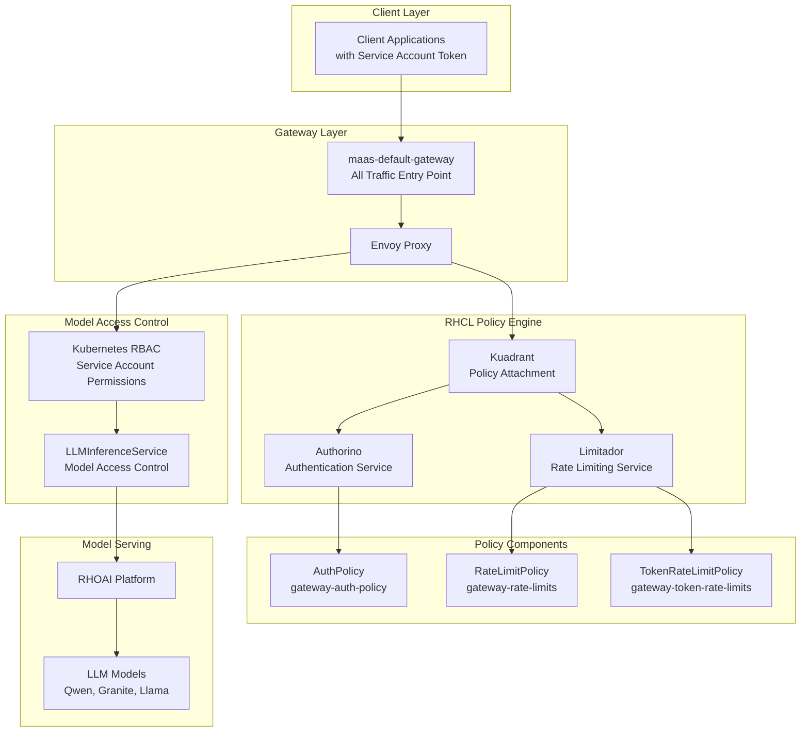

**Key Components:**
- **maas-default-gateway**: Single entry point for all traffic (token requests and inference)
- **RHCL (Red Hat Connectivity Link)**: Policy engine handling authentication and authorization
- **Authorino**: Token validation (OpenShift tokens for MaaS API, Service Account tokens for inference)
- **Limitador**: Rate limiting and quota enforcement
- **RHOAI Model Serving**: Backend LLM model execution platform

#### Model Inference Request Flow

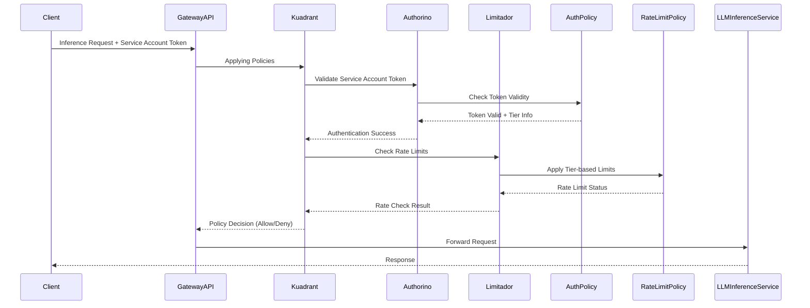

### Current vSR Architecture

The vSR system implements a sophisticated Mixture-of-Models architecture using Envoy Proxy with External Processor integration:

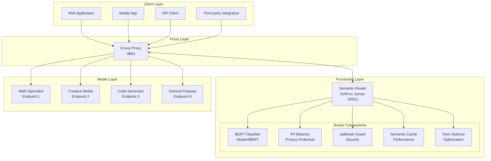

**Key Components:**
- **Envoy Proxy**: Traffic management layer with load balancing, health checking, and request/response processing
- **vSR ExtProc Service**: Go-based gRPC service providing semantic classification and routing intelligence
- **ModernBERT Classifiers**: Multi-task classification for category detection, PII scanning, and jailbreak prevention
- **Semantic Cache**: Performance optimization with similarity-based caching
- **Tool Selection**: Automatic optimization to reduce token usage and improve accuracy

#### Request Processing Pipeline

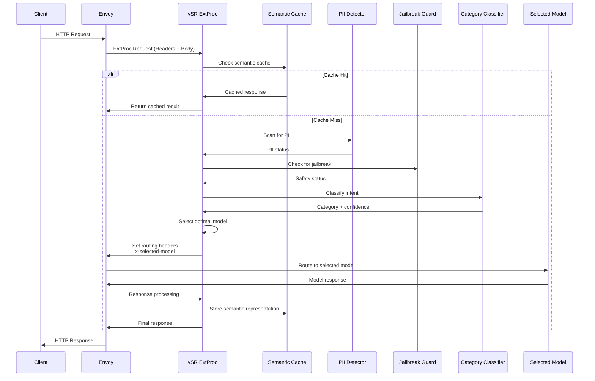


## 2. Authorization (AuthZ) Analysis

### 2.1 MaaS Authorization Architecture

MaaS implements a comprehensive authorization system using Authorino with multi-layered access control:

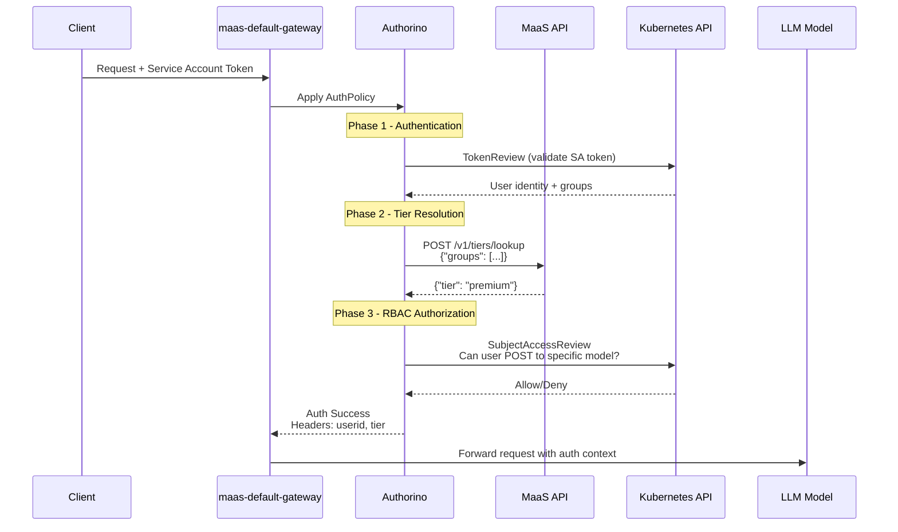

**Key Authorization Components:**
- **Authentication**: Kubernetes TokenReview validates Service Account tokens
- **Tier Resolution**: MaaS API maps user groups to subscription tiers (free/premium/enterprise)
- **RBAC Authorization**: Kubernetes SubjectAccessReview checks model-specific permissions
- **Context Injection**: Auth metadata (userid, tier) added to request headers

### 2.2 vSR Authorization Architecture 

vSR currently operates as a pure routing layer without built-in authorization:

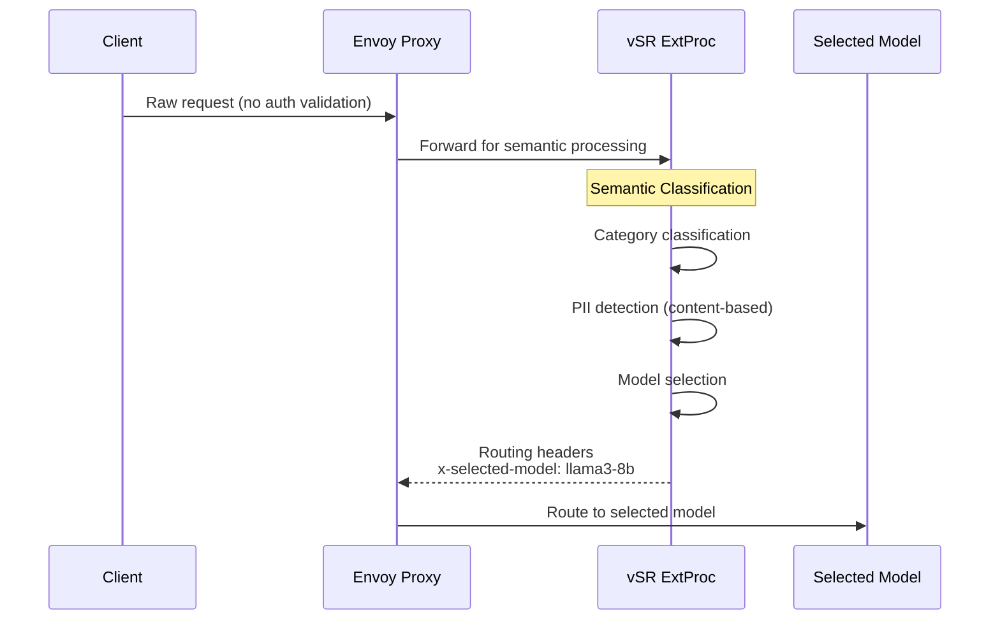

**Key Characteristics:**
- **No Built-in AuthZ**: vSR assumes requests are pre-authorized
- **Content-based Security**: PII detection and jailbreak prevention based on request content
- **Model Selection**: Intelligent routing based on semantic analysis
- **Stateless Design**: No user context or session management

## 3. Comparative Analysis: Order of Operations

### Option A: MaaS before vSR (MaaS → vSR)

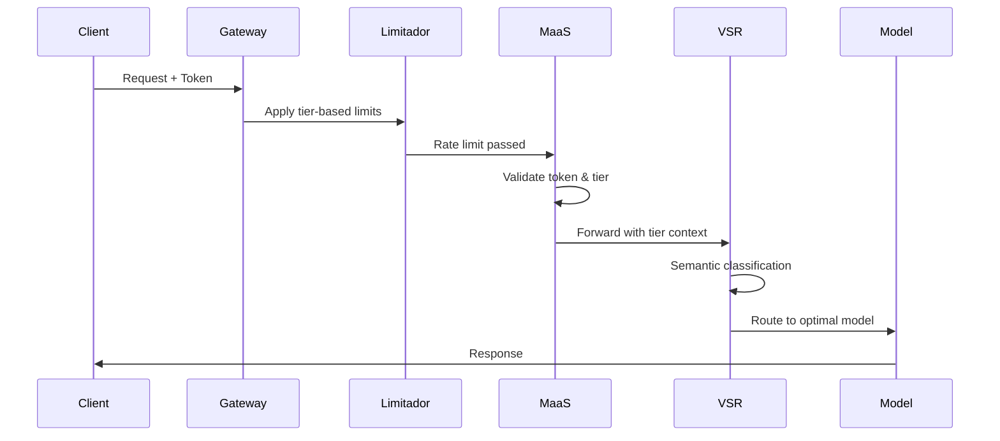

#### Gains vs. Losses Analysis

| **Gains** | **Losses** |
|-----------|------------|
| **✅ Early Authentication**: Token validation and tier resolution happens immediately | **❌ No Per-Model Rate Limiting**: Cannot apply model-specific limits since model selection hasn't occurred |
| **✅ Security First**: Authentication and authorization happen before semantic processing | **❌ Wasted Processing**: Rate limiting occurs before knowing if expensive models will be used |
| **✅ Proven Architecture**: Leverages existing MaaS patterns and policies | **❌ Suboptimal Resource Allocation**: Cannot differentiate between high/low cost model requests for rate limiting |
| **✅ Consistent User Experience**: All users follow the same authentication flow | **❌ Limited Fallback Options**: No opportunity for model downgrading when premium models hit limits |
| **✅ Operational Simplicity**: No changes needed to existing MaaS rate limiting policies | **❌ Missed Optimization**: Cannot leverage semantic caching early to avoid downstream processing |

### Option B: vSR before MaaS (vSR → MaaS)

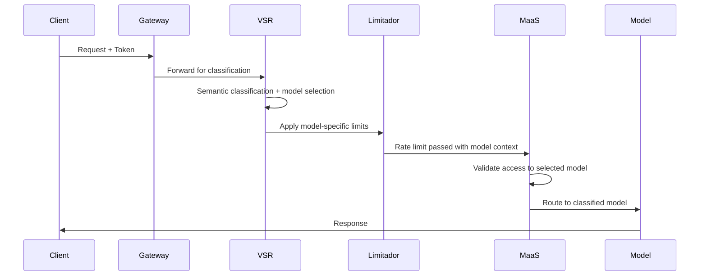

#### Gains vs. Losses Analysis

| **Gains** | **Losses** |
|-----------|------------|
| **✅ Per-Model Rate Limiting**: Can apply specific limits based on model cost and complexity | **❌ Security Risk**: Semantic processing occurs before full authentication |
| **✅ Intelligent Resource Management**: Rate limits can consider model computational costs | **❌ Authentication Bypass Risk**: Risk of processing requests with invalid tokens through semantic router |
| **✅ Advanced Fallback**: Can downgrade to cheaper models when expensive ones hit limits | **❌ Complex Error Handling**: Authentication failures after semantic processing waste resources |
| **✅ Semantic Caching Benefits**: Early caching can prevent downstream processing entirely | **❌ Tier Resolution Complexity**: vSR needs access to user tier information for proper model selection |
| **✅ Optimal Tool Selection**: Tools can be selected before rate limiting, improving accuracy | **❌ Architectural Disruption**: Requires significant changes to existing MaaS auth flow |

## 4. Proposed Solution

Based on the analysis of both options, we recommend the **Hybrid Authorization-First Architecture** that strategically combines the security benefits of Option A with the intelligent routing capabilities of Option B.

### 4.1 Hybrid Approach: Best of Both Worlds

The solution implements a **multi-phase hybrid flow** that maximizes security, performance, and intelligent routing:

**🔒 Phase 1: vSR Access Authorization**  
Kuadrant → Authorino authentication and vSR access control

**🧠 Phase 2: vSR Intelligence**  
Semantic caching, PII detection, jailbreak prevention, and intelligent model routing

**🔐 Phase 3: Model-Specific Authorization**  
Kuadrant → Authorino authorization for the selected model

**⚖️ Phase 4: Rate Limiting & Execution**  
Kuadrant → Limitador rate limiting (requests + tokens) then model execution

**🔄 Phase 4.5: Adaptive Fallback Logic** *(Conditional - Only if Phase 4 fails)*  
When rate limits are exceeded, request fallback model from vSR and retry authorization + rate limiting

**📊 Phase 5: Dynamic Billing** *(Future Extension)*  
Accurate cost tracking based on actual model selection

This hybrid approach ensures **enterprise security** and **intelligent routing**, with proven rate limiting applied after model selection for optimal user experience.

#### Architecture Overview

The integration uses **Envoy External Processing (ExtProc)** to seamlessly combine MaaS and vSR capabilities in a single request flow.

### 4.2 Phase-by-Phase Implementation

#### Phase 1: vSR Access Authorization

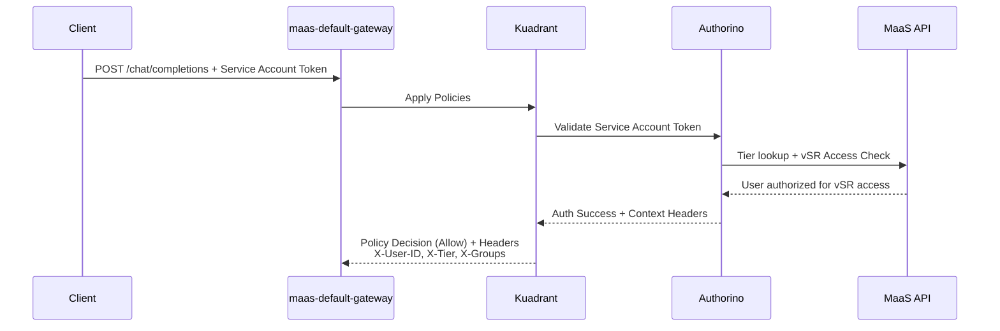

**Benefits**: ✅ Standard MaaS auth flow, proven security model, vSR access control

#### Phase 2: vSR Intelligence with Advanced Features

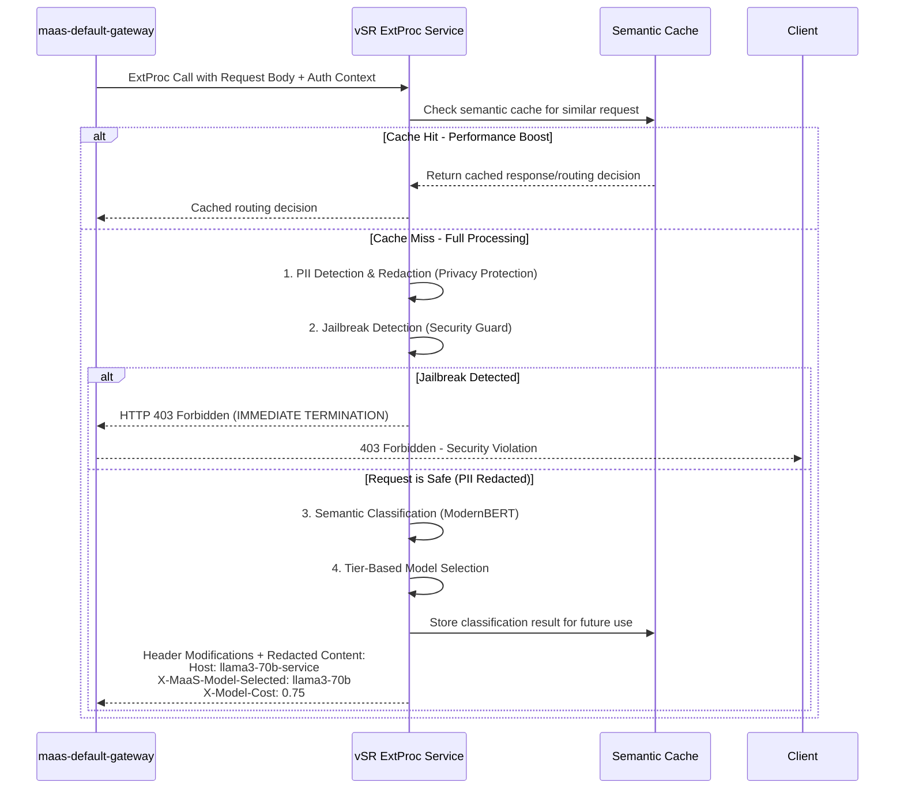

**Benefits**: 
- 🧠 **Intelligent Routing**: ModernBERT semantic classification for optimal model selection
- 🔒 **Privacy Protection**: PII detection and redaction protects sensitive data  
- 🛡️ **Security Guard**: Jailbreak detection blocks malicious prompts
- ⚡ **Performance**: Semantic caching reduces latency for similar requests
- 📊 **Dynamic Billing**: Accurate cost metadata injection

#### Phase 3: Model-Specific Authorization

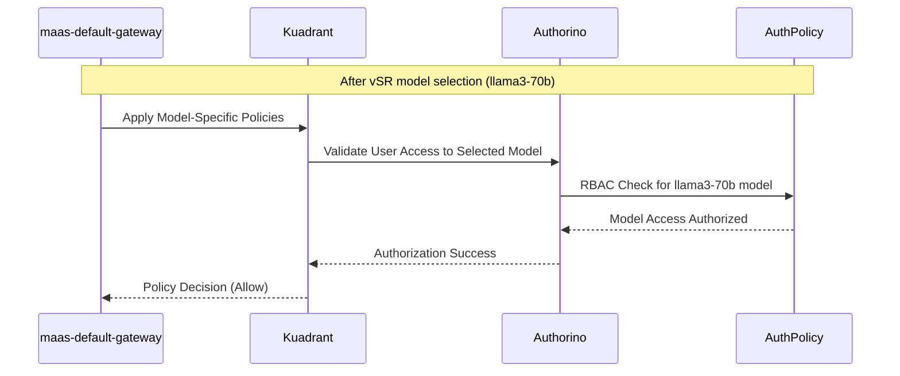

**Benefits**: 🔐 Standard MaaS model authorization, granular access control per model

#### Phase 4: Rate Limiting & Model Execution

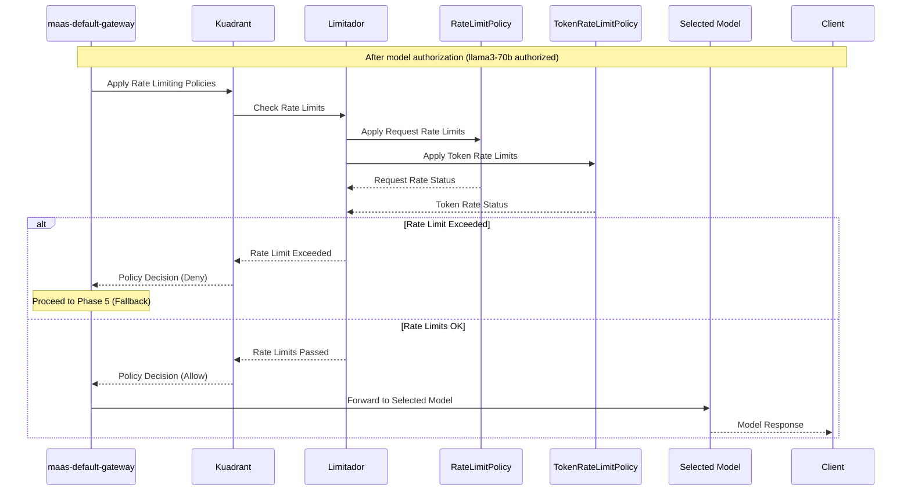

**Benefits**: ⚖️ Standard MaaS rate limiting, both request and token limits, proven reliability

#### Phase 4.5: Adaptive Fallback Logic (Conditional)

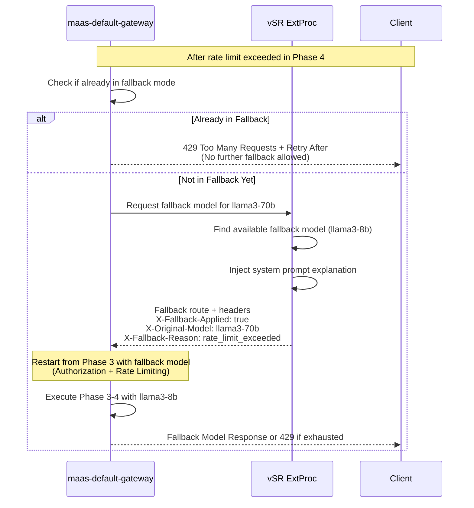

**Benefits**: 
- 🔄 **Intelligent Fallback**: Users get responses instead of immediate 429 errors
- 📊 **Transparent Communication**: Users understand why they got a different model
- 💰 **Cost Optimization**: Utilizes available cheaper models when expensive ones are exhausted
- 🎯 **Improved UX**: Maintains service availability under quota pressure

#### Phase 5: Dynamic Billing (Future Extension)

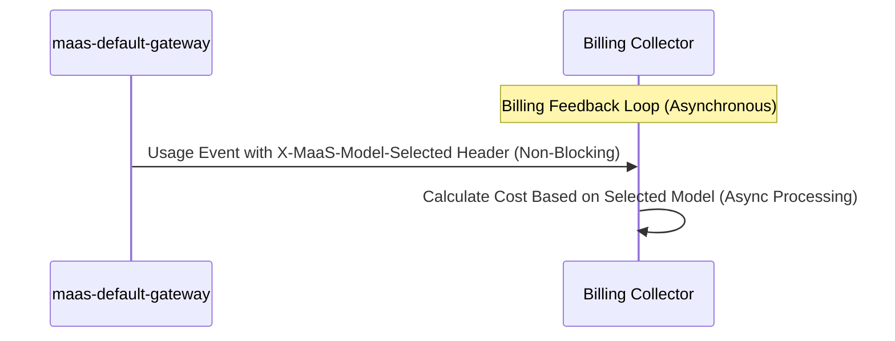

**Benefits**: 📊 Accurate billing, async processing, cost optimization

### 4.3 Implementation Summary

**Core Integration Scope** (Phases 1-4.5): The vSR-MaaS integration focuses on combining MaaS authentication/authorization with vSR intelligent routing, model-specific authorization, standard rate limiting, and conditional adaptive fallback logic.

**Future Extensions** (Phase 5): Enhanced billing features that can be added later without disrupting the core integration.

**Architecture Pattern**: Envoy External Processing (ExtProc) enables seamless integration between MaaS security framework and vSR intelligence without disrupting existing systems.

### 4.4 Adaptive Throttling & Fallback Strategy

**Critical Challenge**: The "Fallback Trap" - Premium users hitting Llama-70b quotas receive 429 errors instead of intelligent fallback to available models, leading to service denial despite having access to other models.

**Business Impact**: Poor user experience when expensive models are exhausted, missed opportunity to utilize available cheaper models, potential user churn due to service unavailability.

**Solution Strategy**: Proactive rate limit checking with intelligent fallback hierarchy:

#### Fallback Decision Tree

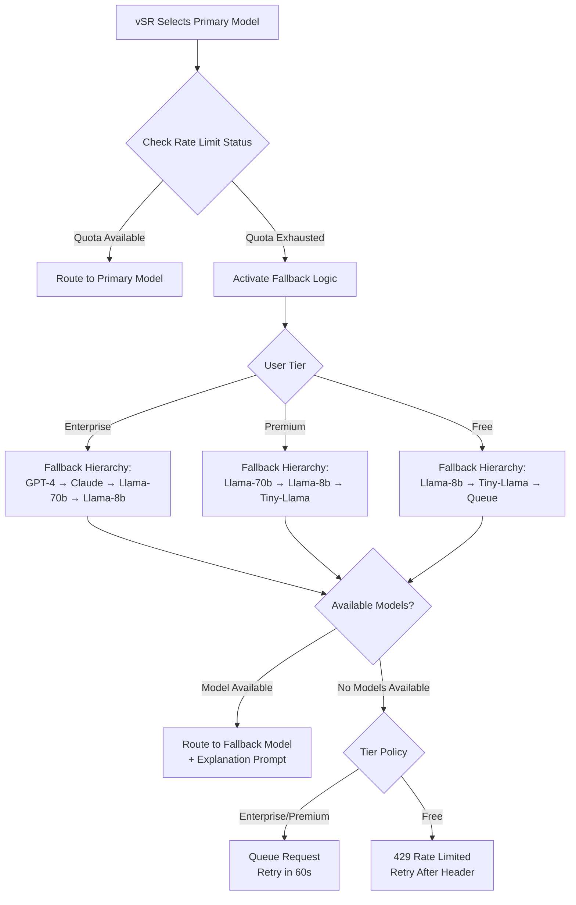

#### System Prompt Injection for Fallbacks

When fallback occurs, vSR automatically injects explanatory system prompts:

```http
# Example: Premium user fallback from Llama-70b to Llama-8b
POST /models/llama3-8b/chat/completions
X-Fallback-Applied: true
X-Original-Model: llama3-70b  
X-Fallback-Reason: rate_limit_exceeded

# Injected system message:
{
  "role": "system", 
  "content": "Note: I am Llama-8B responding to this request. You requested our premium Llama-70B model, but your quota is temporarily exhausted. I will do my best to provide a helpful response with my capabilities."
}
```

**Fallback Benefits**:
- **Service Continuity**: Users get responses instead of 429 errors
- **Transparent Communication**: Clear explanation of model changes
- **Resource Optimization**: Utilizes available capacity across model fleet
- **Business Value**: Maintains user engagement during peak usage periods

**Key Security Requirements:**

For comprehensive security analysis including header trust boundary protection, access control, and fraud prevention, see:
**[📋 Security Considerations](security-considerations.md)**

This document covers:
- Header sanitization to prevent billing fraud
- Semantic routing access control and authorization
- Performance protection through conditional ExtProc
- Enhanced threat modeling and risk assessment
- Comprehensive security monitoring and audit trails

**Core Technologies**: ✅ MaaS (Authorino, Limitador) + 🆕 vSR (Python ExtProc)

**Integration Benefits**:
- **Security**: Proven MaaS authentication + vSR PII detection + jailbreak prevention  
- **Rate Limiting**: Existing tier-based rate limiting applied after intelligent routing
- **Intelligence**: ModernBERT semantic classification with intelligent model routing
- **Performance**: Semantic caching + async processing for optimal latency
- **Privacy**: Automated PII detection and protection across all requests

**Component Interactions:**
- **KServe Model Serving**: Backend model execution platform ✅ **(Supported Today)**
- **Billing Collector**: Enhanced to read dynamic model metadata for accurate accounting 🆕 **(NEW - MaaS Enhancement Required)**
- **Usage Tracking**: Cost calculation based on actual selected model, not API path

For detailed billing enhancement implementation, see:
**[📋 Billing Feedback Loop (Future Enhancement)](billing-feedback-loop.md)**

This document covers dynamic billing metadata for accurate cost tracking based on actual model selection. This is a future enhancement that can improve billing accuracy but is not required for the core vSR-MaaS integration.


#### Component Communication Patterns

**Complete Request Flow Headers:**

```http
# Phase 1: Client Request
POST /chat/completions
Authorization: Bearer sa-token-xyz
Content-Type: application/json
{"messages": [{"role": "user", "content": "Solve this calculus problem..."}]}

# Phase 2: After Authorino (Auth Context Added)
POST /chat/completions
Authorization: Bearer sa-token-xyz
X-User-ID: math-user-123                    # ✅ Supported Today
X-Tier: premium                             # ✅ Supported Today
X-Groups: "tier-premium-users,specialists"  # 🔍 Likely Supported

# Phase 3: After vSR ExtProc (Model Selection & Routing)
POST /models/llama3-70b/chat/completions    # 🆕 NEW - Path rewritten for model routing
Authorization: Bearer sa-token-xyz
X-User-ID: math-user-123                    # ✅ Passed through from Phase 2
X-Tier: premium                             # ✅ Passed through from Phase 2
X-MaaS-Model-Selected: llama3-70b          # 🆕 NEW - For billing tracking
X-Category: mathematics                     # 🆕 NEW - Semantic classification

# Phase 4: Rate Limiting & Model Execution
POST /models/llama3-70b/chat/completions
Authorization: Bearer sa-token-xyz
X-User-ID: math-user-123                    # ✅ Used for rate limiting
X-Tier: premium                             # ✅ Used for rate limiting

# Phase 5: Billing Collection (Usage Event)
Event: {
  "user_id": "math-user-123",
  "api_path": "/chat/completions", 
  "selected_model": "llama3-70b",
  "actual_cost": 0.75,
  "billing_override": true
}
```

**Error Handling and Fallbacks:**
- **Authentication Failure**: 401 Unauthorized with clear error message ✅ **(Supported Today)**
- **Authorization Failure**: 403 Forbidden with permission requirements ✅ **(Supported Today)**
- **Rate Limit Exceeded**: 429 Too Many Requests with retry-after guidance ✅ **(Supported Today)**
- **Model Unavailable**: Automatic fallback or 503 Service Unavailable 🆕 **(NEW - vSR Enhancement Required)**
- **Budget Exceeded**: Cost-aware error with budget status 🆕 **(NEW - MaaS/vSR Enhancement Required)**

**Performance Optimizations:**
- **Caching Strategy**: Multi-layer caching for auth decisions, tier mappings, and semantic results 🔄 **(Enhanced - Both Components)**
- **Connection Pooling**: Efficient connections between gateway components ✅ **(Supported Today)**
- **Async Processing**: Non-blocking operations where possible ✅ **(Supported Today)**
- **Circuit Breakers**: Protection against cascading failures 🆕 **(NEW - vSR Enhancement Required)**

This Authorization-First flow ensures enterprise-grade security while enabling the intelligent routing capabilities of vSR, creating a robust and scalable foundation for the integrated platform.

### Implementation Requirements Summary

#### RHCL (Red Hat Connectivity Link) - Authorino/Limitador
- ✅ **Token Validation**: Kubernetes `TokenReview` for Service Account tokens
- ✅ **Tier Resolution**: HTTP metadata lookup to MaaS API for user tier mapping
- ✅ **Header Injection**: `X-User-ID`, `X-Tier`, `X-Groups` via JSON injection
- ✅ **RBAC Authorization**: SubjectAccessReview for model access control
- ✅ **User/Tier Rate Limiting**: Request and token limits per tier via Limitador

#### MaaS (Models-as-a-Service)
- ✅ **Service Account Token Management**: Generate tokens for model access
- ✅ **Tier Mapping**: Map user groups to subscription tiers (free/premium/enterprise)
- ✅ **Model Discovery**: List available KServe/LLMInferenceService models
- ✅ **Usage Tracking**: Basic request/token metrics via Limitador
- ✅ **Standard Rate Limiting**: Existing Limitador policies applied after model selection
- ✅ **Fallback Model Authorization**: Existing RBAC for fallback models through Authorino
- 🆕 **Rate Limit Status API**: Expose current quota usage for intelligent fallback decisions
  *Provide real-time rate limit status to vSR for adaptive routing decisions*
  *Needed to enable intelligent fallback when primary model quotas are exhausted*
- 🆕 **Semantic Routing RBAC**: New resource `semantic-router.vllm.ai/semanticRouting`
  *Add RBAC resource to control which users can access intelligent routing features*
  *Needed for tier-based access control to semantic routing capabilities*
- 🆕 **Fallback Flow Integration**: Handle re-authorization and re-rate-limiting for fallback models
  *Integrate fallback requests back through Phase 3 authorization and Phase 4 rate limiting*
  *Needed to ensure fallback models go through proper security and quota validation*
- 🔮 **Enhanced Usage Analytics**: Track routing decisions and model performance

#### vSR (vLLM Semantic Router)
- ✅ **Semantic Classification**: Intent classification using embedding models
- ✅ **PII Detection**: Built-in scanning for personally identifiable information
- ✅ **Jailbreak Prevention**: Prompt guard protection against malicious inputs
- ✅ **Semantic Caching**: Similarity-based caching for improved performance
- 🆕 **Authorization Context Integration**: Parse MaaS auth headers (`X-Tier`, `X-User-ID`)
  *Integrate with MaaS authentication context to understand user permissions and tier*
  *Needed for tier-aware routing decisions and security policy enforcement*
- 🆕 **Envoy ExtProc Deployment**: Deploy as External Processor, not standalone service
  *Integrate with MaaS gateway infrastructure using Envoy ExtProc protocol*
  *Needed for seamless integration with existing MaaS authentication and rate limiting*
- 🆕 **Rate Limit Aware Model Selection**: Check quota status before routing decisions
  *Query current rate limit status and select available models within user quotas*
  *Needed to prevent 429 errors and enable intelligent fallback to available models*
- 🆕 **Adaptive Fallback System**: Automatically fallback to cheaper models when quotas exceeded
  *Implement fallback hierarchy, inject system prompts, and trigger re-authorization flow*
  *Needed to maintain service availability and ensure proper security for fallback models*
- 🆕 **Tier-Based Model Selection**: Route based on user tier and model access permissions
  *Enhance model selection logic to respect MaaS tier limitations and budgets*
  *Needed for enforcing business rules and preventing unauthorized expensive model access*
- 🆕 **Path-Based Model Routing**: Modify request path to route to selected model endpoint
  *Rewrite request path from generic `/chat/completions` to model-specific path*
  *Needed to leverage MaaS's existing path-based routing to KServe services*
- 🆕 **User Isolation**: Enhance semantic caching with user/tenant boundaries
  *Ensure cache isolation between different users and tiers for security*
  *Needed for multi-tenant security and preventing data leakage between users*
- 🔮 **Dynamic Billing Metadata**: Inject `X-Selected-Model` header for accurate billing

#### ✅ **Existing Capabilities Leveraged:**
- **MaaS**: Token validation, tier resolution, basic RBAC, standard rate limiting
- **vSR**: Semantic classification, PII detection, jailbreak prevention, semantic caching


## 5. Implementation Architecture Options

For comprehensive analysis of deployment architecture patterns, see:
**[📋 Gateway Consolidation Options](gateway-consolidation-options.md)**

This document analyzes:
- Dual Gateway vs Unified Gateway architectures
- Hybrid Container and Service Mesh deployment patterns  
- Performance, cost, and operational trade-offs
- Implementation examples for each architecture
- Recommendation matrix and migration strategies

## 6. Advanced Use Cases and Implementation Details

The core design proposal above provides the foundation for the integrated vSR-MaaS platform. The following sections detail advanced use cases, deployment options, and operational considerations.

### 6.1 Adaptive Throttling & Model Fallbacks

For detailed implementation of intelligent model fallbacks with cost-aware throttling, see:
**[📋 Adaptive Throttling & Model Fallbacks](adaptive-throttling-and-model-fallbacks.md)**

This document covers:
- Enterprise-grade fallback decision trees with budget constraints
- Component implementation details for budget tracking and circuit breakers
- Complete sequence diagrams for fallback scenarios
- Configuration examples for model hierarchy and rate limiting policies
- Monitoring and alerting strategies for adaptive systems

## 7. Monitoring and Observability

For complete observability strategy and implementation, see:
**[📋 Monitoring and Observability](monitoring-and-observability.md)**

This document details:
- Current monitoring capabilities in MaaS and vSR systems
- Enhanced metrics framework for the integrated platform
- End-to-end tracing and distributed monitoring
- Business intelligence dashboards and alerting strategies
- SLIs/SLOs and error budget management

## 8. Security Considerations

For comprehensive security analysis and implementation details, see:
**[📋 Security Considerations](security-considerations.md)**

This document covers:
- PII protection strategies in the integrated flow
- Authorization flow security controls
- Token scope validation and audit logging
- Data isolation and tenant boundaries
- Security best practices for semantic routing

