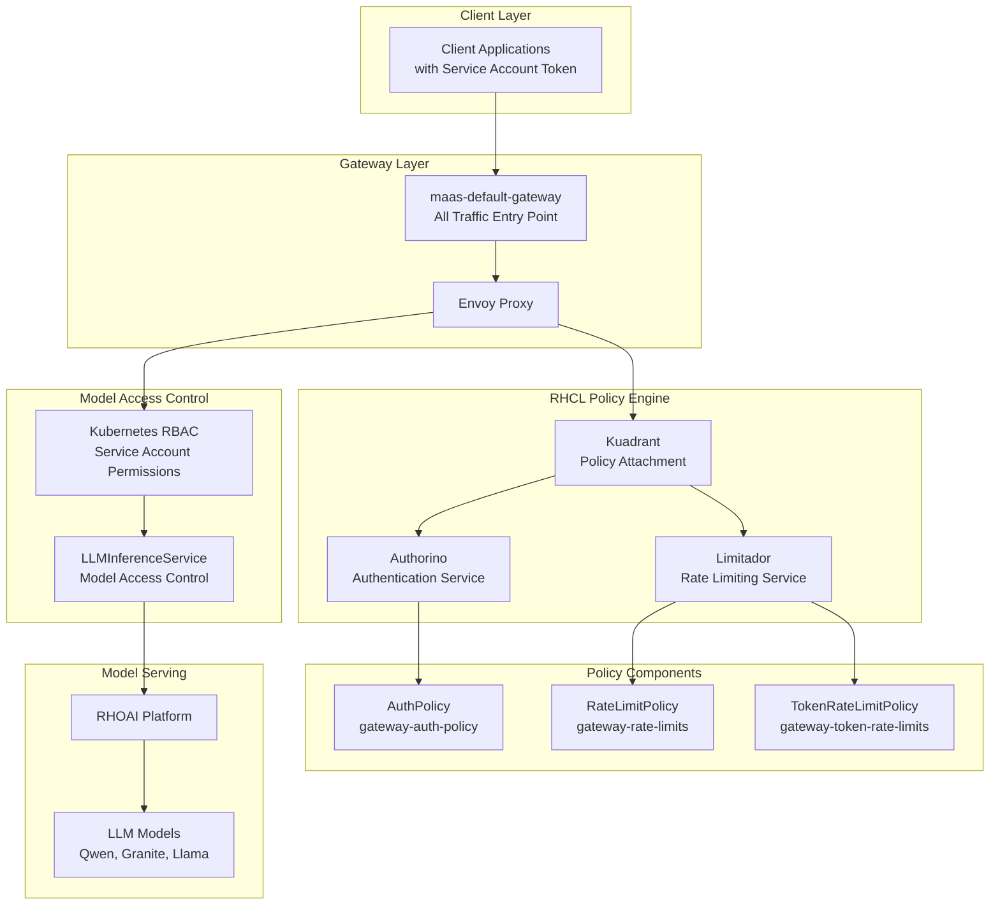
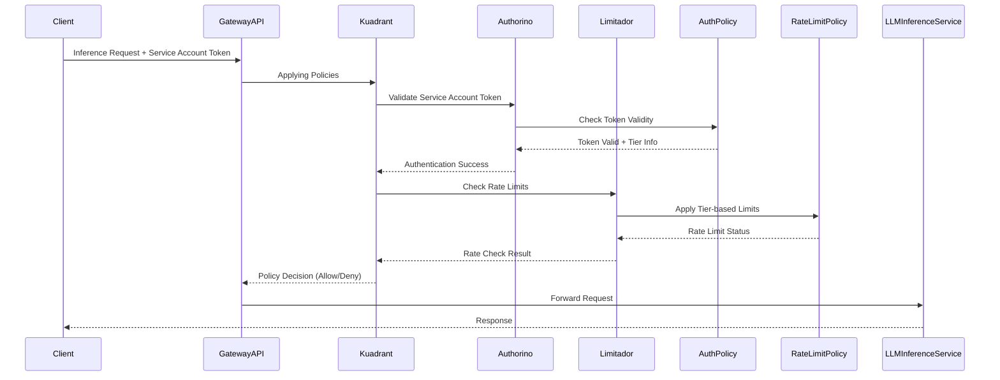
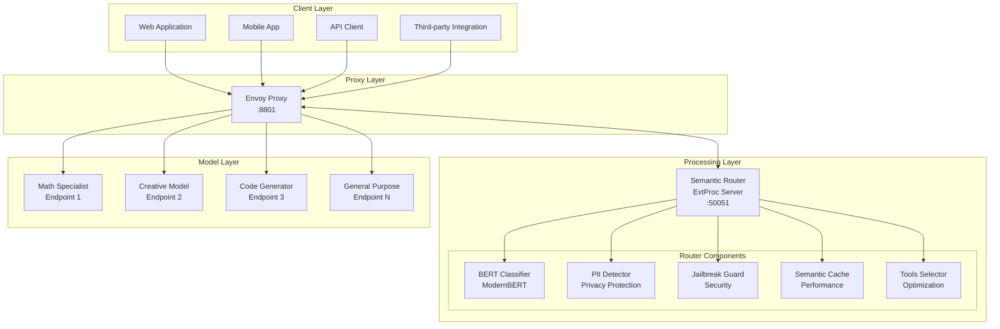
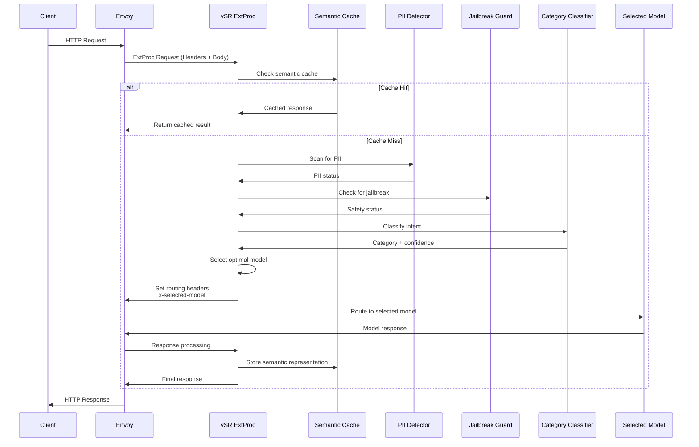
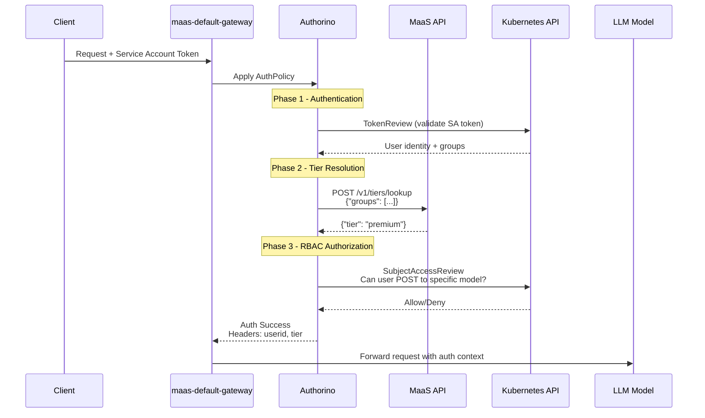
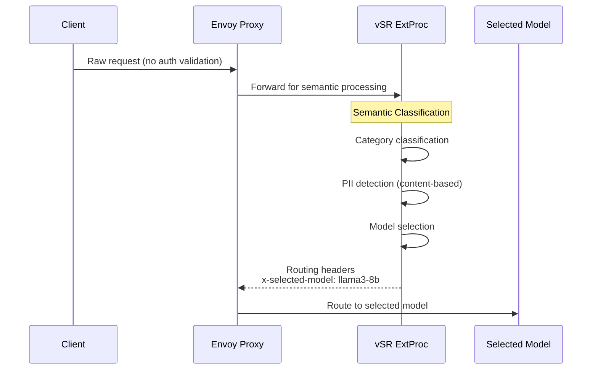
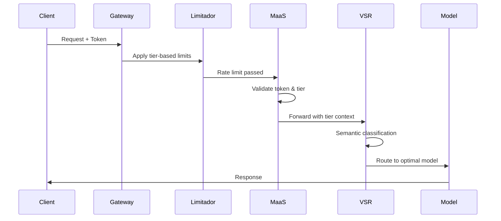
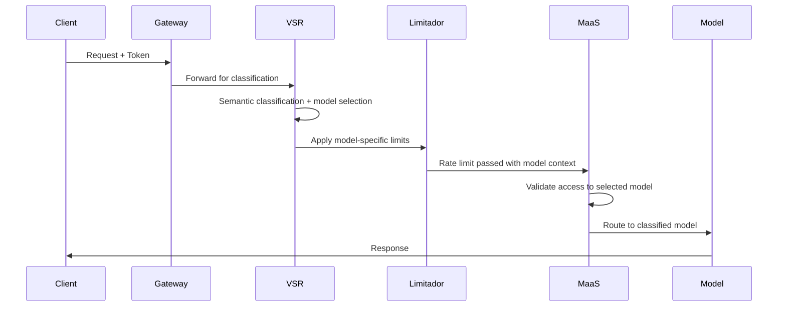
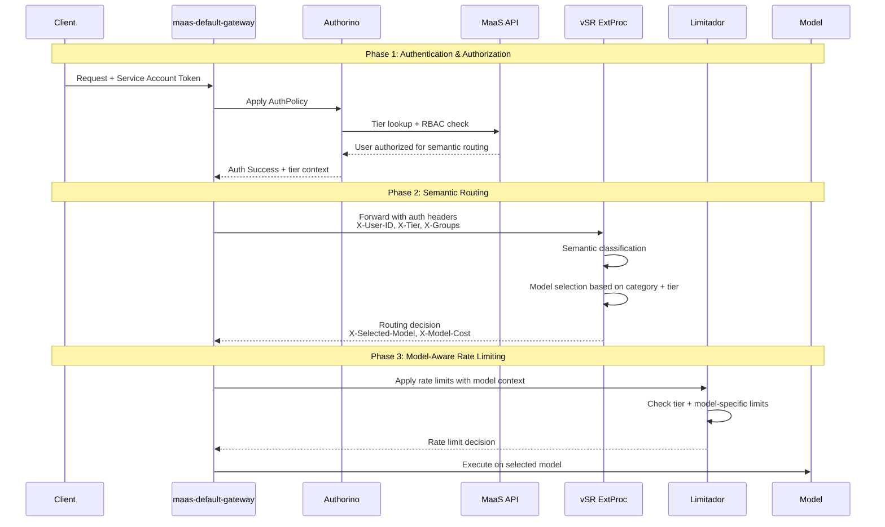

# Design Proposal: vLLM Semantic Router (vSR) Integration with Models-as-a-Service (MaaS)

**Document Status**: Draft  
**Date**: December 2025  
**Author**: Noy Itzikowitz  
**Target Branch**: [maas-billing/main](https://github.com/noyitz/maas-billing/tree/main)

## Executive Summary

This design proposal outlines the integration strategy for vLLM Semantic Router (vSR) with the Models-as-a-Service (MaaS) platform. The integration aims to enhance the MaaS platform with intelligent semantic routing capabilities while maintaining robust rate limiting, billing, and security features.

The proposal evaluates two primary integration patterns and recommends a hybrid approach that maximizes the benefits of both systems while addressing critical challenges in model selection, rate limiting, and adaptive throttling.

## 1. Architecture Overview

### Current MaaS Architecture

The MaaS platform provides a complete Models-as-a-Service solution with policy-based access control:



**Key Components:**
- **maas-default-gateway**: Single entry point for all traffic (token requests and inference)
- **RHCL (Red Hat Connectivity Link)**: Policy engine handling authentication and authorization
- **Authorino**: Token validation (OpenShift tokens for MaaS API, Service Account tokens for inference)
- **Limitador**: Rate limiting and quota enforcement
- **RHOAI Model Serving**: Backend LLM model execution platform

#### Model Inference Request Flow



### Current vSR Architecture

The vSR system implements a sophisticated Mixture-of-Models architecture using Envoy Proxy with External Processor integration:



**Key Components:**
- **Envoy Proxy**: Traffic management layer with load balancing, health checking, and request/response processing
- **vSR ExtProc Service**: Go-based gRPC service providing semantic classification and routing intelligence
- **ModernBERT Classifiers**: Multi-task classification for category detection, PII scanning, and jailbreak prevention
- **Semantic Cache**: Performance optimization with similarity-based caching
- **Tool Selection**: Automatic optimization to reduce token usage and improve accuracy

#### Request Processing Pipeline




## 2. Authorization (AuthZ) Analysis

### 2.1 MaaS Authorization Architecture

MaaS implements a comprehensive authorization system using Authorino with multi-layered access control:



**Key Authorization Components:**
- **Authentication**: Kubernetes TokenReview validates Service Account tokens
- **Tier Resolution**: MaaS API maps user groups to subscription tiers (free/premium/enterprise)
- **RBAC Authorization**: Kubernetes SubjectAccessReview checks model-specific permissions
- **Context Injection**: Auth metadata (userid, tier) added to request headers

### 2.2 vSR Authorization Architecture 

vSR currently operates as a pure routing layer without built-in authorization:



**Key Characteristics:**
- **No Built-in AuthZ**: vSR assumes requests are pre-authorized
- **Content-based Security**: PII detection and jailbreak prevention based on request content
- **Model Selection**: Intelligent routing based on semantic analysis
- **Stateless Design**: No user context or session management

## 3. Comparative Analysis: Order of Operations

### Option A: MaaS before vSR (MaaS → vSR)



#### Gains vs. Losses Analysis

| **Gains** | **Losses** |
|-----------|------------|
| **✅ Early Authentication**: Token validation and tier resolution happens immediately | **❌ No Per-Model Rate Limiting**: Cannot apply model-specific limits since model selection hasn't occurred |
| **✅ Security First**: Authentication and authorization happen before semantic processing | **❌ Wasted Processing**: Rate limiting occurs before knowing if expensive models will be used |
| **✅ Proven Architecture**: Leverages existing MaaS patterns and policies | **❌ Suboptimal Resource Allocation**: Cannot differentiate between high/low cost model requests for rate limiting |
| **✅ Consistent User Experience**: All users follow the same authentication flow | **❌ Limited Fallback Options**: No opportunity for model downgrading when premium models hit limits |
| **✅ Operational Simplicity**: No changes needed to existing MaaS rate limiting policies | **❌ Missed Optimization**: Cannot leverage semantic caching early to avoid downstream processing |

### Option B: vSR before MaaS (vSR → MaaS)



#### Gains vs. Losses Analysis

| **Gains** | **Losses** |
|-----------|------------|
| **✅ Per-Model Rate Limiting**: Can apply specific limits based on model cost and complexity | **❌ Security Risk**: Semantic processing occurs before full authentication |
| **✅ Intelligent Resource Management**: Rate limits can consider model computational costs | **❌ Authentication Bypass Risk**: Risk of processing requests with invalid tokens through semantic router |
| **✅ Advanced Fallback**: Can downgrade to cheaper models when expensive ones hit limits | **❌ Complex Error Handling**: Authentication failures after semantic processing waste resources |
| **✅ Semantic Caching Benefits**: Early caching can prevent downstream processing entirely | **❌ Tier Resolution Complexity**: vSR needs access to user tier information for proper model selection |
| **✅ Optimal Tool Selection**: Tools can be selected before rate limiting, improving accuracy | **❌ Architectural Disruption**: Requires significant changes to existing MaaS auth flow |

## 4. Proposed Solution

Based on the analysis of both options, we recommend the **Authorization-First Integrated Architecture** that combines the security benefits of Option A with the intelligent routing capabilities of Option B.

### 4.1 Recommended Flow: Auth → vSR → MaaS Rate Limiting

The recommended solution implements a **three-phase Authorization-First flow** that maximizes security while enabling intelligent semantic routing. This approach ensures that authentication and authorization occur before any semantic processing, while still providing the benefits of model-aware rate limiting and cost optimization.

#### Architectural Rationale

**Why Authorization-First?**
1. **Security Priority**: No semantic processing occurs without valid authentication and authorization
2. **Context Propagation**: Authentication provides tier and permission context to vSR for intelligent model selection
3. **Audit Compliance**: Complete audit trail from authentication through model execution
4. **Performance Optimization**: Early rejection of unauthorized requests prevents wasted compute resources

**Component Integration Strategy:**
The integration leverages the strengths of both systems:
- **MaaS Security Framework**: Proven authentication, authorization, and rate limiting
- **vSR Intelligence**: Semantic classification and model selection capabilities
- **Unified Policy Engine**: Single policy attachment point via Kuadrant/RHCL

#### Detailed Flow Implementation



#### Phase 1: Authentication & Authorization

**Component Interactions:**
- **maas-default-gateway**: Single entry point for all requests, applies Kuadrant policies
- **Authorino**: Validates Service Account tokens using Kubernetes TokenReview API
- **MaaS API**: Provides tier resolution mapping user groups to subscription levels
- **Enhanced AuthPolicy**: Extended to include semantic routing permissions

**Implementation Details:**

1. **Token Validation**: 
   - Service Account tokens validated against Kubernetes API
   - Token audience scoped to `maas-default-gateway-sa`
   - Cached validation results (TTL: 600s) for performance

2. **Tier Resolution**:
   - User groups mapped to tiers (free/premium/enterprise) via MaaS API
   - Tier information cached per user (TTL: 300s)
   - Tier determines model access permissions and cost budgets

3. **RBAC Authorization**:
   - Two-level authorization: basic tier access + semantic routing access
   - Uses Kubernetes SubjectAccessReview for fine-grained permissions
   - Resource: `semantic-router.vllm.ai/semanticRouting` with verb `use`

4. **Context Enrichment**:
   - Authorino injects authentication context into headers:
     - `X-User-ID`: Extracted user identifier
     - `X-Tier`: User's subscription tier
     - `X-Groups`: User's group memberships
     - `X-Allowed-Models`: Models accessible to user's tier
     - `X-Max-Cost-Per-Request`: Budget limit for the tier

**Security Controls:**
- Early rejection of invalid tokens (before semantic processing)
- Tier-based access control prevents unauthorized model access
- Comprehensive audit logging of authentication decisions
- Token scope validation ensures least privilege access

#### Phase 2: Semantic Routing

**Component Interactions:**
- **vSR ExtProc**: Enhanced to process authorization context
- **ModernBERT Classifier**: Performs semantic classification with tier awareness
- **PII Detector**: Scans content for sensitive information
- **Jailbreak Guard**: Prevents malicious prompt injection
- **Semantic Cache**: Optimizes performance with tier-aware caching

**Implementation Details:**

1. **Authorization Context Processing**:
   ```go
   type AuthContext struct {
       UserID        string
       Tier          string
       Groups        []string
       AllowedModels []string
       MaxCost       float64
   }
   ```

2. **Enhanced Semantic Classification**:
   - Category classification (mathematics, code, creative, general)
   - Tier-aware model selection considering user permissions
   - Cost-aware selection within budget constraints
   - Content security validation (PII, jailbreak detection)

3. **Intelligent Model Selection**:
   - **Primary Selection**: Best model for category within tier permissions
   - **Cost Validation**: Ensure selected model within user's cost budget
   - **Availability Check**: Verify model availability and rate limit status
   - **Fallback Logic**: Automatic downgrade if primary model unavailable

4. **Routing Decision Output**:
   - `X-Selected-Model`: Chosen model for execution
   - `X-Model-Cost`: Estimated cost for the request
   - `X-Fallback-Used`: Boolean indicating if fallback was required
   - `X-Category`: Semantic classification result
   - `X-Confidence`: Classification confidence score

**Intelligence Features:**
- **Tier-Aware Classification**: Model selection considers user's tier constraints
- **Budget Optimization**: Automatic selection of cost-effective models
- **Semantic Caching**: Reduces redundant processing for similar queries
- **Content Security**: Integrated PII detection and jailbreak prevention

#### Phase 3: Model-Aware Rate Limiting

**Component Interactions:**
- **Limitador**: Enhanced rate limiting engine with model context
- **Enhanced RateLimitPolicy**: Model-specific rate limiting rules
- **TokenRateLimitPolicy**: Budget-aware token consumption limits
- **RHOAI Model Serving**: Backend model execution platform

**Implementation Details:**

1. **Model-Specific Rate Limiting**:
   ```yaml
   # Example: Different limits for different models
   gpt4_enterprise: 10 req/min, 100 req/hour
   phi4_premium: 30 req/min, 500 req/hour
   llama3_free: 5 req/min, 50 req/hour
   ```

2. **Multi-Dimensional Limiting**:
   - **User-based**: Per-user request limits
   - **Tier-based**: Subscription tier limits
   - **Model-based**: Per-model capacity limits
   - **Cost-based**: Budget consumption tracking

3. **Dynamic Rate Limiting**:
   - Rate limits adjusted based on selected model cost
   - Premium models have stricter limits than basic models
   - Burst allowances for enterprise tiers
   - Automatic fallback suggestions when limits exceeded

4. **Integration Benefits**:
   - **Cost Control**: Prevents budget exhaustion through intelligent limiting
   - **Resource Optimization**: Distributes load based on model capacity
   - **User Experience**: Transparent limit communication with retry-after headers
   - **Operational Efficiency**: Model-specific monitoring and alerting

**Rate Limiting Logic:**
- **Pre-routing Limits**: Basic tier and user limits applied before model selection
- **Post-routing Limits**: Model-specific limits applied after semantic routing
- **Cost-aware Limiting**: Rate limits consider estimated cost per request
- **Fallback Integration**: Automatic suggestions for alternative models when limited

#### Component Communication Patterns

**Header-Based Context Propagation:**
All context flows through HTTP headers, enabling stateless operation and easy debugging:

```
Authorization: Bearer <service-account-token>
X-User-ID: user123
X-Tier: premium
X-Groups: ["tier-premium-users", "math-specialists"]
X-Allowed-Models: ["phi4-mini", "llama3-8b", "gpt-4o-mini"]
X-Max-Cost-Per-Request: 0.50
X-Selected-Model: phi4-mini
X-Model-Cost: 0.15
X-Category: mathematics
```

**Error Handling and Fallbacks:**
- **Authentication Failure**: 401 Unauthorized with clear error message
- **Authorization Failure**: 403 Forbidden with permission requirements
- **Rate Limit Exceeded**: 429 Too Many Requests with retry-after guidance
- **Model Unavailable**: Automatic fallback or 503 Service Unavailable
- **Budget Exceeded**: Cost-aware error with budget status

**Performance Optimizations:**
- **Caching Strategy**: Multi-layer caching for auth decisions, tier mappings, and semantic results
- **Connection Pooling**: Efficient connections between gateway components
- **Async Processing**: Non-blocking operations where possible
- **Circuit Breakers**: Protection against cascading failures

This Authorization-First flow ensures enterprise-grade security while enabling the intelligent routing capabilities of vSR, creating a robust and scalable foundation for the integrated platform.


## 5. Implementation Architecture Options

For comprehensive analysis of deployment architecture patterns, see:
**[📋 Gateway Consolidation Options](gateway-consolidation-options.md)**

This document analyzes:
- Dual Gateway vs Unified Gateway architectures
- Hybrid Container and Service Mesh deployment patterns  
- Performance, cost, and operational trade-offs
- Implementation examples for each architecture
- Recommendation matrix and migration strategies

## 6. Advanced Use Cases and Implementation Details

The core design proposal above provides the foundation for the integrated vSR-MaaS platform. The following sections detail advanced use cases, deployment options, and operational considerations.

### 6.1 Adaptive Throttling & Model Fallbacks

For detailed implementation of intelligent model fallbacks with cost-aware throttling, see:
**[📋 Adaptive Throttling & Model Fallbacks](adaptive-throttling-and-model-fallbacks.md)**

This document covers:
- Enterprise-grade fallback decision trees with budget constraints
- Component implementation details for budget tracking and circuit breakers
- Complete sequence diagrams for fallback scenarios
- Configuration examples for model hierarchy and rate limiting policies
- Monitoring and alerting strategies for adaptive systems

## 7. Monitoring and Observability

For complete observability strategy and implementation, see:
**[📋 Monitoring and Observability](monitoring-and-observability.md)**

This document details:
- Current monitoring capabilities in MaaS and vSR systems
- Enhanced metrics framework for the integrated platform
- End-to-end tracing and distributed monitoring
- Business intelligence dashboards and alerting strategies
- SLIs/SLOs and error budget management

## 8. Security Considerations

For comprehensive security analysis and implementation details, see:
**[📋 Security Considerations](security-considerations.md)**

This document covers:
- PII protection strategies in the integrated flow
- Authorization flow security controls
- Token scope validation and audit logging
- Data isolation and tenant boundaries
- Security best practices for semantic routing

