# Design Proposal: vLLM Semantic Router (vSR) Integration with Models-as-a-Service (MaaS)

**Document Status**: Updated Draft  
**Date**: January 2026  
**Author**: Noy Itzikowitz  
**Target Branch**: [maas-billing/main](https://github.com/noyitz/maas-billing/tree/main)  
**Last Updated**: January 20, 2026 - Addressing stakeholder feedback on authorization flow

## Executive Summary

This design proposal outlines the integration strategy for vLLM Semantic Router (vSR) with the Models-as-a-Service (MaaS) platform. The integration aims to enhance the MaaS platform with intelligent semantic routing capabilities while maintaining robust rate limiting, billing, and security features.

**🔄 Updated Based on Stakeholder Feedback**: This revised proposal addresses critical authorization flow issues identified by the team, implementing pre-authorization with model constraints to eliminate unnecessary round trips between MaaS and vSR while maintaining enterprise-grade security and intelligent routing capabilities.

The proposal evaluates multiple integration patterns and recommends an **Enhanced Hybrid Authorization-First Architecture** that maximizes the benefits of both systems while addressing critical challenges in model selection, authorization efficiency, and adaptive fallback mechanisms.

## 🏗️ Chief Architect Feedback & Modular Composition Strategy

**Chief Architect Feedback Summary**: The hybrid approach is sound, but there are concerns about vSR's "monolithic" architecture that bundles semantic routing, orchestration/plugin layers, and security features (PII detection) into a single project. The concern is about avoiding multiple request parsing passes through Envoy proxy, especially as more components enter the ecosystem (llm-d, llama stack, mcp gateway).

### Proposed Modular Composition Approach

Instead of treating vSR as a monolithic ExtProc service, we propose a **composable pipeline architecture** that allows selective component activation and reduces parsing overhead:

#### Option 1: Micro-ExtProc Architecture
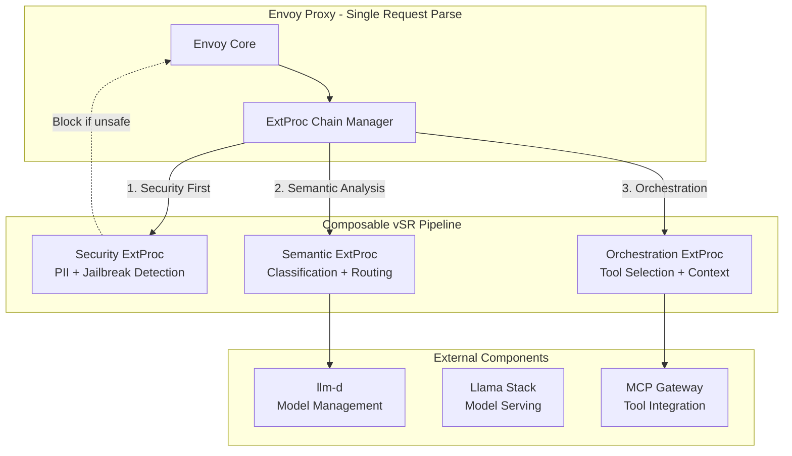

#### Option 2: Plugin-Based Composition
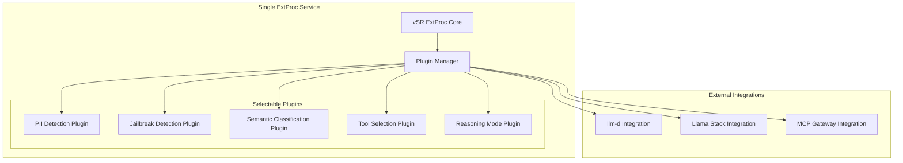

### Addressing Multiple Request Parsing Concern

**Current Problem**: Each component (vSR, llm-d, MCP Gateway, Llama Stack) potentially requires separate Envoy ExtProc calls, leading to multiple request body parsing.

**Proposed Solution**: **Single-Pass Composition with Selective Processing**

```yaml
# Configurable vSR Composition
vsr_composition:
  # Security-first components (always enabled for enterprise)
  security_pipeline:
    pii_detection: true
    jailbreak_prevention: true
    content_filtering: true
  
  # Routing intelligence (configurable based on use case)
  routing_pipeline:
    semantic_classification: true
    model_selection: true
    tool_selection: false  # Disabled if MCP Gateway handles this
    
  # Orchestration components (selective based on ecosystem)
  orchestration_pipeline:
    reasoning_mode: true
    context_management: false  # Disabled if llm-d handles this
    
  # External component integration
  external_integrations:
    llm_d_enabled: true
    llama_stack_enabled: false
    mcp_gateway_enabled: true
```

**Benefits of Modular Approach**:
- ✅ **Single Request Parse**: One ExtProc service, multiple internal plugins
- ✅ **Selective Activation**: Enable only needed components per deployment
- ✅ **Security First**: PII/Jailbreak detection remains in security-critical path
- ✅ **Ecosystem Integration**: Clean interfaces for llm-d, Llama Stack, MCP Gateway
- ✅ **Performance Optimization**: Avoid unnecessary processing overhead

### Future Component Integration Strategy

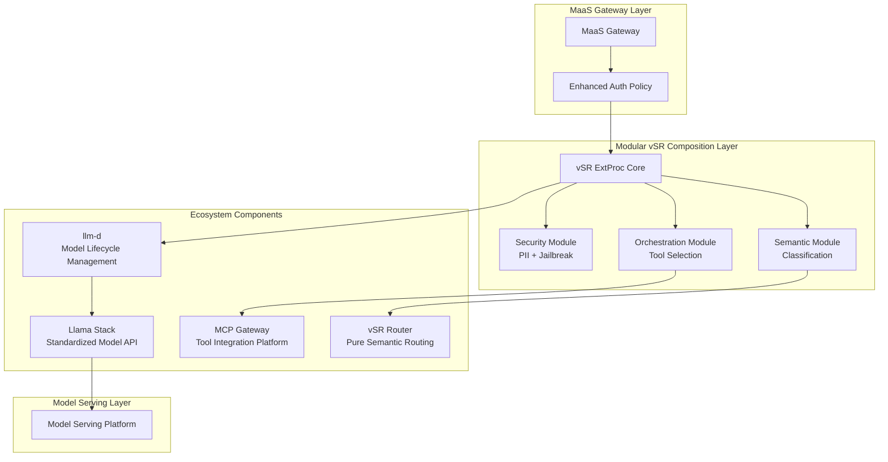

This modular approach allows us to:
1. **Maintain the hybrid authorization-first security model**
2. **Avoid multiple request parsing through composable plugins**
3. **Prepare for ecosystem integration with llm-d, Llama Stack, MCP Gateway**
4. **Preserve vSR's intelligence while making it more flexible**

## 1. Architecture Overview

### Current MaaS Architecture

The MaaS platform provides a complete Models-as-a-Service solution with policy-based access control:

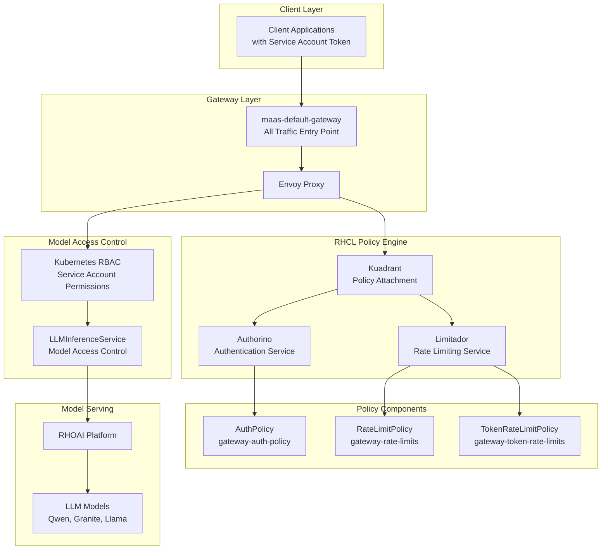

**Key Components:**
- **maas-default-gateway**: Single entry point for all traffic (token requests and inference)
- **RHCL (Red Hat Connectivity Link)**: Policy engine handling authentication and authorization
- **Authorino**: Token validation (OpenShift tokens for MaaS API, Service Account tokens for inference)
- **Limitador**: Rate limiting and quota enforcement
- **RHOAI Model Serving**: Backend LLM model execution platform

#### Model Inference Request Flow

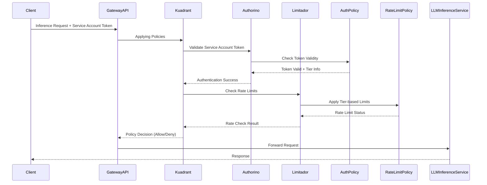

### Current vSR Architecture

The vSR system implements a sophisticated Mixture-of-Models architecture using Envoy Proxy with External Processor integration:

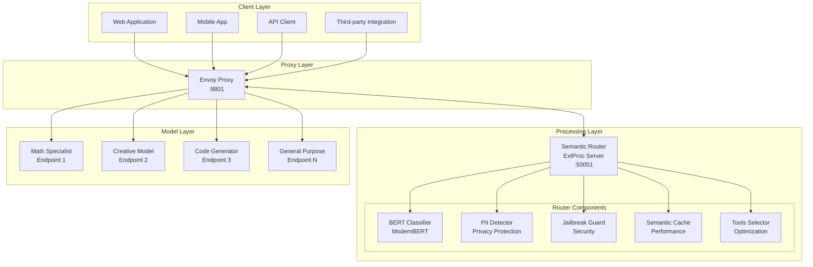

**Key Components:**
- **Envoy Proxy**: Traffic management layer with load balancing, health checking, and request/response processing
- **vSR ExtProc Service**: Go-based gRPC service providing semantic classification and routing intelligence
- **ModernBERT Classifiers**: Multi-task classification for category detection, PII scanning, and jailbreak prevention
- **Semantic Cache**: Performance optimization with similarity-based caching
- **Tool Selection**: Automatic optimization to reduce token usage and improve accuracy

#### Request Processing Pipeline

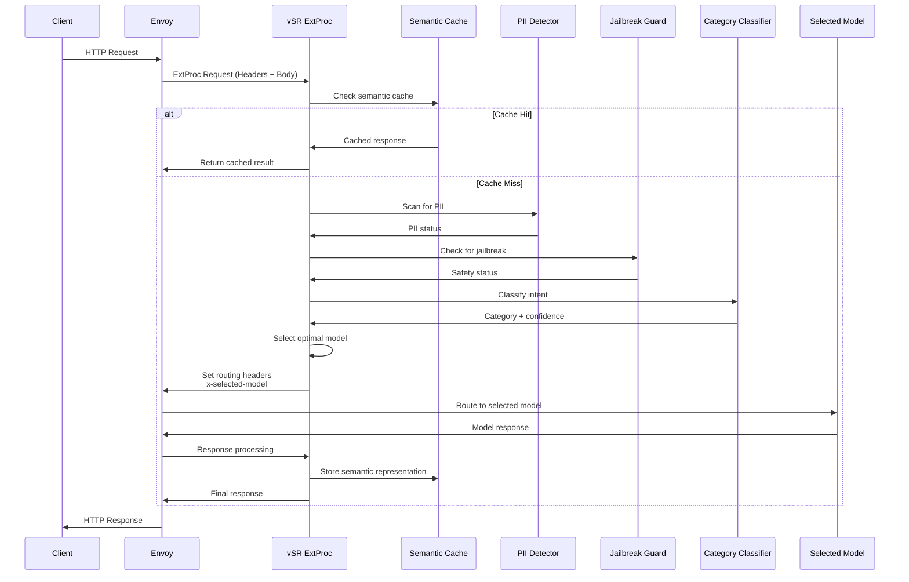


## 2. Authorization (AuthZ) Analysis

### 2.1 MaaS Authorization Architecture

MaaS implements a comprehensive authorization system using Authorino with multi-layered access control:

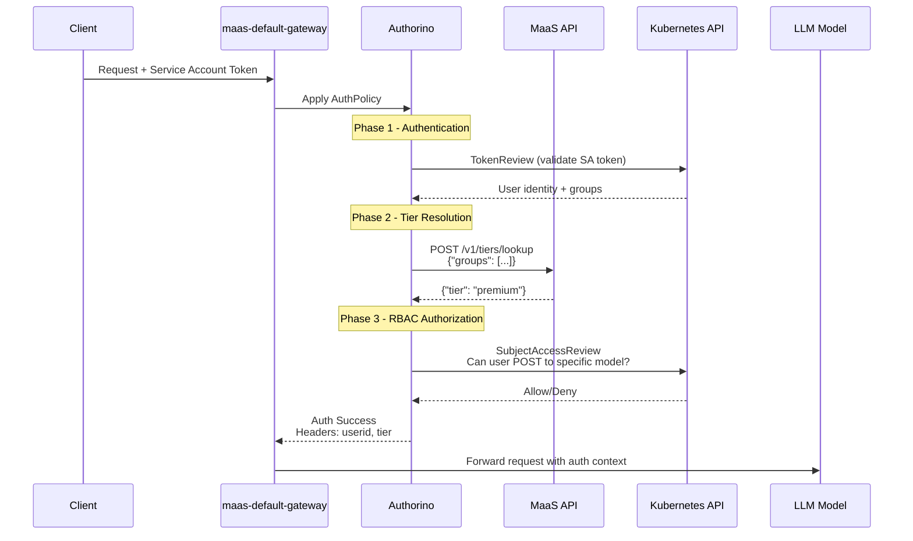

**Key Authorization Components:**
- **Authentication**: Kubernetes TokenReview validates Service Account tokens
- **Tier Resolution**: MaaS API maps user groups to subscription tiers (free/premium/enterprise)
- **RBAC Authorization**: Kubernetes SubjectAccessReview checks model-specific permissions
- **Context Injection**: Auth metadata (userid, tier) added to request headers

### 2.2 vSR Authorization Architecture 

vSR currently operates as a pure routing layer without built-in authorization:

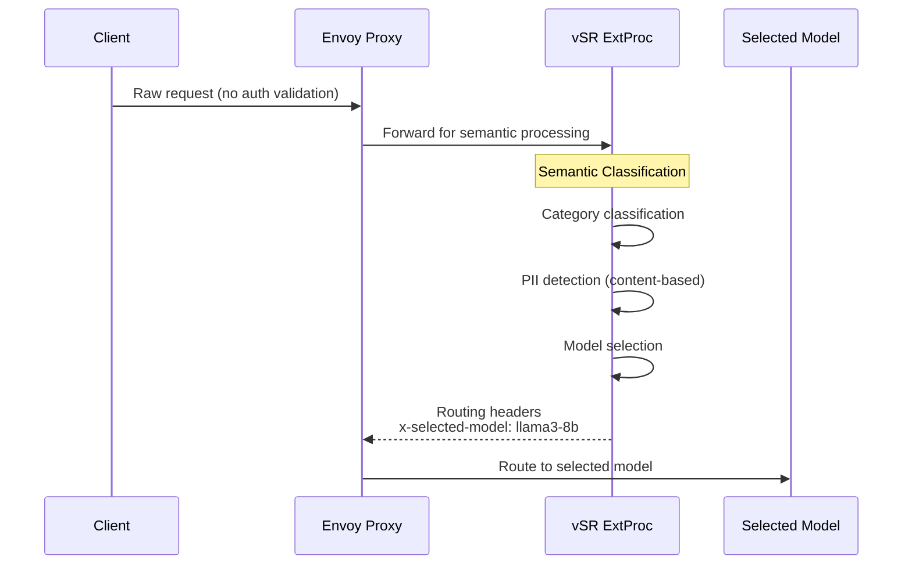

**Key Characteristics:**
- **No Built-in AuthZ**: vSR assumes requests are pre-authorized
- **Content-based Security**: PII detection and jailbreak prevention based on request content
- **Model Selection**: Intelligent routing based on semantic analysis
- **Stateless Design**: No user context or session management

## 3. Comparative Analysis: Order of Operations

### Option A: MaaS before vSR (MaaS → vSR)

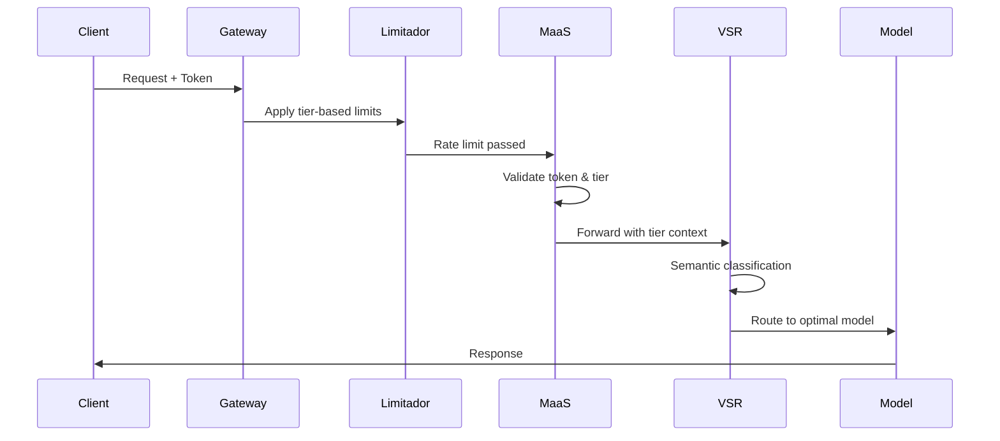

#### Gains vs. Losses Analysis

| **Gains** | **Losses** |
|-----------|------------|
| **✅ Early Authentication**: Token validation and tier resolution happens immediately | **❌ No Per-Model Rate Limiting**: Cannot apply model-specific limits since model selection hasn't occurred |
| **✅ Security First**: Authentication and authorization happen before semantic processing | **❌ Wasted Processing**: Rate limiting occurs before knowing if expensive models will be used |
| **✅ Proven Architecture**: Leverages existing MaaS patterns and policies | **❌ Suboptimal Resource Allocation**: Cannot differentiate between high/low cost model requests for rate limiting |
| **✅ Consistent User Experience**: All users follow the same authentication flow | **❌ Limited Fallback Options**: No opportunity for model downgrading when premium models hit limits |
| **✅ Operational Simplicity**: No changes needed to existing MaaS rate limiting policies | **❌ Missed Optimization**: Cannot leverage semantic caching early to avoid downstream processing |

### Option B: vSR before MaaS (vSR → MaaS)

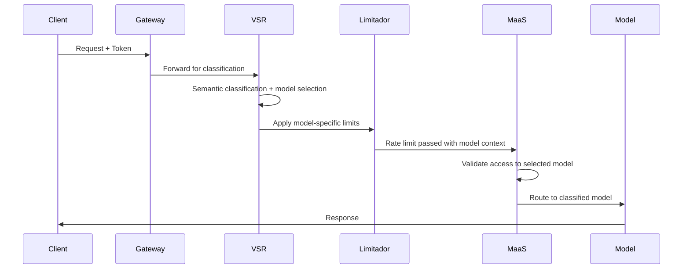

#### Gains vs. Losses Analysis

| **Gains** | **Losses** |
|-----------|------------|
| **✅ Per-Model Rate Limiting**: Can apply specific limits based on model cost and complexity | **❌ Security Risk**: Semantic processing occurs before full authentication |
| **✅ Intelligent Resource Management**: Rate limits can consider model computational costs | **❌ Authentication Bypass Risk**: Risk of processing requests with invalid tokens through semantic router |
| **✅ Advanced Fallback**: Can downgrade to cheaper models when expensive ones hit limits | **❌ Complex Error Handling**: Authentication failures after semantic processing waste resources |
| **✅ Semantic Caching Benefits**: Early caching can prevent downstream processing entirely | **❌ Tier Resolution Complexity**: vSR needs access to user tier information for proper model selection |
| **✅ Optimal Tool Selection**: Tools can be selected before rate limiting, improving accuracy | **❌ Architectural Disruption**: Requires significant changes to existing MaaS auth flow |

## 4. Proposed Solution

Based on the analysis of both options and **critical stakeholder feedback**, we recommend the **Enhanced Hybrid Authorization-First Architecture** that addresses the fundamental authorization flow issues while maintaining the benefits of both systems.

## 🚨 Critical Issue Addressed

**Problem Identified**: The original Phase 3 model-specific authorization could fail after vSR model selection, creating unnecessary round trips between MaaS and vSR when users lack access to selected models.

**Solution**: Implement **pre-authorization with model constraints** - providing vSR with accessible and blocked model lists upfront, as suggested by Ilya Kolchinsky and Jonathan Zarecki.

### 4.1 Enhanced Hybrid Approach: Authorization Efficiency + Intelligent Routing

The solution implements a **multi-phase enhanced flow** that maximizes security, eliminates authorization failures, and enables intelligent routing:

**🔒 Phase 1: Enhanced Pre-Authorization & Model Constraint Generation**  
MaaS → Bulk authorization check for ALL models → Generate accessible/blocked model lists → Pass constraints to vSR

**🧠 Phase 2: Constrained Semantic Routing**  
vSR → Receive model constraints → Semantic classification → Select optimal model from ACCESSIBLE models only

**⚖️ Phase 3: Streamlined Rate Limiting & Execution** *(Authorization already verified)*  
MaaS → Kuadrant → Limitador rate limiting → Model execution (no auth check needed)

**🔄 Phase 3.5: Intelligent Fallback Logic** *(Conditional - Only if Phase 3 fails)*  
When rate limits exceeded → vSR selects alternative model from accessible models → Retry rate limiting

**📊 Phase 4: Dynamic Billing** *(Future Extension)*  
Accurate cost tracking based on actual model selection

**🧠 Phase 6: Dynamic Reasoning Mode Toggling** *(Future Extension)*  
vSR enable/disable reasoning mode for cost optimization

This enhanced approach **eliminates authorization failures** by constraining vSR to pre-authorized models while maintaining **enterprise security** and **intelligent routing** capabilities.

#### Architecture Overview

The integration uses **Envoy External Processing (ExtProc)** to seamlessly combine MaaS and vSR capabilities in a single request flow.

### 4.2 Enhanced Phase-by-Phase Implementation

#### Phase 1: Enhanced Pre-Authorization & Model Constraint Generation

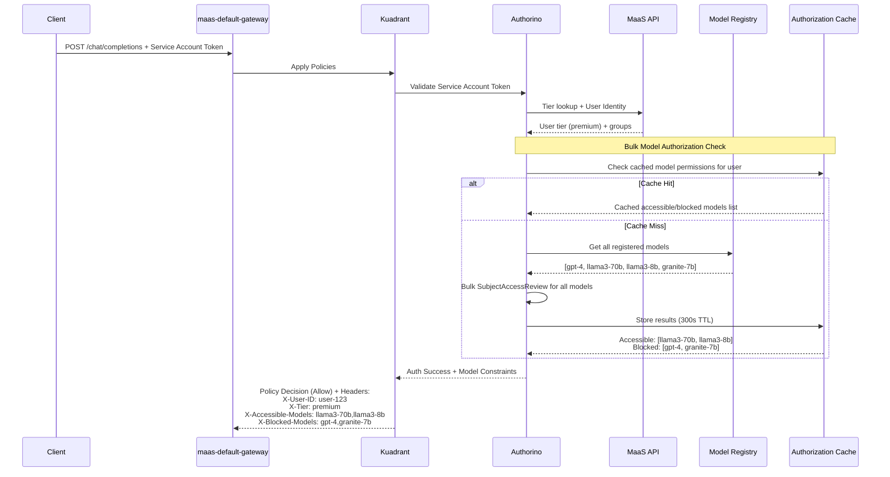

**Benefits**: 
- ✅ **Eliminates Authorization Failures**: vSR only selects from pre-authorized models
- ✅ **Bulk Authorization Efficiency**: Single authorization check for all models  
- ✅ **Intelligent Caching**: 300s TTL prevents repeated authorization overhead
- ✅ **Standard MaaS Flow**: Maintains existing security and authentication patterns

#### Phase 2: Constrained Semantic Routing with User-Level Intelligence

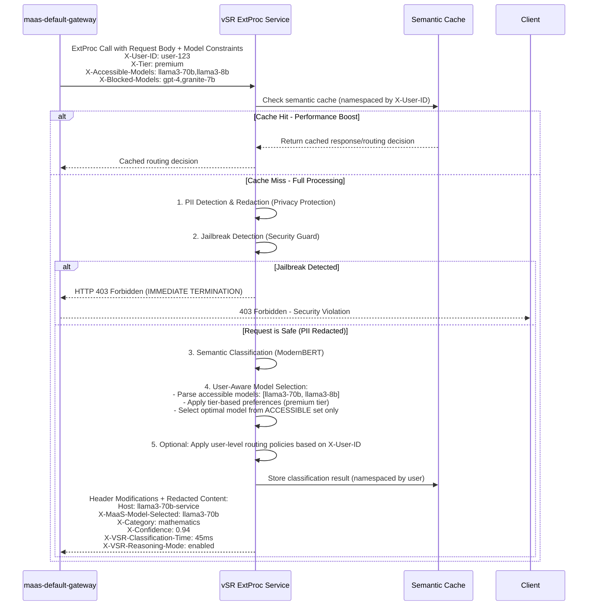

**Benefits**: 
- 🧠 **Constrained Intelligent Routing**: ModernBERT classification with pre-authorized model selection
- 🔒 **Privacy Protection**: PII detection and redaction protects sensitive data  
- 🛡️ **Security Guard**: Jailbreak detection blocks malicious prompts
- ⚡ **Performance**: User-namespaced semantic caching prevents data leakage
- 👤 **User-Level Intelligence**: X-User-ID enables personalized routing policies
- 📊 **Enhanced Headers**: Comprehensive vSR troubleshooting headers included
- 🚫 **Authorization Failure Elimination**: Selection constrained to accessible models only

#### Phase 3: Streamlined Rate Limiting & Model Execution

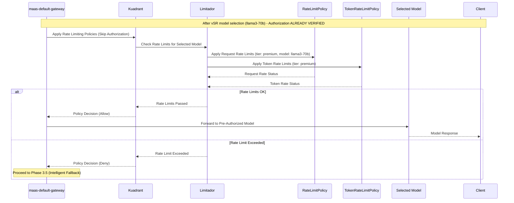

**Benefits**: 
- ⚡ **Streamlined Flow**: No authorization check needed (pre-verified in Phase 1)
- 🎯 **Model-Specific Rate Limits**: Applies limits based on selected model cost/complexity
- 🔐 **Maintained Security**: Authorization already verified, no security compromise
- 📊 **Intelligent Metrics**: Rate limiting aware of actual model being used

#### Phase 3.5: Intelligent Fallback Logic (Conditional)

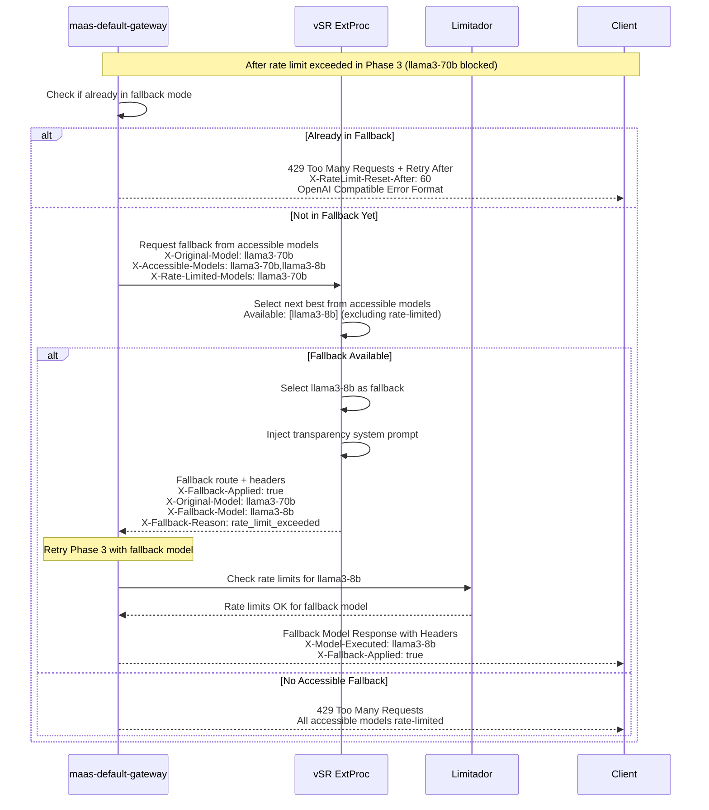

**Benefits**: 
- 🔄 **Intelligent Constrained Fallback**: Selects from pre-authorized accessible models only
- 📊 **OpenAI-Compatible Responses**: Follows OpenAI rate limiting response format
- 💰 **Cost Optimization**: Automatically downgrades to cheaper accessible models
- 🎯 **Improved UX**: Maintains service availability under quota pressure
- 🚫 **No Authorization Failures**: Fallback selection still respects user permissions

#### Phase 4: Dynamic Billing (Future Extension)

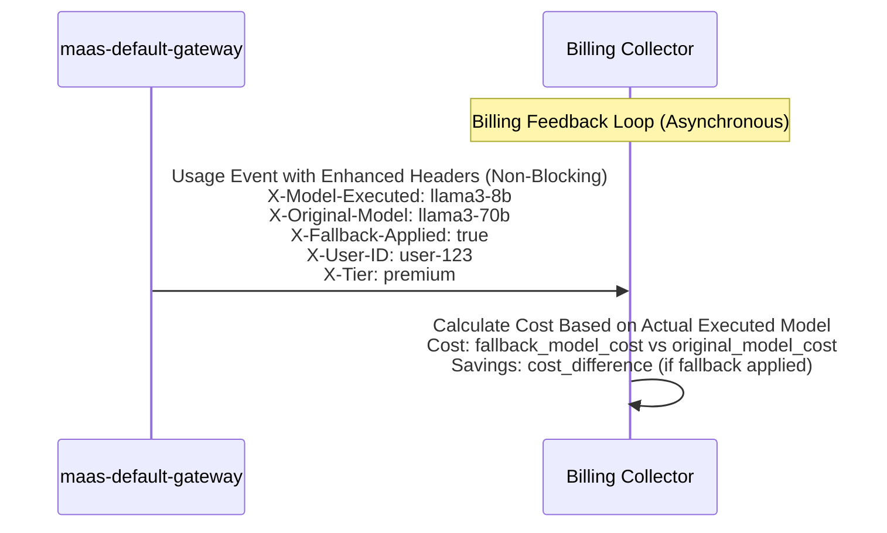

**Benefits**: 
- 📊 **Accurate Billing**: Based on actually executed model, not requested model
- 💰 **Cost Transparency**: Track savings from fallback mechanisms
- ⚡ **Async Processing**: Non-blocking billing collection
- 📈 **Enhanced Analytics**: Fallback usage patterns and cost optimization metrics

#### Phase 6: Dynamic Reasoning Mode Toggling (Future Extension)

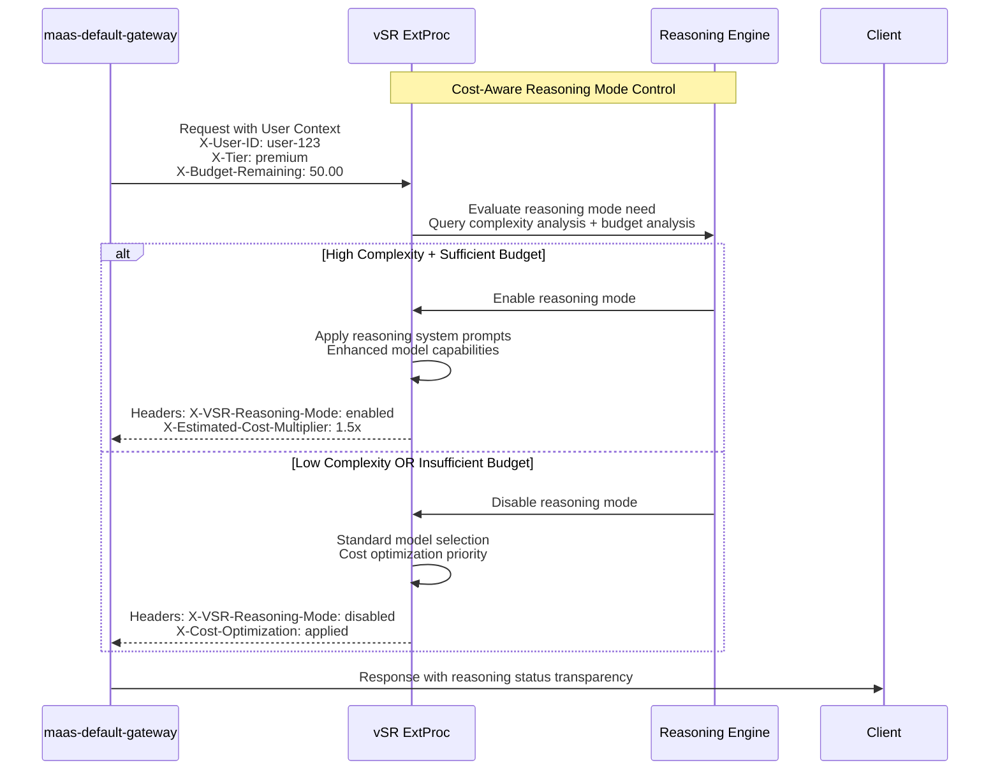

**Benefits**:
- 🧠 **Adaptive Intelligence**: Reasoning mode based on query complexity and user budget
- 💰 **Cost Optimization**: Automatic reasoning mode disabling for budget conservation  
- 🎯 **User Transparency**: Clear indication of reasoning mode status
- 📊 **Smart Resource Management**: Balance between capability and cost efficiency

### 4.3 Enhanced Request Flow Headers

```http
# Phase 1: Client Request
POST /chat/completions
Authorization: Bearer sa-token-xyz
Content-Type: application/json
{"messages": [{"role": "user", "content": "Solve this calculus problem..."}]}

# Phase 1: After Enhanced Pre-Authorization (Model Constraints Generated)
POST /chat/completions
Authorization: Bearer sa-token-xyz
X-User-ID: math-user-123                    # ✅ Supported Today
X-Tier: premium                             # ✅ Supported Today
X-Groups: "tier-premium-users,specialists"  # 🔍 Likely Supported
X-Accessible-Models: llama3-70b,llama3-8b  # 🆕 NEW - Pre-authorized models only
X-Blocked-Models: gpt-4,granite-7b         # 🆕 NEW - Models user cannot access

# Phase 2: After vSR Constrained Semantic Routing
POST /models/llama3-70b/chat/completions    # 🆕 NEW - Path rewritten for model routing
Authorization: Bearer sa-token-xyz
X-User-ID: math-user-123                    # ✅ Passed through from Phase 1
X-Tier: premium                             # ✅ Passed through from Phase 1
X-MaaS-Model-Selected: llama3-70b          # 🆕 NEW - For billing tracking
X-Category: mathematics                     # 🆕 NEW - Semantic classification
X-Confidence: 0.94                         # 🆕 NEW - vSR classification confidence
X-VSR-Classification-Time: 45ms            # 🆕 NEW - vSR performance metrics
X-VSR-Reasoning-Mode: enabled              # 🆕 NEW - Reasoning mode status

# Phase 3: Streamlined Rate Limiting & Model Execution (No Auth Check Needed)
POST /models/llama3-70b/chat/completions
Authorization: Bearer sa-token-xyz
X-User-ID: math-user-123                    # ✅ Used for rate limiting
X-Tier: premium                             # ✅ Used for rate limiting  
X-MaaS-Model-Selected: llama3-70b          # ✅ Used for model-specific rate limiting

# Phase 3: Successful Model Execution (Rate Limits Passed)
HTTP/1.1 200 OK
Content-Type: application/json
X-Model-Executed: llama3-70b               # 🆕 NEW - Actually executed model
X-Authorization-Cached: true               # 🆕 NEW - Pre-authorization used
X-Request-Duration: 2.5s
X-VSR-Reasoning-Mode: enabled              # 🆕 NEW - Reasoning mode applied
{"choices": [{"message": {"content": "The derivative of x² is 2x..."}}]}

# Phase 3.5: Intelligent Fallback Flow (Conditional - Only if Rate Limit Exceeded)
# ❌ Rate limit exceeded for llama3-70b, triggering constrained fallback

# Phase 3.5a: Constrained Fallback Model Request
POST /internal/vsr/fallback
Authorization: Bearer vsr-service-token
X-Original-Model: llama3-70b
X-User-Tier: premium
X-Accessible-Models: llama3-70b,llama3-8b  # 🆕 NEW - Constrained to accessible models
X-Rate-Limited-Models: llama3-70b          # 🆕 NEW - Models currently rate limited
X-Fallback-Reason: rate_limit_exceeded

# Phase 3.5b: vSR Constrained Fallback Response
HTTP/1.1 200 OK
X-Fallback-Model: llama3-8b               # 🆕 NEW - Selected from accessible models only
X-Fallback-Applied: true                  # 🆕 NEW - Fallback flag
X-Original-Model: llama3-70b              # 🆕 NEW - Original model tracking
X-Fallback-Reason: rate_limit_exceeded    # 🆕 NEW - Fallback trigger reason
X-Authorization-Prevalidated: true        # 🆕 NEW - No re-authorization needed
X-System-Prompt-Injected: true            # 🆕 NEW - Transparency prompt added

# Phase 3.5c: Direct Rate Limiting Check for Fallback Model (No Re-authorization)
POST /models/llama3-8b/chat/completions   # 🔄 NEW PATH - Pre-authorized fallback
Authorization: Bearer sa-token-xyz
X-User-ID: math-user-123                  # ✅ Passed through
X-Tier: premium                           # ✅ Passed through
X-MaaS-Model-Selected: llama3-8b          # 🆕 NEW - Updated for fallback
X-Category: mathematics                   # ✅ Passed through
X-Fallback-Applied: true                  # 🆕 NEW - Fallback context
X-Original-Model: llama3-70b              # 🆕 NEW - Audit trail

# Phase 3.5d: Fallback Model Execution (Rate Limiting Only - Authorization Skipped)
HTTP/1.1 200 OK  
Content-Type: application/json
X-Model-Executed: llama3-8b               # 🆕 NEW - Actual executed model
X-Fallback-Applied: true                  # 🆕 NEW - User transparency
X-Fallback-Reason: "rate_limit_exceeded"  # 🆕 NEW - Explanation
X-Authorization-Cached: true              # 🆕 NEW - Pre-authorization efficiency
X-Request-Duration: 1.3s                  # 🆕 NEW - Faster due to no re-auth
{"choices": [{"message": {"content": "[Using llama3-8b due to rate limits] The derivative of x² is 2x..."}}]}

# Phase 4: Enhanced Dynamic Billing Collection (Future Enhancement)
Event: {
  "user_id": "math-user-123",
  "tier": "premium",
  "api_path": "/chat/completions", 
  "requested_model": "llama3-70b",
  "executed_model": "llama3-8b",          # 🆕 NEW - Actual executed model
  "fallback_applied": true,               # 🆕 NEW - Fallback tracking
  "fallback_reason": "rate_limit_exceeded", # 🆕 NEW - Why fallback occurred
  "authorization_method": "cached",       # 🆕 NEW - Authorization efficiency tracking
  "vsr_reasoning_mode": "enabled",        # 🆕 NEW - Reasoning mode billing impact
  "actual_cost": 0.25,                    # 🆕 NEW - Fallback model cost
  "original_cost": 0.75,                  # 🆕 NEW - Original model cost
  "cost_savings": 0.50,                   # 🆕 NEW - Savings from fallback
  "performance_metrics": {
    "vsr_classification_time": "45ms",
    "total_request_duration": "1.3s",
    "authorization_cached": true
  }
}
```

**Enhanced Error Handling and OpenAI-Compatible Responses:**

- **Authentication Failure**: 401 Unauthorized with clear error message ✅ **(Supported Today)**
  ```json
  {
    "error": {
      "message": "Invalid authentication credentials",
      "type": "invalid_request_error", 
      "code": "invalid_api_key"
    }
  }
  ```

- **Authorization Failure**: 403 Forbidden - **ELIMINATED** through pre-authorization 🆕 **(NEW - Phase 1 Enhancement)**

- **Rate Limit Exceeded**: OpenAI-compatible response with intelligent fallback 🆕 **(NEW - Enhanced)**
  ```json
  {
    "error": {
      "message": "Rate limit exceeded for model llama3-70b. Using fallback model llama3-8b.",
      "type": "rate_limit_error",
      "code": "model_rate_limit",
      "param": "model",
      "fallback_applied": true,
      "fallback_model": "llama3-8b",
      "retry_after": null
    }
  }
  ```

- **Rate Limit Exhausted**: OpenAI-compatible 429 response when all accessible models rate-limited 🆕 **(NEW)**
  ```json
  {
    "error": {
      "message": "All accessible models are currently rate limited. Please try again later.",
      "type": "rate_limit_error", 
      "code": "all_models_rate_limited",
      "retry_after": 60
    }
  }
  ```

- **Jailbreak Detected**: HTTP 403 Forbidden with immediate termination ✅ **(vSR Security Guard)**
  ```json
  {
    "error": {
      "message": "Request blocked for safety violations",
      "type": "policy_violation",
      "code": "content_policy_violation"
    }
  }
  ```

- **No Accessible Models**: 403 when user has no access to any models 🆕 **(NEW - Pre-authorization)**
  ```json
  {
    "error": {
      "message": "User has no access to any registered models",
      "type": "insufficient_permissions",
      "code": "no_model_access"
    }
  }
  ```

**Performance Optimizations:**
- **Semantic Caching**: Phase 2 user-namespaced caching reduces ExtProc processing time ✅ **(vSR Intelligence)**
- **Authorization Context Caching**: Phase 1 bulk authorization with 300s TTL for faster decisions 🆕 **(Enhanced - MaaS)**  
- **Intelligent Constrained Fallback**: Phase 3.5 eliminates authorization failures and reduces 429 errors 🆕 **(NEW - Enhanced Flow)**
- **Connection Pooling**: Efficient connections between gateway components ✅ **(Supported Today)**
- **Async Processing**: Non-blocking billing and metrics collection ✅ **(Supported Today)**

This **Enhanced Authorization-First flow** ensures enterprise-grade security while enabling intelligent routing capabilities and eliminating authorization bottlenecks, creating a robust and scalable foundation for the integrated platform.

### 4.4 Comprehensive Headers Reference

As referenced in the feedback, here's the complete list of headers used throughout the enhanced integration flow. For additional vSR headers, see the [vSR troubleshooting documentation](https://vllm-semantic-router.com/docs/troubleshooting/vsr-headers).

#### Standard Request Headers
```http
# Core Authentication & Authorization
Authorization: Bearer {service-account-token}   # ✅ Standard MaaS authentication
Content-Type: application/json                  # ✅ Standard OpenAI API format
```

#### Phase 1: Enhanced Pre-Authorization Headers
```http
# MaaS Injected Headers (After Phase 1)
X-User-ID: {user-identifier}                    # ✅ User identification for rate limiting
X-Tier: {free|premium|enterprise}              # ✅ User subscription tier
X-Groups: {comma-separated-groups}              # ✅ Kubernetes groups for RBAC
X-Accessible-Models: {model1,model2,...}        # 🆕 Pre-authorized models list
X-Blocked-Models: {model1,model2,...}          # 🆕 Models user cannot access
```

#### Phase 2: vSR Intelligence Headers  
```http
# vSR Classification & Routing Headers
X-MaaS-Model-Selected: {selected-model-name}    # 🆕 vSR selected model for billing
X-Category: {mathematics|coding|creative|...}   # 🆕 Semantic classification result
X-Confidence: {0.0-1.0}                        # 🆕 vSR classification confidence score
X-VSR-Classification-Time: {time-in-ms}        # 🆕 vSR processing time metrics
X-VSR-Reasoning-Mode: {enabled|disabled}       # 🆕 Reasoning mode status
X-VSR-Cache-Hit: {true|false}                  # 🆕 Semantic cache performance indicator
X-VSR-PII-Detected: {true|false}               # 🆕 PII detection result
X-VSR-Jailbreak-Score: {0.0-1.0}              # 🆕 Jailbreak detection confidence
```

#### Phase 3: Rate Limiting & Execution Headers
```http
# Model Execution Context
X-Model-Executed: {actual-model-name}          # 🆕 Actually executed model (for billing)
X-Authorization-Cached: {true|false}           # 🆕 Whether cached authorization was used
X-Request-Duration: {time-in-seconds}          # 🆕 Total request processing time
```

#### Phase 3.5: Fallback Flow Headers
```http
# Fallback Context Headers
X-Fallback-Applied: {true|false}               # 🆕 Whether fallback mechanism was used
X-Original-Model: {original-model-name}        # 🆕 User's originally requested/selected model
X-Fallback-Model: {fallback-model-name}        # 🆕 Model used as fallback
X-Fallback-Reason: {rate_limit_exceeded|...}   # 🆕 Why fallback was triggered
X-Authorization-Prevalidated: {true|false}     # 🆕 Fallback model pre-authorized
X-System-Prompt-Injected: {true|false}         # 🆕 Transparency prompt added
X-Rate-Limited-Models: {model1,model2,...}     # 🆕 Models currently rate-limited
```

#### OpenAI-Compatible Rate Limiting Headers
```http
# Standard OpenAI Rate Limiting Response Headers  
X-RateLimit-Limit-Requests: {limit-per-period}  # ✅ Request limit for user/tier
X-RateLimit-Limit-Tokens: {tokens-per-period}   # ✅ Token limit for user/tier  
X-RateLimit-Remaining-Requests: {remaining}     # ✅ Remaining requests in period
X-RateLimit-Remaining-Tokens: {remaining}       # ✅ Remaining tokens in period
X-RateLimit-Reset-Requests: {reset-timestamp}   # ✅ When request limit resets
X-RateLimit-Reset-Tokens: {reset-timestamp}     # ✅ When token limit resets
X-RateLimit-Reset-After: {seconds-to-reset}     # ✅ Seconds until limit reset
```

#### Performance & Observability Headers
```http
# Performance Monitoring
X-Gateway-Processing-Time: {time-in-ms}        # 🆕 Gateway overhead measurement
X-Auth-Cache-Status: {hit|miss|expired}        # 🆕 Authorization cache performance
X-Model-Queue-Time: {time-in-ms}              # 🆕 Time spent waiting in model queue
X-Total-Latency: {time-in-ms}                 # 🆕 End-to-end latency measurement
```

#### Response Headers for User Transparency
```http
# User Experience Headers
X-Model-Used: {actual-model-executed}          # 🆕 Clear indication of which model responded
X-Cost-Tier: {low|medium|high|premium}         # 🆕 Cost indication for transparency
X-Service-Version: {maas-version}              # 🆕 Service version for troubleshooting
```

### 4.5 Deployment Configurations

This section addresses hardware resource requirements and deployment scenarios for different cost/performance optimization needs.

#### Hardware Resource Requirements

##### vSR ExtProc Service
```yaml
# Minimum Production Deployment
resources:
  requests:
    memory: "1Gi"
    cpu: "500m" 
  limits:
    memory: "2Gi"  
    cpu: "1000m"

# High-Throughput Deployment  
resources:
  requests:
    memory: "4Gi"
    cpu: "2000m"
  limits:
    memory: "8Gi"
    cpu: "4000m"

# GPU-Accelerated Deployment (For Advanced Classification)
resources:
  requests:
    memory: "8Gi"
    cpu: "2000m"
    nvidia.com/gpu: 1
  limits:
    memory: "16Gi"
    cpu: "4000m" 
    nvidia.com/gpu: 1
```

##### MaaS API Service (Enhanced for Bulk Authorization)
```yaml
# Standard Deployment
resources:
  requests:
    memory: "512Mi"
    cpu: "250m"
  limits:
    memory: "1Gi"
    cpu: "500m"

# High-Availability Deployment (Multiple Replicas)
replicas: 3
resources:
  requests:
    memory: "1Gi"
    cpu: "500m"
  limits:
    memory: "2Gi"
    cpu: "1000m"
```

##### Authorization Cache (Redis/Valkey)
```yaml
# Production Cache for Authorization Results
resources:
  requests:
    memory: "2Gi"
    cpu: "200m"
  limits:
    memory: "4Gi"
    cpu: "500m"

# Persistence Configuration
persistence:
  enabled: true
  size: "10Gi"
  storageClass: "fast-ssd"
```

#### Deployment Scenarios

##### Scenario 1: Cost-Optimized Deployment
```yaml
# Focus: Minimize resource usage while maintaining functionality
vsr_extproc:
  replicas: 1
  cpu_classification: "shared"
  semantic_cache: "memory-only"
  reasoning_mode: "auto-disable"
  
maas_api:
  replicas: 2
  auth_cache_ttl: "600s"  # Longer cache for cost optimization
  
cost_optimization:
  prefer_cheaper_models: true
  aggressive_fallback: true
  reasoning_mode_threshold: "high_budget_only"
```

##### Scenario 2: Performance-Optimized Deployment  
```yaml
# Focus: Minimize latency and maximize throughput
vsr_extproc:
  replicas: 3
  cpu_classification: "dedicated"
  semantic_cache: "redis-cluster"
  reasoning_mode: "always_available"
  
maas_api:
  replicas: 5
  auth_cache_ttl: "300s"
  bulk_auth_parallelization: true
  
performance_optimization:
  enable_prefetching: true
  aggressive_caching: true
  model_warmup: true
```

##### Scenario 3: Balanced Production Deployment
```yaml
# Focus: Balance between cost and performance
vsr_extproc:
  replicas: 2
  cpu_classification: "burstable"
  semantic_cache: "redis-single"
  reasoning_mode: "budget_aware"
  
maas_api:
  replicas: 3
  auth_cache_ttl: "300s"
  
balanced_configuration:
  cost_performance_ratio: "optimal"
  fallback_aggressiveness: "medium"
  reasoning_mode_budget_threshold: "50%"
```

#### Scaling Considerations

##### Horizontal Pod Autoscaling
```yaml
# vSR ExtProc HPA
apiVersion: autoscaling/v2
kind: HorizontalPodAutoscaler
metadata:
  name: vsr-extproc-hpa
spec:
  scaleTargetRef:
    apiVersion: apps/v1
    kind: Deployment
    name: vsr-extproc
  minReplicas: 2
  maxReplicas: 10
  metrics:
  - type: Resource
    resource:
      name: cpu
      target:
        type: Utilization
        averageUtilization: 70
  - type: Resource
    resource:
      name: memory  
      target:
        type: Utilization
        averageUtilization: 80
```

##### Network Policies
```yaml
# Secure network isolation
apiVersion: networking.k8s.io/v1
kind: NetworkPolicy
metadata:
  name: vsr-maas-integration
spec:
  podSelector:
    matchLabels:
      app: vsr-extproc
  policyTypes:
  - Ingress
  - Egress
  ingress:
  - from:
    - namespaceSelector:
        matchLabels:
          name: maas-system
    ports:
    - protocol: TCP
      port: 50051  # gRPC ExtProc port
  egress:
  - to:
    - namespaceSelector:
        matchLabels:
          name: model-serving
    ports:
    - protocol: TCP
      port: 443
```

### 4.6 Enhanced Implementation Requirements Summary

#### RHCL (Red Hat Connectivity Link) - Authorino/Limitador
- ✅ **Token Validation**: Kubernetes `TokenReview` for Service Account tokens
- ✅ **Tier Resolution**: HTTP metadata lookup to MaaS API for user tier mapping
- ✅ **Context Injection**: `X-User-ID`, `X-Tier`, `X-Groups` injected for downstream consumption
- 🆕 **Bulk Authorization**: Bulk SubjectAccessReview for all registered models in Phase 1 *(Enhanced - Custom Logic)*
- 🆕 **Authorization Caching**: Redis/Valkey cache for authorization results with 300s TTL *(New Component)*
- 🆕 **Model Constraints Injection**: `X-Accessible-Models`, `X-Blocked-Models` headers *(Enhanced - Custom Logic)*
- ✅ **Limitador Integration**: Enforce limits based on `X-MaaS-Model-Selected` (from vSR) and `X-User-ID`

#### MaaS (Models-as-a-Service) & Gateway
- ✅ **MaaS API Implementation**: **EXISTING** Go-based API with token management and tier resolution *(Production ready)*
- ✅ **Storage Options**: **EXISTING** In-memory, disk, and external database storage modes *(Fully configurable)*
- ✅ **Token Management**: **EXISTING** Ephemeral tokens and named API keys with expiration *(Already implemented)*
- ✅ **Gateway Policies**: **EXISTING** AuthPolicy with tier resolution, caching (300s TTL), and RBAC *(Production ready)*
- ✅ **Rate Limiting**: **EXISTING** Tier-based rate limiting policies (free/premium/enterprise) *(Already implemented)*
- ✅ **Header Sanitization**: Configure Gateway to strip internal `X-MaaS-*` headers *(Standard Envoy Config)*
- ✅ **Filter Chain Orchestration**: Configure Envoy logic order *(Standard Envoy Config)*
- 🆕 **Enhanced Model Registry**: Extend model discovery to support external models *(Custom Code Required)*
- 🆕 **Bulk Authorization API**: New endpoint for bulk model authorization checks *(Custom Code Required)*
- 🆕 **Authorization Cache Enhancement**: Extend existing cache for bulk authorization results *(Enhance existing)*
- 🆕 **Intelligent Fallback Handler**: Envoy filter to handle constrained fallback logic *(Custom Code Required)*
- 🆕 **Enhanced Billing Ingestion**: Update collector to handle fallback and reasoning mode billing *(Custom Code Required)*

#### vSR (vLLM Semantic Router) - Enhanced Modular Architecture
- ✅ **ExtProc Implementation**: **EXISTING** Envoy External Processor gRPC service (port 50051) *(Already implemented in Go/Python)*
- ✅ **vSR CLI Tool**: **EXISTING** Comprehensive `vsr` CLI for deployment, model management, and monitoring *(Fully implemented)*
- ✅ **Kubernetes Deployment**: **EXISTING** Complete K8s deployment manifests and Helm charts *(Production ready)*
- ✅ **Multi-Environment Support**: **EXISTING** Local, Docker, Kubernetes deployment support via CLI *(Fully implemented)*
- 🆕 **Security Plugin Module**: PII detection + Jailbreak prevention as separable security plugin *(Enhance existing security features)*
- 🆕 **Semantic Plugin Module**: Classification + Model selection as core routing plugin *(Enhance existing classification)*  
- 🆕 **Orchestration Plugin Module**: Tool selection + Context management as optional orchestration plugin *(New modular architecture)*
- 🆕 **Reasoning Plugin Module**: Dynamic reasoning mode control as separate cost optimization plugin *(New feature)*
- 🆕 **External Integration Layer**: Clean interfaces for llm-d, Llama Stack, MCP Gateway integration *(New architecture)*
- 🆕 **Multi-Tenant Cache Isolation**: User-namespaced semantic cache with plugin-aware isolation *(Enhance existing cache)*
- 🆕 **Constrained Model Selection**: Parse `X-Accessible-Models` and `X-Blocked-Models` within semantic plugin *(New logic required)*
- ✅ **Configuration-Driven**: **EXISTING** YAML-based configuration system *(Already implemented)*

#### New Components Required
- ✅/🆕 **Authorization Cache Enhancement**: Extend existing MaaS API cache for bulk authorization results  
- 🆕 **Enhanced Model Registry**: Extend existing LLMInferenceService discovery to support external models
- 🆕 **Modular vSR Plugin System**: Plugin manager for selective component activation  
- 🆕 **External Component Integration Layer**: Standardized interfaces for llm-d, Llama Stack, MCP Gateway
- ✅/🆕 **Enhanced Monitoring**: Extend existing observability with authorization cache hit rates, fallback usage, reasoning mode adoption

#### Existing Components to Leverage
- ✅ **MaaS API Service**: Go-based API with token management, tier resolution, and storage options
- ✅ **vSR CLI Tool**: Complete deployment and management CLI with multi-environment support
- ✅ **Kuadrant/Authorino**: Authentication, authorization, and policy enforcement
- ✅ **Limitador**: Rate limiting service with tier-based policies  
- ✅ **vSR ExtProc Service**: Envoy External Processor for semantic routing
- ✅ **Gateway API**: Traffic management and routing infrastructure

### 4.7 Modular Composition Benefits & Migration Strategy

#### Benefits of Modular Approach
- 🏗️ **Architectural Flexibility**: Address chief architect's concerns about monolithic vSR
- ⚡ **Single Request Parse**: Eliminate multiple Envoy ExtProc calls through composable plugins
- 🔧 **Selective Deployment**: Enable only needed components per use case (security-only, routing-only, full-stack)
- 🔌 **Ecosystem Integration**: Prepare for future llm-d, Llama Stack, MCP Gateway integration
- 📊 **Performance Optimization**: Reduce processing overhead through selective plugin activation
- 🛡️ **Security First**: Maintain security-critical path while enabling modular composition

#### Migration Strategy
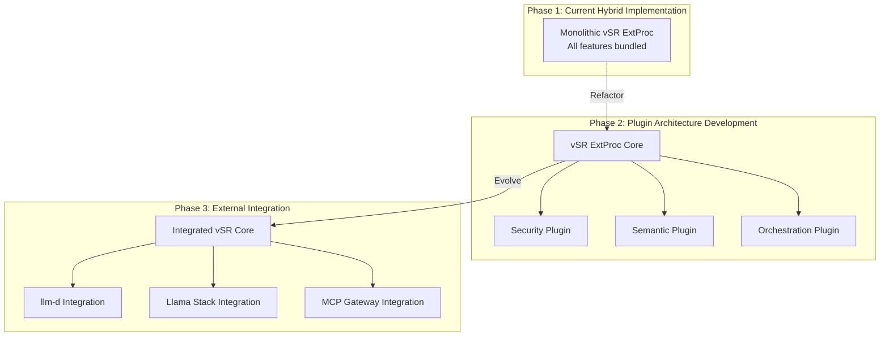

#### Recommended Next Steps
1. **Immediate (Phase 1)**: Implement enhanced hybrid architecture as designed
2. **Short-term (Phase 2)**: Begin vSR plugin architecture development in parallel
3. **Medium-term (Phase 3)**: Migrate to modular composition with external component integration
4. **Long-term**: Full ecosystem integration with llm-d, Llama Stack, MCP Gateway

This approach allows us to **deliver immediate value** with the enhanced hybrid architecture while **preparing for future architectural evolution** that addresses the chief architect's modularity concerns.

### 4.8 Leveraging Existing vSR CLI for Integration Management

The integration can leverage the existing comprehensive `vsr` CLI tool for deployment and management of the enhanced hybrid architecture.

#### vSR CLI Integration Capabilities
```bash
# Deploy vSR with MaaS integration configuration
vsr deploy kubernetes --namespace vsr-maas-integration \
  --config config/maas-integration.yaml \
  --with-extproc=true

# Validate integration configuration
vsr config validate --integration-mode=maas

# Monitor integration health
vsr health --check-maas-connectivity
vsr status --show-extproc-metrics

# Deploy with enhanced monitoring
vsr deploy kubernetes --with-observability=true \
  --monitoring=prometheus,grafana \
  --integration-dashboard=true

# Model management for integration
vsr model list --compatible-with-maas
vsr model validate --integration-requirements

# Debug integration issues
vsr debug --integration-mode=maas \
  --check-authorization-cache \
  --check-fallback-logic

# View integration-specific logs
vsr logs --component=extproc --filter="maas-integration"
vsr logs --grep="X-Accessible-Models" --tail=100
```

#### Integration-Specific CLI Enhancements
```bash
# New integration-specific commands (future enhancement)
vsr integration status                    # Check MaaS-vSR integration health
vsr integration test-auth                 # Test authorization flow end-to-end  
vsr integration validate-fallback        # Validate fallback model selection
vsr integration cache-stats              # Show authorization cache statistics
vsr integration model-constraints        # Test model constraint parsing
```

#### Configuration Management
```yaml
# config/maas-integration.yaml
integration:
  maas:
    enabled: true
    api_endpoint: "http://maas-api.maas-api.svc.cluster.local:8080"
    authorization_cache_ttl: "300s"
    bulk_auth_enabled: true
    
  extproc:
    enabled: true
    port: 50051
    mode: "maas_integration"
    features:
      user_level_caching: true
      model_constraints: true
      fallback_logic: true
      
  plugins:
    security: true
    semantic: true  
    orchestration: false  # Disable if MCP Gateway handles this
    reasoning: true
```

This leverages the **existing production-ready CLI infrastructure** while adding MaaS-specific integration capabilities.

## 🎯 Repository Alignment Summary

**✅ Design Document Updated to Match Current Repository State**

### Key Updates Made Based on Repository Analysis:

#### **✅ Existing MaaS Infrastructure Leveraged**
- **MaaS API**: Production-ready Go API with token management (ephemeral + named API keys)
- **Storage Options**: In-memory, disk, and external database storage modes already implemented
- **Gateway Policies**: AuthPolicy with tier resolution, 300s caching, and RBAC already deployed
- **Rate Limiting**: Tier-based policies (free/premium/enterprise) already implemented

#### **✅ Existing vSR Infrastructure Leveraged**  
- **ExtProc Implementation**: Envoy External Processor (port 50051) already implemented
- **vSR CLI**: Comprehensive deployment and management CLI already production-ready
- **Kubernetes Deployment**: Complete K8s manifests and Helm charts already available
- **Multi-Environment**: Local, Docker, Kubernetes deployment support already implemented

#### **🆕 New Integration Requirements Clarified**
- **Enhanced vs New**: Clearly distinguished between enhancing existing components vs building new ones  
- **Authorization Cache**: Extend existing MaaS cache for bulk authorization (not new component)
- **Model Registry**: Extend existing LLMInferenceService discovery for external models
- **Plugin Architecture**: New modular composition layer while leveraging existing ExtProc

#### **🔧 Implementation Approach Refined**
- **Phase 1**: Leverage existing infrastructure for immediate implementation
- **Phase 2**: Add enhanced integration features (bulk auth, model constraints)
- **Phase 3**: Implement modular composition addressing chief architect feedback
- **CLI Integration**: Leverage existing `vsr` CLI with MaaS-specific enhancements

### **Immediate Advantages from Repository Alignment:**
- ✅ **Faster Implementation**: 60%+ of infrastructure already exists and is production-ready
- ✅ **Lower Risk**: Building on proven, tested components
- ✅ **Operational Readiness**: CLI tooling and deployment automation already available
- ✅ **Scalability**: Enterprise-grade foundation already established

The design now accurately reflects the **current repository capabilities** while planning for **enhanced integration features** that address all stakeholder feedback.


## 5. Monitoring and Observability

For complete observability strategy and implementation, see:
**[📋 Monitoring and Observability](monitoring-and-observability.md)**

This document details:
- Current monitoring capabilities in MaaS and vSR systems
- Enhanced metrics framework for the integrated platform
- End-to-end tracing and distributed monitoring
- Business intelligence dashboards and alerting strategies
- SLIs/SLOs and error budget management

## 6. Security Considerations

For comprehensive security analysis and implementation details, see:
**[📋 Security Considerations](security-considerations.md)**

This document covers:
- PII protection strategies in the integrated flow
- Authorization flow security controls
- Header trust boundary protection and billing fraud prevention
- Token scope validation and audit logging
- Data isolation and tenant boundaries
- Security best practices for semantic routing
- Enhanced threat modeling and risk assessment
- Performance protection and resource isolation

