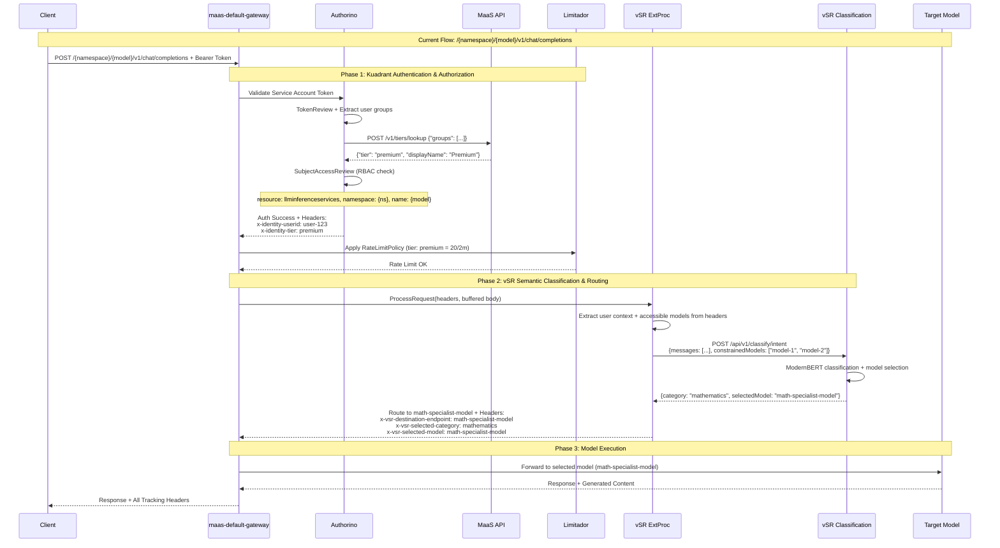

# vSR-MaaS Integration: Enhanced Gateway Architecture

**Document Status**: Technical Design  
**Date**: January 2026  
**Author**: Noy Itzikowitz

## 1. Current Architecture Analysis

### 1.1 MaaS Platform Current Flow

**MaaS API Role**: Model listing (`/v1/models`) and token management only
**Inference Flow**: Client → Gateway → Kuadrant (auth/rate limiting) → Target Model  
**No MaaS API in inference path** - direct model access via `/{namespace}/{model}/v1/chat/completions`

**Key Components:**
- **Gateway**: `maas-default-gateway` (routes all traffic)
- **Kuadrant**: Policy engine (AuthPolicy + RateLimitPolicy)  
- **Authorino**: Authentication/authorization (SA token + tier lookup + RBAC)
- **Limitador**: Rate limiting (tier-based: free=5/2m, premium=20/2m, enterprise=50/2m)
- **Model Access**: Direct via HTTPRoutes created by LLMInferenceService

### 1.2 vSR Platform Current Capabilities

**vSR ExtProc**: Envoy External Processor (gRPC port 50051)
**Classification**: ModernBERT-based intent, PII, and jailbreak detection
**Model Selection**: Based on category classification
**Headers**: Rich set of decision tracking headers (x-vsr-selected-*)

## 2. Integration Solution

**Problem**: Integrate semantic routing while maintaining single-pass efficiency and existing auth/rate limiting.

**Solution**: Add vSR ExtProc to the Gateway processing pipeline alongside Kuadrant.

### 2.1 Enhanced Gateway Architecture

```mermaid
graph TB
    subgraph "Client Layer"
        Client[Client Applications]
    end
    
    subgraph "Gateway Layer - maas-default-gateway" 
        Gateway[Envoy Gateway<br/>maas.cluster.local]
        
        subgraph "Processing Pipeline"
            Kuadrant[Kuadrant Policies]
            VSRExtProc[vSR ExtProc<br/>:50051]
        end
        
        subgraph "Policy Services"
            Authorino[Authorino<br/>Auth Service]
            Limitador[Limitador<br/>Rate Limiting]
        end
    end
    
    subgraph "Backend Services"
        MaaSAPI[MaaS API<br/>Token + Model Listing]
        VSRClassification[vSR Classification<br/>HTTP APIs]
        TargetModel[KServe Model<br/>/{ns}/{model}/v1/chat/completions]
    end
    
    Client --> Gateway
    Gateway --> Kuadrant
    Gateway --> VSRExtProc
    
    Kuadrant --> Authorino
    Kuadrant --> Limitador
    
    Authorino <--> MaaSAPI
    VSRExtProc <--> VSRClassification
    
    Gateway --> TargetModel
```

**Key Innovation**: vSR ExtProc runs **alongside** (not replacing) Kuadrant policies, enabling smart routing while preserving authentication/authorization.

### 2.2 Complete Inference Flow Sequence



## 3. Headers and Metadata Flow

### 3.1 Existing Headers (Current MaaS)

**Authorino → Gateway (Existing)**
| Header | Source | Example | Purpose |
|--------|---------|---------|---------|
| `x-identity-userid` | Authorino | `user-123` | User identification from SA token |
| `x-identity-tier` | Authorino | `premium` | Tier from MaaS API lookup |

### 3.2 New Headers (vSR Integration)

**vSR ExtProc → Gateway (New)**
| Header | Source | Example | Purpose |
|--------|---------|---------|---------|
| `x-vsr-destination-endpoint` | vSR ExtProc | `math-specialist-model` | Model routing destination |
| `x-vsr-selected-category` | vSR ExtProc | `mathematics` | Detected content category |
| `x-vsr-selected-model` | vSR ExtProc | `math-specialist-model` | Selected model identifier |
| `x-vsr-selected-reasoning` | vSR ExtProc | `on` | Reasoning mode status |
| `x-vsr-selected-decision` | vSR ExtProc | `math_decision` | Decision engine result |

**Security Headers (Conditional)**
| Header | Source | When | Purpose |
|--------|---------|------|---------|
| `x-vsr-pii-violation` | vSR ExtProc | PII detected | Request blocked for PII |
| `x-vsr-jailbreak-blocked` | vSR ExtProc | Jailbreak detected | Request blocked for security |

### 3.3 Internal Processing Headers

**ExtProc Internal Logic (Not exposed to client)**
| Data | Source | Example | Usage |
|------|---------|---------|-------|
| Accessible Models | From user RBAC context | `["model-1", "model-2"]` | Constrain vSR selection |
| User Groups | From Authorino headers | `["premium-users"]` | Model access control |

## 4. Implementation Requirements

### 4.1 Changes Required by Component

#### vSR Platform Changes 
**Status**: ✅ **Minimal changes** - vSR already supports most requirements

**Required Additions:**
1. **Model Constraint API**: Add `constrainedModels` parameter to classification endpoints
   ```go
   // Add to existing /api/v1/classify/intent endpoint
   type ClassifyRequest struct {
       Text             string   `json:"text"`             // ✅ Existing
       ConstrainedModels []string `json:"constrainedModels"` // 🆕 New field
   }
   ```

2. **Model Selection Response**: Include selected model in classification response
   ```go
   // Extend existing response
   type ClassifyResponse struct {
       Category      string  `json:"category"`     // ✅ Existing  
       Confidence    float64 `json:"confidence"`   // ✅ Existing
       SelectedModel string  `json:"selectedModel"` // 🆕 New field
   }
   ```

3. **ExtProc Integration**: Add MaaS-specific headers processing
   - Extract user context from Authorino headers (`x-identity-*`)
   - Derive accessible models from user RBAC/tier information
   - Map category → model selection within constraints

#### MaaS Platform Changes
**Status**: ✅ **No changes required** - MaaS continues current role

**Confirmed No Changes:**
- ✅ Keep existing `/v1/models` endpoint (model listing)  
- ✅ Keep existing `/v1/tiers/lookup` endpoint (used by Authorino)
- ✅ Keep existing token management (`/v1/tokens`, `/v1/api-keys`)
- ✅ No new inference endpoints needed

#### Kuadrant Configuration Changes  
**Status**: ⚠️ **Gateway configuration only**

**Required Additions:**
1. **Add vSR ExtProc Filter** to `maas-default-gateway`
   ```yaml
   # Add to existing Envoy configuration
   http_filters:
   - name: envoy.filters.http.ext_proc
     typed_config:
       "@type": type.googleapis.com/envoy.extensions.filters.http.ext_proc.v3.ExternalProcessor
       grpc_service:
         envoy_grpc:
           cluster_name: vsr_extproc_service
       processing_mode:
         request_header_mode: "SEND"
         request_body_mode: "BUFFERED"  # Required for classification
         response_header_mode: "SEND"
   ```

2. **Keep Existing Policies** - No changes to AuthPolicy or RateLimitPolicy
   ```yaml
   # ✅ Keep existing gateway-auth-policy.yaml
   # ✅ Keep existing rate-limit-policy.yaml  
   # ✅ Keep existing token-limit-policy.yaml
   ```

### 4.2 Deployment Architecture

**Service Deployment:**
```yaml
# vsr-extproc-service.yaml  
apiVersion: apps/v1
kind: Deployment
metadata:
  name: vsr-extproc-service
spec:
  template:
    spec:
      containers:
      - name: vsr-extproc
        image: vsr/semantic-router:latest  # ✅ Existing vSR image
        ports:
        - containerPort: 50051  # ✅ Existing gRPC port
        env:
        - name: VSR_CONFIG_PATH
          value: "/config/router-config.yaml"
        - name: MAAS_INTEGRATION_MODE  # 🆕 New flag
          value: "true"
```

### 4.3 Benefits Summary

✅ **Minimal Changes**: vSR needs only API extensions, MaaS needs zero changes  
✅ **Single-Pass Processing**: No "back and forth" request parsing  
✅ **Preserves Security**: Full Kuadrant auth/rate limiting maintained  
✅ **Flexible Composition**: Easy to add GIE, llm-d without additional parsing  
✅ **Zero Authorization Failures**: vSR only selects from user-accessible models  
✅ **Operational Simplicity**: Leverages existing production infrastructure  

This design directly addresses the efficiency requirement while maintaining the robust security and policy enforcement of the current MaaS architecture.
