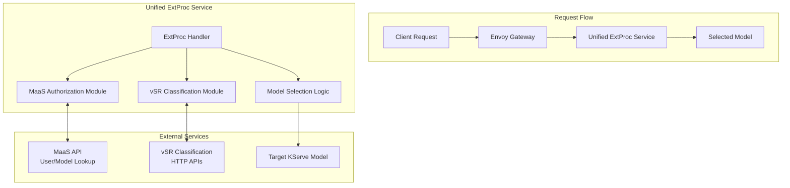
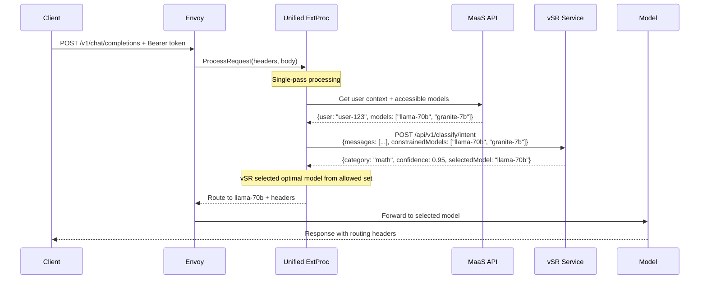

# vSR-MaaS Integration: Single-Pass Architecture

**Document Status**: Technical Design  
**Date**: January 2026  
**Author**: Noy Itzikowitz

## 1. Solution Overview

**Problem**: Avoid multiple request parsing while integrating vSR semantic classification with MaaS authorization and model routing.

**Solution**: Single Envoy ExtProc that combines MaaS authorization logic with vSR classification in one pass.

### Component Integration



## 2. Technical Implementation

### 2.1 Single-Pass ExtProc Architecture

The solution implements a **unified ExtProc service** that handles authorization, classification, and routing in a single request pass:



### 2.2 Component Interactions

#### Unified ExtProc Service
- **Location**: Deployed as Kubernetes service alongside vSR
- **Protocol**: gRPC ExtProc interface (port 50051)
- **Function**: Single-pass request processing combining authorization + classification

#### MaaS API Integration
- **Endpoint**: `/api/v1/users/{user_id}/models` - Get accessible models for user
- **Authentication**: Service-to-service using ExtProc service account
- **Data**: Returns user context, tier, and authorized model list

#### vSR Classification Integration  
- **Endpoints**: 
  - `/api/v1/classify/intent` - Content classification
  - `/api/v1/classify/pii` - PII detection
  - `/api/v1/classify/security` - Jailbreak detection
- **Protocol**: HTTP REST calls from ExtProc
- **Input**: Chat request body (messages array)

#### Envoy Configuration
```yaml
http_filters:
- name: envoy.filters.http.ext_proc
  typed_config:
    "@type": type.googleapis.com/envoy.extensions.filters.http.ext_proc.v3.ExternalProcessor
    grpc_service:
      envoy_grpc:
        cluster_name: unified_extproc_service  # New unified service
    processing_mode:
      request_header_mode: "SEND"
      request_body_mode: "BUFFERED"  # Required for classification
      response_header_mode: "SEND"
```

#### Kuadrant Policy Configuration
```yaml
# Remove separate auth policies, delegate to ExtProc
apiVersion: kuadrant.io/v1beta3
kind: AuthPolicy
metadata:
  name: maas-extproc-auth
spec:
  targetRef:
    group: gateway.networking.k8s.io
    kind: Gateway
    name: maas-default-gateway
  rules:
    authentication:
      "delegate-to-extproc":
        extProc:
          endpoint: unified_extproc_service:50051
```

### 2.3 ExtProc Implementation

```go
// Unified ExtProc service combining MaaS auth + vSR classification
type UnifiedExtProcServer struct {
    maasClient *maas.Client
    vsrClient  *vsr.ClassificationClient
    modelMap   map[string]ModelInfo
}

func (s *UnifiedExtProcServer) Process(
    ctx context.Context, 
    req *extproc.ProcessingRequest,
) (*extproc.ProcessingResponse, error) {
    
    // 1. Extract user context from bearer token
    userID, err := s.extractUserFromToken(req.Request.Headers)
    if err != nil {
        return s.createAuthErrorResponse(), nil
    }
    
    // 2. Get accessible models for user (single MaaS API call)
    models, err := s.maasClient.GetUserModels(ctx, userID)
    if err != nil {
        return s.createAuthErrorResponse(), nil
    }
    
    // 3. Classify request content with model constraints (single vSR call)
    classifyRequest := vsr.ClassifyRequest{
        Messages: extractMessages(body),
        ConstrainedModels: extractModelNames(models), // Pass allowed models to vSR
    }
    classification, err := s.vsrClient.ClassifyWithConstraints(ctx, classifyRequest)
    if err != nil {
        return s.createErrorResponse("Classification failed"), nil
    }
    
    // 4. Security check
    if classification.IsJailbreak {
        return s.createSecurityErrorResponse(), nil
    }
    
    // 5. vSR returns pre-selected model from allowed set
    selectedModel := classification.SelectedModel // vSR already selected from constraints
    
    // 6. Return routing decision
    return s.createRoutingResponse(selectedModel, classification), nil
}
```

### 2.4 Response Headers

| Header | Source | Example | Purpose |
|--------|---------|---------|---------|
| `x-vsr-selected-model` | ExtProc | `llama-70b` | Selected model identifier |
| `x-vsr-category` | ExtProc | `mathematics` | Detected content category |
| `x-vsr-confidence` | ExtProc | `0.95` | Classification confidence |
| `x-maas-user-tier` | ExtProc | `premium` | User tier for billing |

## 3. Deployment

### 3.1 Service Deployment

```yaml
# unified-extproc-service.yaml
apiVersion: apps/v1
kind: Deployment
metadata:
  name: unified-extproc-service
spec:
  template:
    spec:
      containers:
      - name: unified-extproc
        image: maas/unified-extproc:latest
        ports:
        - containerPort: 50051  # gRPC ExtProc
        env:
        - name: MAAS_API_ENDPOINT
          value: "http://maas-api:8080"
        - name: VSR_API_ENDPOINT  
          value: "http://vsr-service:9090"
        - name: LOG_LEVEL
          value: "INFO"
```

### 3.2 Benefits of Single-Pass Architecture

✅ **Efficiency**: One request parse, no "back and forth" to Envoy  
✅ **Performance**: Parallel MaaS + vSR calls within single ExtProc  
✅ **Flexibility**: Easy to add new classification types (GIE, llm-d integration)  
✅ **Maintainability**: All integration logic in one service  
✅ **Scalability**: ExtProc scales independently from gateway  

This design directly addresses the composition flexibility requirement - new components like GIE can be added to the unified ExtProc without additional Envoy parsing passes.

### 3.3 Model Constraint Flow

The critical innovation is passing **constrained model sets** to vSR for selection:

```go
// vSR receives only user-authorized models
type ClassifyRequest struct {
    Messages         []ChatMessage `json:"messages"`
    ConstrainedModels []string     `json:"constrainedModels"` // Only user-accessible models
}

// vSR selects optimal model from constraints
type ClassifyResponse struct {
    Category      string  `json:"category"`
    Confidence    float64 `json:"confidence"`
    SelectedModel string  `json:"selectedModel"`  // Selected from constrainedModels only
    IsJailbreak   bool    `json:"isJailbreak"`
}
```

**Benefits:**
- ✅ **Zero Authorization Failures**: vSR cannot select unauthorized models
- ✅ **Intelligent Selection**: vSR picks optimal model from user's allowed set  
- ✅ **Security**: Authorization happens before classification
- ✅ **Efficiency**: Single classification call includes model selection

