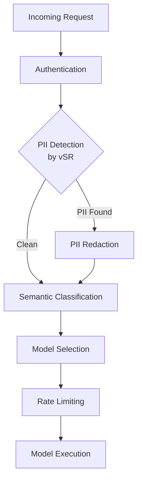
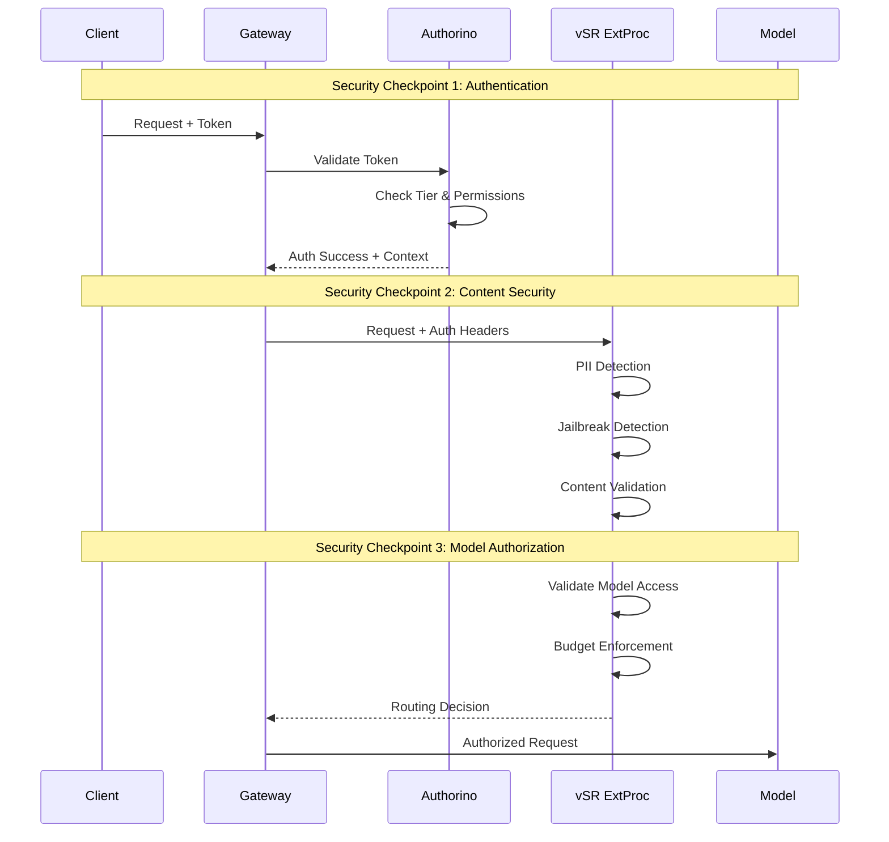

# Security Considerations

**Document**: Security Analysis for vSR-MaaS Integration  
**Date**: December 2025  
**Related**: [Main Design Proposal](README.md)

## Overview

This document provides a comprehensive security analysis for the integration of vLLM Semantic Router with the Models-as-a-Service platform. The integration maintains the security posture of both systems while introducing new security considerations specific to semantic routing, intelligent model selection, and protection against fraud and unauthorized access.

## Critical Security Challenges

### 1. Header Trust Boundary & Billing Fraud

**Risk**: Malicious users can inject billing headers to manipulate cost calculations and commit billing fraud.

**Attack Scenario**:
```http
# Malicious request with injected billing headers
POST /chat/completions
Authorization: Bearer token123
X-MaaS-Model-Selected: tiny-model    # ← INJECTED FRAUD HEADER
X-Model-Cost: 0.01                   # ← FAKE COST HEADER

# What happens:
# 1. vSR routes to llama3-70b (actual cost: $0.75)
# 2. Billing system reads fake header (charged: $0.01)  
# 3. Company loses $0.74 per request
```

**Impact**: Revenue loss, billing system integrity compromise, unfair resource consumption

### 2. Unauthorized Access to Premium Features

**Risk**: Non-paying users gaining access to semantic routing capabilities without proper authorization.

**Attack Scenario**:
```http
# Free tier user accessing premium semantic routing
POST /chat/completions
Authorization: Bearer free-tier-token
# User gets intelligent model selection without semantic-router.vllm.ai/semanticRouting permission
```

**Impact**: Revenue loss, unfair resource allocation, tier boundary violations

### 3. Performance Degradation Attack

**Risk**: Basic users forced through unnecessary ExtProc processing, causing latency and resource waste.

**Attack Scenario**:
```http
# Basic users experiencing 200ms+ additional latency through vSR processing
# when they don't need or pay for semantic routing features
```

**Impact**: Poor user experience, resource waste, system performance degradation

## Security Architecture

### PII Protection in Integrated Flow

The integrated architecture maintains robust PII protection through multiple layers:



**Key PII Protection Features:**

1. **Early Detection**: PII scanning occurs immediately after authentication, before any model processing
2. **Configurable Policies**: Per-tier PII policies with allow/deny lists for specific PII types
3. **Content Redaction**: Automatic redaction or rejection of requests containing prohibited PII
4. **Audit Trail**: Complete logging of PII detection events and policy decisions

### Authorization Flow Security

The proposed Authorization-First flow ensures comprehensive security controls:



## Enhanced Security Controls

### 1. Header Trust Boundary Protection

**Objective**: Prevent billing fraud and header manipulation attacks through strict header sanitization.

#### Pre-ExtProc Header Sanitization

```yaml
# Envoy HTTP Filter Configuration - Applied BEFORE ExtProc
http_filters:
- name: envoy.filters.http.lua
  typed_config:
    "@type": type.googleapis.com/envoy.extensions.filters.http.lua.v3.Lua
    inline_code: |
      function envoy_on_request(request_handle)
        -- Strip ALL potential billing fraud headers before vSR processing
        request_handle:headers():remove("x-maas-model-selected")
        request_handle:headers():remove("x-model-cost")
        request_handle:headers():remove("x-fallback-applied")
        request_handle:headers():remove("x-original-model")
        request_handle:headers():remove("x-fallback-reason")
        request_handle:headers():remove("x-category")
        request_handle:headers():remove("x-security-passed")
        
        -- Log sanitization for audit trail
        request_handle:logInfo("Header sanitization applied for security")
      end

# Apply this filter BEFORE the ExtProc filter to ensure all malicious headers are stripped
```

**Benefits**:
- Prevents billing fraud through client header injection
- Creates clear trust boundary between client and system-generated metadata
- Maintains audit trail of sanitization actions

#### Billing Header Authorization

Only vSR ExtProc service is authorized to inject billing-related headers:

```yaml
# Service account configuration for vSR
apiVersion: v1
kind: ServiceAccount
metadata:
  name: vsr-extproc-service
  annotations:
    billing.maas.io/authorized-headers: "x-maas-model-selected,x-model-cost"
    security.maas.io/trusted-source: "true"
```

### 2. Semantic Routing Access Control

**Objective**: Ensure only authorized users can access premium semantic routing features.

#### Authorization Policy Enhancement

```yaml
# Authorino AuthPolicy with semantic routing check
apiVersion: authorino.kuadrant.io/v1beta2
kind: AuthPolicy
metadata:
  name: semantic-routing-gate
spec:
  authorization:
    semantic_routing_access:
      kubernetesSubjectAccessReview:
        user:
          expression: auth.identity.user.username
        groups:
          expression: auth.identity.user.groups
        resourceAttributes:
          group:
            value: semantic-router.vllm.ai
          resource:
            value: semanticRouting
          verb:
            value: use
  response:
    success:
      headers:
        x-semantic-authorized:
          expression: |
            auth.authorization.semantic_routing_access ? "true" : "false"
        x-semantic-tier:
          expression: auth.metadata.tier_lookup.tier
```

#### Complete RBAC Configuration

**ClusterRole for Semantic Routing Access:**
```yaml
# ClusterRole defining semantic routing permissions
apiVersion: rbac.authorization.k8s.io/v1
kind: ClusterRole
metadata:
  name: semantic-routing-user
  labels:
    app.kubernetes.io/component: rbac
    app.kubernetes.io/part-of: vsr-maas-integration
rules:
- apiGroups: ["semantic-router.vllm.ai"]
  resources: ["semanticRouting"]
  verbs: ["use"]
- apiGroups: [""]
  resources: ["configmaps"]
  resourceNames: ["vsr-routing-config"]
  verbs: ["get"]
---
# ClusterRole for semantic routing administration
apiVersion: rbac.authorization.k8s.io/v1
kind: ClusterRole
metadata:
  name: semantic-routing-admin
rules:
- apiGroups: ["semantic-router.vllm.ai"]
  resources: ["semanticRouting"]
  verbs: ["use", "manage", "configure"]
- apiGroups: [""]
  resources: ["configmaps"]
  verbs: ["get", "update", "patch"]
```

**RoleBindings for Tier-Based Access:**
```yaml
# Premium users get semantic routing access
apiVersion: rbac.authorization.k8s.io/v1
kind: RoleBinding
metadata:
  name: premium-semantic-access
  namespace: maas-system
subjects:
- kind: Group
  name: tier-premium-users
  apiGroup: rbac.authorization.k8s.io
- kind: Group  
  name: premium-group
  apiGroup: rbac.authorization.k8s.io
roleRef:
  kind: ClusterRole
  name: semantic-routing-user
  apiGroup: rbac.authorization.k8s.io
---
# Enterprise users get semantic routing access
apiVersion: rbac.authorization.k8s.io/v1
kind: RoleBinding
metadata:
  name: enterprise-semantic-access
  namespace: maas-system
subjects:
- kind: Group
  name: tier-enterprise-users
  apiGroup: rbac.authorization.k8s.io
- kind: Group
  name: enterprise-group  
  apiGroup: rbac.authorization.k8s.io
- kind: Group
  name: admin-group
  apiGroup: rbac.authorization.k8s.io
roleRef:
  kind: ClusterRole
  name: semantic-routing-admin
  apiGroup: rbac.authorization.k8s.io
---
# Free tier users explicitly denied (no binding)
# This ensures free tier cannot access semantic routing
```

**Service Account Configuration:**
```yaml
# Service account for vSR ExtProc service
apiVersion: v1
kind: ServiceAccount
metadata:
  name: vsr-extproc-service
  namespace: maas-system
  labels:
    app.kubernetes.io/component: semantic-router
    app.kubernetes.io/part-of: vsr-maas-integration
  annotations:
    billing.maas.io/authorized-headers: "x-maas-model-selected,x-model-cost,x-category"
    security.maas.io/trusted-source: "true"
    semantic-router.vllm.ai/processor-role: "extproc"
---
# ClusterRoleBinding for vSR service operations  
apiVersion: rbac.authorization.k8s.io/v1
kind: ClusterRoleBinding
metadata:
  name: vsr-service-operations
subjects:
- kind: ServiceAccount
  name: vsr-extproc-service
  namespace: maas-system
roleRef:
  kind: ClusterRole
  name: semantic-routing-admin
  apiGroup: rbac.authorization.k8s.io
```

**Model-Specific RBAC Integration:**
```yaml
# Model access control with semantic routing integration
apiVersion: rbac.authorization.k8s.io/v1
kind: Role
metadata:
  name: model-access-with-routing
  namespace: model-serving
rules:
# Standard model access
- apiGroups: ["serving.kserve.io"] 
  resources: ["inferenceservices"]
  verbs: ["get", "create"]
# Semantic routing enhanced access
- apiGroups: ["semantic-router.vllm.ai"]
  resources: ["modelRouting"]
  verbs: ["use"]
# Fallback model access  
- apiGroups: ["serving.kserve.io"]
  resources: ["inferenceservices"]
  resourceNames: ["llama3-8b", "mistral-7b"] # Fallback models
  verbs: ["get", "create"]
```

#### Conditional ExtProc Processing

```yaml
# HTTPRoute with conditional ExtProc based on authorization
apiVersion: gateway.networking.k8s.io/v1
kind: HTTPRoute
spec:
  rules:
  - matches:
    - path: 
        type: PathPrefix
        value: /chat/completions
    filters:
    - type: ExtensionRef
      extensionRef:
        group: networking.istio.io
        kind: EnvoyFilter
        name: conditional-vsr-extproc
      # ExtProc only enabled when X-Semantic-Authorized: true

---
# EnvoyFilter for conditional ExtProc
apiVersion: networking.istio.io/v1alpha3
kind: EnvoyFilter
spec:
  configPatches:
  - applyTo: HTTP_FILTER
    match:
      context: SIDECAR_INBOUND
      listener:
        filterChain:
          filter:
            name: envoy.filters.network.http_connection_manager
    patch:
      operation: INSERT_BEFORE
      value:
        name: envoy.filters.http.ext_proc
        typed_config:
          "@type": type.googleapis.com/envoy.extensions.filters.http.ext_proc.v3.ExternalProcessor
          processing_mode:
            request_header_mode: SEND
            response_header_mode: SKIP
            request_body_mode: BUFFERED
            response_body_mode: NONE
          # Only process if semantic routing is authorized
          filter_enabled:
            runtime_key: semantic_routing_enabled
            default_value:
              numerator: 0
              denominator: HUNDRED
          # Enable based on header
          request_headers_to_add:
          - header:
              key: x-extproc-enabled
              value: "%REQ(x-semantic-authorized)%"
```

### 3. Authentication and Authorization

**Multi-Layer Authentication:**
- **Service Account Tokens**: Kubernetes-native token validation via Authorino
- **Tier Resolution**: Dynamic tier mapping based on user group membership
- **RBAC Enforcement**: Fine-grained permissions for model access

**Authorization Context Validation:**
```yaml
authorization:
  semantic-routing-access:
    kubernetesSubjectAccessReview:
      user:
        expression: auth.identity.user.username
      authorizationGroups:
        expression: auth.identity.user.groups
      resourceAttributes:
        group:
          value: semantic-router.vllm.ai
        resource:
          value: semanticRouting
        verb:
          value: use
```

### 2. Content Security

**PII Protection:**
- **Detection Engine**: ModernBERT-based PII classification with configurable policies
- **Policy Enforcement**: Tier-specific PII handling rules
- **Content Filtering**: Automatic redaction or request rejection

**Jailbreak Prevention:**
- **Prompt Injection Detection**: AI-based detection of malicious prompts
- **Content Validation**: Multi-layer content analysis before model execution
- **Security Filters**: Configurable security policies per model tier

### 3. Model Access Security

**Tier-Based Access Control:**
```go
func (r *AuthorizedOpenAIRouter) validateModelAccess(authContext *AuthContext, selectedModel string) error {
    // Check if selected model is in user's allowed models
    if !slices.Contains(authContext.AllowedModels, selectedModel) {
        return errors.New("model not authorized for user tier")
    }
    
    // Validate cost constraints
    modelCost := r.getModelCost(selectedModel)
    if modelCost > authContext.MaxCost {
        return errors.New("model exceeds cost budget")
    }
    
    return nil
}
```

**Budget Enforcement:**
- **Cost Tracking**: Real-time tracking of model usage costs
- **Budget Limits**: Per-tier and per-user budget enforcement
- **Fallback Protection**: Automatic fallback to cheaper models when budgets are exceeded

### 4. Data Isolation and Privacy

**Tenant Isolation:**
- **Namespace Separation**: Tier-based namespace isolation for service accounts
- **Token Scoping**: Service account tokens scoped to specific namespaces and models
- **Cache Isolation**: Semantic cache respects tenant boundaries

**Data Protection:**
```go
type SecureSemanticCache struct {
    cache map[string]map[string]interface{} // tenant -> cache_key -> data
    
    // Tenant-aware cache operations
    Get(tenantID, key string) interface{}
    Set(tenantID, key string, value interface{})
    Invalidate(tenantID string) // Clear all data for tenant
}
```

### 5. Performance Protection & Resource Isolation

**Objective**: Protect system performance and ensure fair resource allocation.

#### User Tier-Based Processing

```go
// vSR ExtProc processing logic with tier awareness
func (p *ExtProcService) ProcessRequest(req *ProcessingRequest) (*ProcessingResponse, error) {
    // Check semantic routing authorization
    if !p.isSemanticRoutingAuthorized(req.Headers) {
        return p.bypassResponse(), nil // Skip processing for unauthorized users
    }
    
    // Get user tier for appropriate processing
    tier := p.getUserTier(req.Headers)
    
    switch tier {
    case "enterprise":
        return p.fullSemanticProcessing(req) // All features, higher latency budget
    case "premium":  
        return p.standardSemanticProcessing(req) // Core features, standard latency budget
    case "free":
        return p.basicSemanticProcessing(req) // Limited features, strict latency budget
    default:
        return p.bypassResponse(), nil // No semantic routing for unauthorized tiers
    }
}

func (p *ExtProcService) isSemanticRoutingAuthorized(headers map[string]string) bool {
    return headers["x-semantic-authorized"] == "true"
}
```

#### Resource Isolation

```yaml
# Kubernetes ResourceQuota for vSR processing
apiVersion: v1
kind: ResourceQuota
metadata:
  name: vsr-processing-quota
spec:
  hard:
    requests.cpu: "4"
    requests.memory: "8Gi"
    limits.cpu: "8" 
    limits.memory: "16Gi"
  scopes:
  - PriorityClass
  scopeSelector:
    matchExpressions:
    - operator: In
      scopeName: PriorityClass
      values: ["semantic-routing-workload"]
```

### 6. Audit and Monitoring

**Enhanced Security Logging:**
- **Authentication Events**: All token validation and authorization decisions
- **Semantic Routing Access**: Authorization checks for semantic routing capability
- **Header Sanitization**: All instances of malicious header removal
- **Billing Protection**: Attempts to inject billing-related headers
- **Routing Decisions**: Complete audit trail of model selection and routing
- **Security Violations**: PII detection, jailbreak attempts, unauthorized access
- **Performance Protection**: Bypass decisions for unauthorized users
- **Cost Tracking**: Budget usage and limit enforcement events

**Enhanced Monitoring Integration:**
```yaml
# Prometheus metrics for comprehensive security monitoring
security_metrics:
  # Header Trust Boundary
  - name: vsr_header_sanitization_total
    help: "Total number of malicious headers sanitized"
    labels: [header_name, user_tier, source_ip]
  
  - name: vsr_billing_fraud_attempts_total  
    help: "Total number of billing fraud attempts detected"
    labels: [injected_header, user_id, tier]
  
  # Access Control
  - name: vsr_unauthorized_semantic_access_total
    help: "Total number of unauthorized semantic routing attempts"
    labels: [user_tier, user_id, access_reason]
  
  - name: vsr_extproc_bypass_total
    help: "Total number of ExtProc bypasses for unauthorized users"
    labels: [tier, bypass_reason]
    
  # Existing Security Metrics (Enhanced)
  - name: vsr_auth_failures_total
    help: "Total number of authentication failures"
    labels: [tier, reason, semantic_access]
  
  - name: vsr_pii_detections_total
    help: "Total number of PII detection events"
    labels: [tier, pii_type, action, model_selected]
  
  - name: vsr_unauthorized_model_access_total
    help: "Total number of unauthorized model access attempts"
    labels: [tier, requested_model, user_id, semantic_authorized]

  # Performance Protection  
  - name: vsr_processing_latency_by_tier
    help: "vSR processing latency segmented by user tier"
    labels: [tier, processing_mode, authorized]
```

## Security Best Practices

### 1. Token Management

**Service Account Token Security:**
- **Short TTL**: 4-hour token expiration with automatic refresh
- **Audience Scoping**: Tokens scoped to specific gateway audiences
- **Rotation**: Regular rotation of service account tokens
- **Revocation**: Immediate token revocation on security events

### 2. Network Security

**Network Policies:**
```yaml
apiVersion: networking.k8s.io/v1
kind: NetworkPolicy
metadata:
  name: vsr-security-policy
spec:
  podSelector:
    matchLabels:
      app: semantic-router
  policyTypes:
  - Ingress
  - Egress
  ingress:
  - from:
    - namespaceSelector:
        matchLabels:
          name: openshift-ingress
    ports:
    - protocol: TCP
      port: 50051
  egress:
  - to:
    - namespaceSelector:
        matchLabels:
          name: model-serving
    ports:
    - protocol: TCP
      port: 8080
```

### 3. Security Configuration

**vSR Security Configuration:**
```yaml
security:
  pii_detection:
    enabled: true
    strict_mode: true
    policies:
      enterprise:
        allow_by_default: false
        allowed_types: ["ORGANIZATION", "LOCATION"]
      premium:
        allow_by_default: false
        allowed_types: ["ORGANIZATION"]
      free:
        allow_by_default: false
        allowed_types: []
  
  jailbreak_protection:
    enabled: true
    confidence_threshold: 0.8
    action: "reject"  # reject, redact, or allow
  
  authorization:
    require_tier_validation: true
    enforce_budget_limits: true
    validate_model_access: true
```

### 4. Phase 4.5 Fallback Security

**Objective**: Ensure adaptive fallback maintains the same security posture as primary model access while preventing fallback abuse.

#### Fallback Security Requirements

**Re-Authorization Enforcement:**
- All fallback models must pass through complete Phase 3 authorization
- Fallback requests cannot bypass model-specific RBAC checks
- User tier validation applies to fallback model access permissions

**Audit Trail Completeness:**
```yaml
# Enhanced audit logging for fallback decisions
fallback_audit_event:
  timestamp: "2025-12-24T10:30:00Z"
  user_id: "premium-user-123"
  original_model: "llama3-70b" 
  fallback_model: "llama3-8b"
  fallback_reason: "rate_limit_exceeded"
  authorization_status: "approved"
  tier: "premium"
  session_id: "sess-abc123"
```

**Fallback Abuse Prevention:**
```go
type FallbackSecurityConfig struct {
    MaxFallbacksPerSession int           `yaml:"max_fallbacks_per_session"` // Prevent quota gaming
    FallbackCooldown       time.Duration `yaml:"fallback_cooldown"`          // Rate limit fallback attempts
    AuditAllFallbacks     bool          `yaml:"audit_all_fallbacks"`        // Complete audit trail
}

// Security validation for fallback requests
func (s *FallbackSecurityService) ValidateFallbackRequest(req *FallbackRequest) error {
    // Check fallback attempt limits
    if req.SessionFallbackCount >= s.config.MaxFallbacksPerSession {
        return errors.New("maximum fallback attempts exceeded for session")
    }
    
    // Enforce cooldown between fallback attempts  
    if time.Since(req.LastFallbackAttempt) < s.config.FallbackCooldown {
        return errors.New("fallback cooldown period not elapsed")
    }
    
    // Validate user has access to fallback model
    if !s.rbac.HasModelAccess(req.UserContext, req.FallbackModel) {
        return errors.New("user not authorized for fallback model")
    }
    
    return nil
}
```

**Fallback Security Controls:**
- **Loop Prevention**: Track fallback chain depth to prevent infinite fallback loops
- **Model Hierarchy Validation**: Ensure fallback models are actually cheaper/lower tier
- **Session Tracking**: Monitor fallback patterns for abuse detection
- **Emergency Circuit Breaker**: Disable fallback for suspected abuse patterns

#### Enhanced Fallback Monitoring

```yaml
# Security metrics for Phase 4.5 fallback monitoring
fallback_security_metrics:
  - name: fallback_abuse_attempts_total
    help: "Total number of suspected fallback abuse attempts"
    labels: [user_tier, abuse_type, blocked]
    
  - name: fallback_authorization_failures_total  
    help: "Authorization failures during fallback model access"
    labels: [fallback_model, user_tier, failure_reason]
    
  - name: fallback_session_violations_total
    help: "Sessions exceeding fallback limits"
    labels: [user_tier, violation_type, action_taken]
    
  - name: fallback_security_latency_seconds
    help: "Additional security validation time for fallback requests" 
    labels: [validation_type, user_tier]
```

### 5. Incident Response

**Security Incident Handling:**
1. **Automated Response**: Immediate blocking of suspicious requests
2. **Alert Generation**: Real-time alerts for security violations
3. **Evidence Collection**: Comprehensive logging for forensic analysis
4. **Recovery Procedures**: Automated recovery and system hardening

**Compliance and Governance:**
- **GDPR Compliance**: PII detection and handling procedures
- **SOC 2 Type II**: Audit trail and security controls documentation
- **HIPAA Compliance**: Healthcare data protection for medical models

## Enhanced Threat Modeling

### Critical Threat Vectors

1. **Billing Fraud & Header Injection**: Malicious header injection to manipulate billing
   - **Attack Vector**: Client injects `X-MaaS-Model-Selected: cheap-model` while using expensive model
   - **Mitigation**: Pre-ExtProc header sanitization, trusted source validation, audit logging
   - **Impact**: High (Revenue loss, billing integrity compromise)

2. **Unauthorized Semantic Access**: Non-paying users accessing premium semantic routing
   - **Attack Vector**: Free/basic tier users bypassing semantic routing access controls
   - **Mitigation**: RBAC enforcement for semantic-router.vllm.ai/semanticRouting resource, conditional ExtProc
   - **Impact**: Medium (Revenue loss, unfair resource consumption)

3. **Performance Denial Attack**: Forcing unnecessary ExtProc processing on basic users
   - **Attack Vector**: Routing all traffic through vSR regardless of authorization
   - **Mitigation**: Conditional ExtProc bypass, tier-based processing, resource isolation
   - **Impact**: Medium (System performance degradation, poor user experience)

4. **Token Compromise**: Stolen or leaked service account tokens
   - **Attack Vector**: Compromised tokens used to access models and semantic routing
   - **Mitigation**: Short TTL, audience scoping, rotation policies, semantic access validation
   - **Impact**: High (Unauthorized access, potential fraud)

5. **Model Access Bypass**: Attempts to access unauthorized models
   - **Attack Vector**: Manipulating routing decisions or bypassing authorization checks
   - **Mitigation**: Multi-layer RBAC enforcement, budget validation, audit logging
   - **Impact**: Medium (Unauthorized expensive model access)

6. **PII Exfiltration**: Attempts to extract PII through model responses
   - **Attack Vector**: Crafting prompts to extract sensitive information from cached responses
   - **Mitigation**: PII detection, content filtering, user isolation, response scanning
   - **Impact**: High (Privacy violation, compliance breach)

7. **Cost-based Attacks**: Attempts to exhaust user budgets or system resources
   - **Attack Vector**: Repeated expensive model requests to drain quotas or overload system
   - **Mitigation**: Rate limiting, cost tracking, budget enforcement, adaptive fallback
   - **Impact**: Medium (Resource exhaustion, budget drain)

8. **Prompt Injection**: Malicious prompts to manipulate model behavior
   - **Attack Vector**: Crafted prompts to bypass security controls or extract information
   - **Mitigation**: Jailbreak detection, content validation, security filters, tier-based protection
   - **Impact**: Medium (Security control bypass, information disclosure)

### Enhanced Risk Assessment Matrix

| Threat | Probability | Impact | Risk Level | Mitigation Status | Revenue Impact |
|--------|-------------|--------|------------|-------------------|----------------|
| **Billing Fraud & Header Injection** | **High** | **High** | **Critical** | 🆕 **New Controls** | **High Loss** |
| **Unauthorized Semantic Access** | **Medium** | **High** | **High** | 🆕 **New Controls** | **Medium Loss** |
| **Performance Denial Attack** | **Medium** | **Medium** | **Medium** | 🆕 **New Controls** | **Low Impact** |
| Token Compromise | Medium | High | High | ✅ Enhanced | Medium Loss |
| Model Access Bypass | Low | Medium | Medium | ✅ Enhanced | Medium Loss |
| PII Exfiltration | Medium | High | High | ✅ Enhanced | High Compliance Risk |
| Cost-based Attacks | Medium | Medium | Medium | ✅ Enhanced | Medium Loss |
| Prompt Injection | High | Medium | High | ✅ Enhanced | Low Impact |

**Critical Risk Summary**:
- **Billing Fraud**: Highest priority - direct revenue impact through header manipulation
- **Unauthorized Access**: High priority - premium feature theft and unfair resource consumption  
- **PII Exfiltration**: High priority - compliance and privacy violation risks
- **Performance Attacks**: Medium priority - system degradation and user experience impact

## Security Testing and Validation

### Automated Security Testing

```bash
# Security test suite for vSR-MaaS integration
pytest tests/security/test_auth_bypass.py
pytest tests/security/test_pii_detection.py
pytest tests/security/test_token_validation.py
pytest tests/security/test_budget_enforcement.py
pytest tests/security/test_model_access_control.py
```

### Penetration Testing Scope

1. **Authentication Testing**: Token validation, authorization bypass attempts
2. **Content Security Testing**: PII detection accuracy, jailbreak prevention
3. **Model Access Testing**: Unauthorized model access, privilege escalation
4. **Budget Testing**: Cost limit bypass, budget exhaustion attacks
5. **Network Security Testing**: Network policy validation, traffic interception

This security framework ensures that the vSR-MaaS integration maintains enterprise-grade security while enabling intelligent semantic routing capabilities.

## Related Documentation

**Monitoring Integration**: See [Monitoring and Observability](monitoring-and-observability.md) for:
- Security metrics correlation with business metrics and Phase 4.5 fallback monitoring
- Enhanced threat detection through comprehensive metric collection
- End-to-end security tracing across all 5 phases
- Alert correlation and automated incident response

**Architecture Details**: See main [Design Proposal](README.md) for:
- Complete 5-phase hybrid authorization-first architecture overview
- Technical implementation requirements and component integration
- Phase-by-phase security flow and authorization patterns
- Integration patterns and implementation best practices