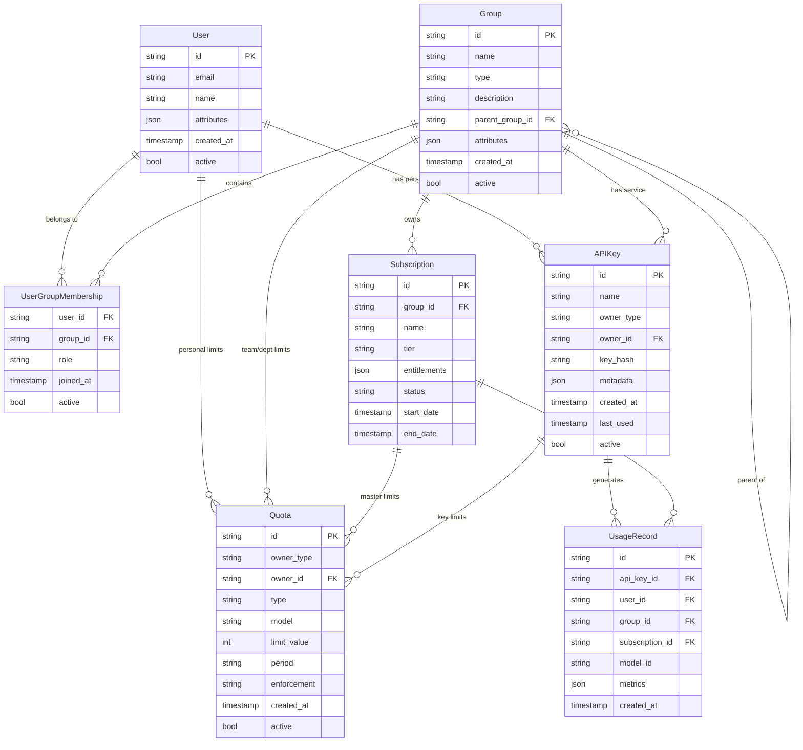
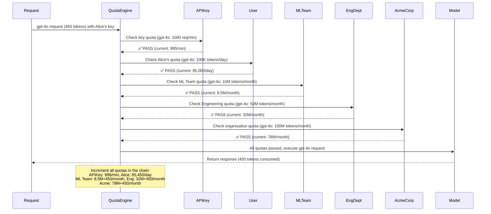
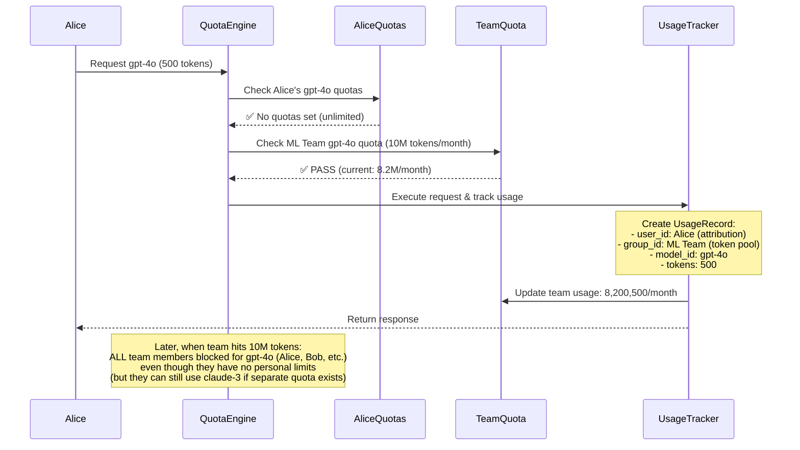
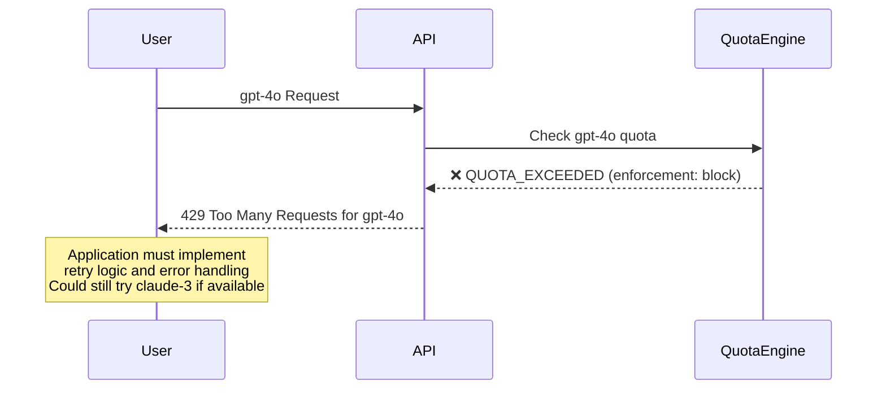
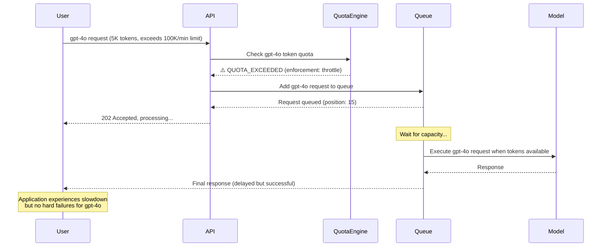

# MaaS Entity Architecture - Token-Based Hierarchical Model
## Flexible Identity and Resource Entitlement

**Author:** Noy Itzikowitz - with some help from Claude Code :)  
**Status:** Draft  
**Created:** 2024-10-27  
**Updated:** 2024-11-10  

---

## Overview

This document defines a new, simplified token-based hierarchical entity model for the MaaS platform. The goal is to establish a flexible, fast data model that enables:

- **Flexible Identity Hierarchy**: Support multi-level organizational structures (Organization → Department → Team) using recursive Group entities
- **Clear Separation of Concerns**: 
  - **Identity Layer**: Who the user/group is (User, Group)
  - **Entitlement Layer**: What they're allowed to access (Subscription)
  - **Enforcement Layer**: Authentication and token limits (APIKey, Quota)
- **Token-Based Quotas**: Simple integer limits (tokens, requests) with no financial logic
- **Model-Aware Limits**: Quotas are specific to individual models (gpt-4, claude-3, etc.)
- **Recursive Enforcement**: Hierarchical limit checking with pooled token budgets
- **Billing Agnostic**: Core system handles only tokens/requests - financial calculations are separate

## Problem Statement

**Current Issues:**
- Flat user/group structure cannot represent complex organizations
- Quotas and limits are buried in JSON blobs, making them hard to manage
- No clear hierarchy for resource allocation and enforcement
- Limited enforcement options (only blocking, no throttling)
- Financial logic mixed with core enforcement, creating complexity
- No model-specific quota support

**Goals:**
- Define 6 core entities with clear separation of concerns
- **Hierarchical Identity**: Recursive Group structure supporting any organizational depth
- **Token-Based Quotas**: Simple integer limits without financial complexity
- **Model-Aware Limits**: Per-model quota enforcement (gpt-4, claude-3, etc.)
- **Layered Enforcement**: Quota checks that walk up the organizational hierarchy
- **Pooled Token Budgets**: Team/department token pools without individual user limits
- **Billing Separation**: Core system handles only tokens/requests - costs calculated elsewhere

---

## Core Design Principles

### 1. Flexible Identity Hierarchy
The system uses recursive Group entities to model any organizational structure:
- **Root Organization**: Top-level Group (no parent)
- **Departments**: Groups with the organization as parent
- **Teams**: Groups with departments as parent  
- **Users**: Individuals who belong to one or more Groups

### 2. Separation of Identity from Entitlements
Clear boundaries between different concerns:

| Layer | Purpose | Entities |
|-------|---------|----------|
| **Identity** | Who the user/group is | User, Group |
| **Entitlement** | What they're allowed to access | Subscription |
| **Enforcement** | Authentication and token limits | APIKey, Quota |

### 3. Token-Based Simplicity
- **No Financial Logic**: Core system only understands tokens, requests, and model names
- **Model-Specific Quotas**: Each quota applies to a specific model (gpt-4, claude-3, etc.)
- **Integer Limits**: All quota values are simple integers (1000000 tokens, 500 requests/min)
- **Billing Separation**: Financial calculations happen in a separate billing layer

### 4. First-Class Quotas and Keys
- **APIKey**: Structured entity (not just a string) with metadata and relationships
- **Quota**: Dedicated entity (not JSON blob) with model, type, limit, and enforcement options

---

## Core Entities

We define 5 core entities with clear separation of concerns:

### Entity Relationships



## Entity Definitions

### 1. User (The Human)
**Role**: The individual human identity that uses the platform.

**Core Fields:**
- `id`: Unique identifier (UUID)
- `email`: Primary email address
- `name`: Display name
- `attributes`: Custom user properties (JSON)
- `active`: Account status

**Key Capabilities:**
- **Group Membership**: Can belong to one or more Groups
- **Derived Department**: User's department is derived from Group membership (no static department field)
- **Personal API Keys**: Can have personal authentication keys
- **Personal Quotas**: Can have individual spending caps or limits
- **Usage Attribution**: All usage is attributed back to the User

**Example:**
```json
{
  "id": "usr-alice-12345",
  "email": "alice@acme.com",
  "name": "Alice Johnson",
  "attributes": {
    "employee_id": "EMP001",
    "hire_date": "2023-01-15",
    "manager": "ml-manager@acme.com"
  },
  "active": true,
  "created_at": "2024-01-15T10:00:00Z"
}
```

**Department Derivation**: Alice's department is determined by finding the Group of `type: "department"` in her membership hierarchy. If Alice belongs to "ML Team" → "Engineering Department" → "Acme Corp", then her department is "Engineering Department". This approach makes organizational changes seamless - move Alice to a new team, and her department updates automatically.

**Relationships:**
- **Belongs to**: Multiple Groups (via UserGroupMembership)
- **Owns**: Personal APIKeys and personal Quotas
- **Generates**: All UsageRecords are attributed to a User

### 2. Group (The Core Identity Container)
**Role**: The primary container for identity and resource allocation. Represents any level of an organization hierarchy through recursive nesting.

**Core Fields:**
- `id`: Unique identifier (UUID)
- `name`: Group display name
- `type`: Group type (organization, department, team, project)
- `description`: Purpose description
- `parent_group_id`: Parent group for hierarchy (NULL for root organization)
- `attributes`: Custom group properties (JSON)
- `active`: Group status

**Key Capabilities:**
- **Recursive Nesting**: Groups can contain other Groups, enabling unlimited hierarchy depth
- **Multi-Level Support**: Can represent Organization → Department → Team → Project
- **Resource Ownership**: Can own Subscriptions and be assigned Quotas
- **Service Accounts**: Can have group-level APIKeys for automated systems

**Example Hierarchy:**
```json
[
  {
    "id": "grp-acme-corp",
    "name": "Acme Corporation",
    "type": "organization", 
    "description": "Root organization",
    "parent_group_id": null,
    "attributes": {
      "industry": "technology",
      "founded": "2010"
    },
    "active": true
  },
  {
    "id": "grp-eng-dept",
    "name": "Engineering Department", 
    "type": "department",
    "description": "All engineering teams",
    "parent_group_id": "grp-acme-corp",
    "attributes": {
      "cost_center": "ENG-001",
      "vp": "engineering-vp@acme.com"
    },
    "active": true
  },
  {
    "id": "grp-ml-team",
    "name": "ML Engineering Team",
    "type": "team",
    "description": "Machine learning engineers and data scientists", 
    "parent_group_id": "grp-eng-dept",
    "attributes": {
      "cost_center": "ENG-ML",
      "manager": "ml-manager@acme.com"
    },
    "active": true
  }
]
```

**Relationships:**
- **Contains**: Multiple Users (via UserGroupMembership)
- **Contains**: Multiple child Groups (via parent_group_id)
- **Owns**: Subscriptions (commercial agreements)
- **Assigned**: Quotas (budget allocations)

### 3. Subscription (The Entitlement Contract)
**Role**: Defines what the group is allowed to access. Purely about entitlements and permissions, not commercial terms.

**Core Fields:**
- `id`: Unique identifier (UUID)
- `group_id`: Owner Group (typically the Root Organization)
- `name`: Subscription name
- `tier`: Service level (free, pro, enterprise)
- `entitlements`: What features/models are included (JSON)
- `status`: Current status (active, suspended, expired)
- `start_date`: Subscription start
- `end_date`: Subscription end (optional)

**Key Capabilities:**
- **Model Access**: Defines which models are available (gpt-4, claude-3, etc.)
- **Feature Entitlements**: Defines available features (throttling, priority, etc.)
- **Multiple Per Tenant**: A Group can have multiple subscriptions (e.g., "Prod", "Dev")
- **Billing Agnostic**: No commercial terms - purely about what's allowed

**Example:**
```json
{
  "id": "sub-acme-enterprise",
  "group_id": "grp-acme-corp",
  "name": "Enterprise Production Subscription",
  "tier": "enterprise",
  "entitlements": {
    "model_access": ["gpt-4o", "gpt-3.5-turbo", "claude-3", "dall-e-3"],
    "feature_throttling": true,
    "priority_support": true,
    "max_concurrent_requests": 500
  },
  "status": "active",
  "start_date": "2024-01-01T00:00:00Z",
  "end_date": "2024-12-31T23:59:59Z"
}
```

**Master Quota**: Subscriptions can have master Quota objects that define total token pools:
```json
{
  "id": "quota-sub-master-gpt4",
  "owner_type": "subscription", 
  "owner_id": "sub-acme-enterprise",
  "type": "tokens",
  "model": "gpt-4o",
  "limit_value": 1000000000,
  "period": "monthly",
  "enforcement": "block"
}
```

**Relationships:**
- **Owned by**: A Group (typically root organization)
- **Has**: Master Quota objects defining the total token limits
- **Tracks**: All UsageRecords for usage attribution

### 4. APIKey (The Authentication Token)
**Role**: First-class entity for authentication and usage attribution. No longer just a string, but a structured object with metadata and relationships.

**Core Fields:**
- `id`: Unique identifier (UUID)
- `name`: Human-readable name
- `owner_type`: Type of owner (user, group)
- `owner_id`: Owner identifier (User ID or Group ID)
- `key_hash`: Hashed version of the actual key
- `metadata`: Additional properties (JSON)
- `created_at`: Creation timestamp
- `last_used`: Last usage timestamp
- `active`: Key status

**Key Capabilities:**
- **Primary Authentication**: Every request is tied to an APIKey
- **Usage Attribution**: All usage is tracked back to the specific key
- **Personal or Service**: Can belong to a User (personal) or Group (service account)
- **Granular Quotas**: Can have its own rate limits and quotas attached

**Examples:**
```json
[
  {
    "id": "key-alice-personal",
    "name": "Alice's Personal Key",
    "owner_type": "user",
    "owner_id": "usr-alice-12345",
    "key_hash": "sha256:abc123...",
    "metadata": {
      "purpose": "personal-development",
      "client_app": "cli-tool"
    },
    "created_at": "2024-01-15T10:00:00Z",
    "last_used": "2024-01-20T14:30:00Z",
    "active": true
  },
  {
    "id": "key-ml-service",
    "name": "ML Team Service Account",
    "owner_type": "group", 
    "owner_id": "grp-ml-team",
    "key_hash": "sha256:def456...",
    "metadata": {
      "purpose": "production-service",
      "service_name": "recommendation-engine"
    },
    "created_at": "2024-01-10T10:00:00Z",
    "last_used": "2024-01-20T14:29:45Z", 
    "active": true
  }
]
```

**Relationships:**
- **Owned by**: Either a User (personal key) or Group (service account)
- **Can have**: Associated Quota objects for rate limiting
- **Generates**: All UsageRecords are tied to an APIKey

### 5. Quota (The Token Limit Rule)
**Role**: Model-specific token/request limits. Each quota applies to a single model and tracks simple integer values.

**Core Fields:**
- `id`: Unique identifier (UUID)
- `owner_type`: What owns this quota (user, group, subscription, api_key)
- `owner_id`: Owner identifier
- `type`: Quota type (tokens, requests)
- `model`: Specific model this quota applies to (e.g., "gpt-4o", "claude-3")
- `limit_value`: The actual limit (integer)
- `period`: Time period (monthly, daily, hourly, per_minute)
- `enforcement`: How to handle violations (block, throttle, alert)
- `created_at`: Creation timestamp
- `active`: Quota status

**Key Capabilities:**
- **Model-Specific**: Each quota applies to exactly one model
- **Token-Based**: Only understands tokens and requests, no financial values
- **Flexible Attachment**: Can be attached to any entity (User, Group, Subscription, APIKey)
- **Integer Limits**: All quota values are simple integers for fast comparison
- **Hierarchical Checking**: System walks up the hierarchy checking quotas for the requested model

**Examples:**
```json
[
  {
    "id": "quota-alice-gpt4-daily",
    "owner_type": "user",
    "owner_id": "usr-alice-12345",
    "type": "tokens",
    "model": "gpt-4o",
    "limit_value": 100000,
    "period": "daily",
    "enforcement": "block",
    "active": true
  },
  {
    "id": "quota-ml-team-claude-monthly",
    "owner_type": "group",
    "owner_id": "grp-ml-team",
    "type": "tokens",
    "model": "claude-3",
    "limit_value": 10000000,
    "period": "monthly",
    "enforcement": "throttle",
    "active": true
  },
  {
    "id": "quota-service-key-rate",
    "owner_type": "api_key",
    "owner_id": "key-ml-service",
    "type": "requests",
    "model": "gpt-4o",
    "limit_value": 100,
    "period": "per_minute",
    "enforcement": "block",
    "active": true
  }
]
```

**Model-Specific Enforcement**: Each quota only applies to its specific model. A user with a gpt-4o token limit can still use claude-3 if they have a separate quota for that model.

**Enforcement Types:**
- **block**: Standard rate limiting - reject request with 429 error
- **throttle**: Queue request and process when capacity available (premium feature)
- **alert**: Allow request but send notification (monitoring only)

**Relationships:**
- **Owned by**: User, Group, Subscription, or APIKey
- **Enforced on**: All requests during hierarchical quota checking

### 6. UsageRecord (The Audit Trail)
**Role**: Captures individual usage events for token attribution and audit. Critical for connecting usage to quota consumption.

**Core Fields:**
- `id`: Unique identifier (UUID)
- `api_key_id`: APIKey that made the request (FK)
- `user_id`: User who owns the APIKey (FK)
- `group_id`: Group context at time of request (FK)
- `subscription_id`: Subscription used for entitlement (FK)
- `model_id`: Model that was used
- `metrics`: Usage details (tokens, duration, etc.) (JSON)
- `created_at`: Request timestamp

**Denormalization Note**: The `user_id`, `group_id`, and `subscription_id` fields are denormalized and stored at the time of the request to simplify and accelerate usage reporting and attribution. This prevents the need for complex JOINs on every reporting query and captures the organizational context at the time of usage (important if users change groups later).

**Example:**
```json
{
  "id": "usage-abc123",
  "api_key_id": "key-alice-personal",
  "user_id": "usr-alice-12345",
  "group_id": "grp-ml-team",
  "subscription_id": "sub-acme-enterprise",
  "model_id": "gpt-4o",
  "metrics": {
    "input_tokens": 150,
    "output_tokens": 300,
    "total_tokens": 450,
    "processing_time_ms": 2500
  },
  "created_at": "2024-01-20T14:30:00Z"
}
```

**Relationships:**
- **Generated by**: APIKey (primary relationship)
- **Attributed to**: User (for accountability)
- **Tracked by**: Subscription (for entitlement usage)
- **Grouped under**: Group (for quota tracking)

---

## Key Scenarios

This section explains how the hierarchical model supports the most important use cases in practice.

### Scenario A: The Recursive Layered Quota Check

When a request comes in with an APIKey, the system performs hierarchical quota checking by walking up the Group tree. This ensures token limits are enforced at every organizational level for the specific model being requested.

**Setup (for gpt-4o model):**
- **Organization**: Acme Corp (100M tokens/month for gpt-4o)
- **Department**: Engineering Dept (50M tokens/month for gpt-4o)
- **Team**: ML Team (10M tokens/month for gpt-4o)
- **User**: Alice (personal 100K tokens/day for gpt-4o)
- **APIKey**: Alice's personal key (1000 requests/minute for gpt-4o)

**Hierarchical Check Flow:**


**Critical Behavior**: If ANY quota in this chain fails, the entire request is blocked. This ensures that token limits are enforced at every organizational level for the specific model. **Model Specificity**: This check only applies to gpt-4o quotas - Alice could still use claude-3 if she has separate quotas for that model.

### Scenario B: The "Pooled Quota" (Most Important Use Case)

This scenario supports users who should NOT be individually limited but should contribute to their team's shared token pool.

**Setup:**
- **Alice** (ML Engineer): No personal quotas set for gpt-4o
- **Bob** (ML Engineer): No personal quotas set for gpt-4o
- **ML Team**: 10M tokens/month shared pool for gpt-4o
- **Use Case**: Team members share a token pool without individual limits

**Configuration:**
```json
{
  "users": [
    {
      "id": "usr-alice",
      "name": "Alice",
      "quotas": []
    },
    {
      "id": "usr-bob", 
      "name": "Bob",
      "quotas": []
    }
  ],
  "groups": [
    {
      "id": "grp-ml-team",
      "name": "ML Team",
      "quotas": [
        {
          "type": "tokens",
          "model": "gpt-4o",
          "limit_value": 10000000,
          "period": "monthly",
          "enforcement": "block"
        }
      ]
    }
  ]
}
```

**Request Flow:**


**Key Benefits:**
1. **Individual Freedom**: Alice and Bob have no personal token limits
2. **Team Accountability**: Their usage counts toward shared team token pool
3. **Clear Attribution**: Each request is still attributed to the individual user
4. **Model-Specific Enforcement**: When gpt-4o pool exhausted, all members blocked for that model only

### Scenario C: Throttling vs. Blocking

Advanced enforcement options provide different behaviors when token quotas are exceeded.

**Setup: Different Enforcement Types**
```json
{
  "quotas": [
    {
      "id": "quota-basic-user",
      "owner_type": "user",
      "owner_id": "usr-basic",
      "type": "requests",
      "model": "gpt-4o",
      "limit_value": 10,
      "period": "per_minute",
      "enforcement": "block"
    },
    {
      "id": "quota-premium-team",
      "owner_type": "group",
      "owner_id": "grp-premium",
      "type": "tokens",
      "model": "gpt-4o", 
      "limit_value": 100000,
      "period": "per_minute",
      "enforcement": "throttle"
    }
  ]
}
```

**Behavior Comparison:**

| Enforcement | When Quota Exceeded | User Experience |
|-------------|-------------------|-----------------|
| **block** | Immediate 429 error | Hard failure, application must handle retries |
| **throttle** | Request queued | Application slows down but doesn't fail |
| **alert** | Request allowed, notification sent | Normal operation, monitoring only |

**Blocking Flow (Standard):**


**Throttling Flow (Premium):**


**Model-Specific Benefits:**
- **Per-Model Enforcement**: Throttling applies only to the specific model (gpt-4o) - users can still access other models
- **Granular Control**: Different enforcement policies for different models based on cost/importance
- **Flexible Fallback**: Applications can try alternative models when preferred model is throttled

**Use Cases:**
- **Government/Public Services**: Cannot afford hard failures, throttling ensures service degradation instead of outages
- **Production Systems**: Throttling prevents cascade failures while maintaining availability
- **Development**: Blocking is acceptable for non-critical workloads

## Implementation Benefits

This new hierarchical model provides significant advantages over the previous flat structure:

### 1. Organizational Flexibility
- **Unlimited Hierarchy**: Support any organizational depth (Org → Division → Department → Team → Project)
- **Real-World Modeling**: Accurately represents how companies are actually structured
- **Easy Reorganization**: Moving teams between departments is just a parent_group_id change

### 2. Token Management
- **Hierarchical Enforcement**: Token limits enforced at every level of the organization
- **Pooled Resources**: Teams can share token pools without individual user limits  
- **Model-Specific Control**: Separate quotas for each model (gpt-4o, claude-3, etc.)
- **Transparent Attribution**: Every token consumed is attributed to both user and quota owner

### 3. Operational Excellence
- **First-Class Entities**: No more JSON blobs - quotas and keys are queryable objects
- **Advanced Enforcement**: Support for throttling in addition to blocking
- **Clear Separation**: Identity, entitlement, and enforcement concerns are cleanly separated
- **Billing Agnostic**: Core system only handles tokens - financial calculations are separate

### 4. Enterprise Readiness
- **Multi-Subscription**: Organizations can have separate dev/prod/research entitlements
- **Service Accounts**: Groups can have their own API keys for automated systems
- **Model-Specific Control**: Fine-grained quotas per model for precise resource management
- **Audit Trail**: Complete traceability from request to token consumption

---

## Sample Implementation

Here's how a complete organizational setup might look:

```json
{
  "groups": [
    {
      "id": "grp-acme",
      "name": "Acme Corporation",
      "type": "organization",
      "parent_group_id": null
    },
    {
      "id": "grp-engineering",
      "name": "Engineering",
      "type": "department", 
      "parent_group_id": "grp-acme"
    },
    {
      "id": "grp-ml-team",
      "name": "ML Team",
      "type": "team",
      "parent_group_id": "grp-engineering"
    }
  ],
  "subscriptions": [
    {
      "id": "sub-enterprise",
      "group_id": "grp-acme",
      "tier": "enterprise",
      "entitlements": {
        "model_access": ["gpt-4", "claude-3"],
        "feature_throttling": true
      }
    }
  ],
  "quotas": [
    {
      "owner_type": "subscription",
      "owner_id": "sub-enterprise",
      "type": "tokens",
      "model": "gpt-4o",
      "limit_value": 1000000000,
      "period": "monthly"
    },
    {
      "owner_type": "group", 
      "owner_id": "grp-engineering",
      "type": "tokens",
      "model": "gpt-4o",
      "limit_value": 500000000,
      "period": "monthly"
    },
    {
      "owner_type": "group",
      "owner_id": "grp-ml-team",
      "type": "tokens", 
      "model": "gpt-4o",
      "limit_value": 100000000,
      "period": "monthly",
      "enforcement": "throttle"
    }
  ],
  "users": [
    {
      "id": "usr-alice",
      "email": "alice@acme.com",
      "memberships": [
        {
          "group_id": "grp-ml-team",
          "role": "engineer"
        }
      ]
    }
  ],
  "api_keys": [
    {
      "id": "key-alice-personal",
      "owner_type": "user",
      "owner_id": "usr-alice",
      "name": "Alice Personal Key"
    },
    {
      "id": "key-ml-service",
      "owner_type": "group", 
      "owner_id": "grp-ml-team",
      "name": "ML Team Service Account"
    }
  ]
}
```

**Token Hierarchy for gpt-4o**: `Subscription (1B tokens)` → `Engineering (500M tokens)` → `ML Team (100M tokens)` → `Alice (unlimited)`

**Request Flow**: Alice's gpt-4o request checks token quotas in order, updating all levels, and gets throttled (not blocked) if ML Team exceeds 100M tokens for gpt-4o. She could still use claude-3 if separate quotas exist.

---

## Next Steps

This document establishes the foundation for a flexible, enterprise-ready token enforcement system. The next phase should focus on:

### Immediate Implementation
1. **Database Schema**: Design tables and relationships for the 6 core entities
2. **API Endpoints**: Create REST APIs for entity management (CRUD operations)  
3. **Token Quota Engine**: Implement hierarchical, model-specific quota checking and enforcement
4. **Migration Strategy**: Plan transition from current flat structure

### Advanced Features
1. **Policy Engine**: Add access control policies on top of the identity hierarchy
2. **Billing Integration**: Connect usage records to external billing systems for cost calculation
3. **Advanced Quotas**: Support for time-based quotas (burst allowances, rolling windows)
4. **Monitoring & Alerts**: Real-time quota monitoring and threshold notifications

### Enterprise Features
1. **External Identity**: Integration with SAML/OIDC providers
2. **Usage Analytics**: Detailed reporting by group/user/model for capacity planning
3. **Governance**: Approval workflows for quota changes and key creation
4. **Multi-Tenancy**: Support for multiple root organizations in a single deployment

The token-based hierarchical model provides the flexibility to support all these future requirements while maintaining clean separation of concerns between token enforcement and financial calculations. The billing layer can be built separately on top of this foundation.
