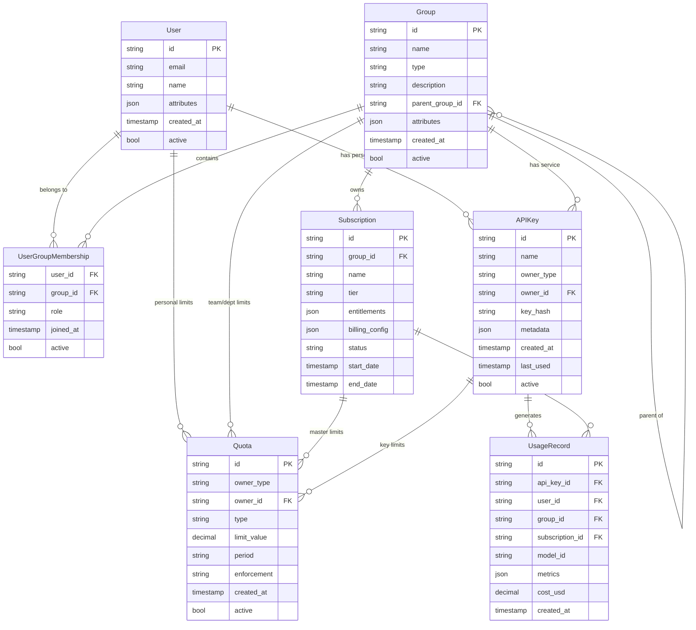
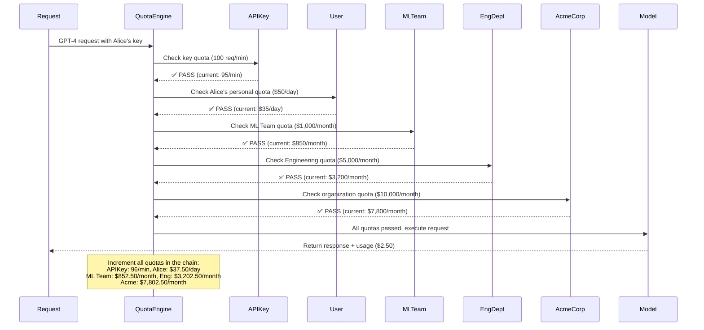
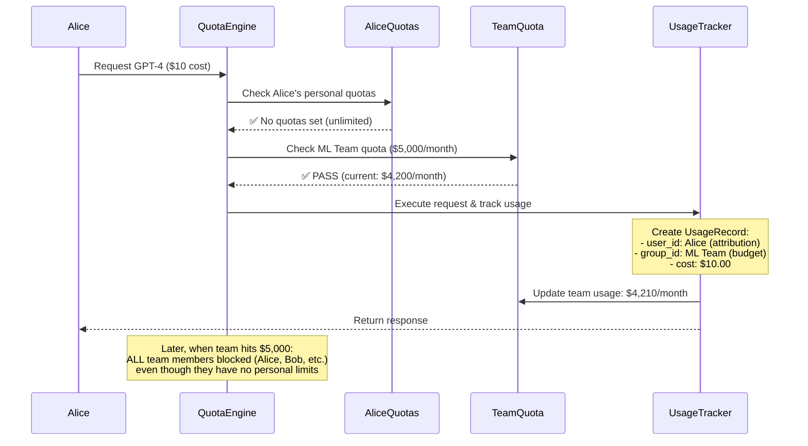
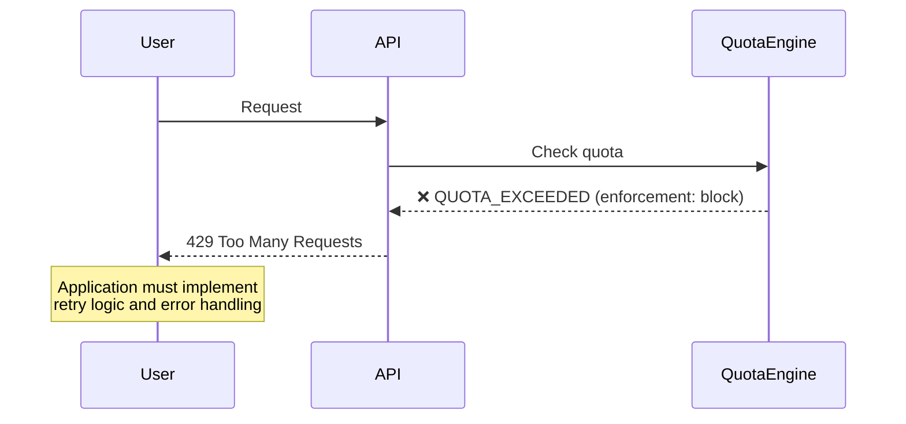
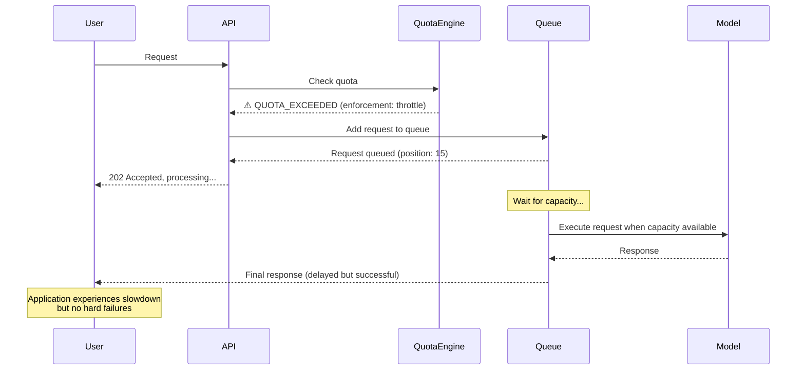

# MaaS Entity Architecture - Hierarchical Model
## Flexible Identity and Commercial Separation

**Author:** Noy Itzikowitz - with some help from Claude Code :)  
**Status:** Draft  
**Created:** 2024-10-27  
**Updated:** 2024-11-10  

---

## Overview

This document defines a new, more robust hierarchical entity model for the MaaS platform. The goal is to establish a flexible, industry-standard data model that enables:

- **Flexible Identity Hierarchy**: Support multi-level organizational structures (Organization → Department → Team) using recursive Group entities
- **Clear Separation of Concerns**: 
  - **Identity Layer**: Who the user/group is (User, Group)
  - **Commercial Layer**: What they bought (Subscription)
  - **Access Layer**: Authentication and limits (APIKey, Quota)
- **First-Class Entities**: Structured objects instead of JSON blobs for keys and quotas
- **Recursive Quota Enforcement**: Hierarchical limit checking with pooled budgets
- **Advanced Enforcement**: Support for both blocking and throttling behaviors

## Problem Statement

**Current Issues:**
- Flat user/group structure cannot represent complex organizations
- Quotas and limits are buried in JSON blobs, making them hard to manage
- No clear hierarchy for budget allocation and enforcement
- Limited enforcement options (only blocking, no throttling)
- Tight coupling between identity, commercial, and access concerns

**Goals:**
- Define 5 core entities with clear separation of concerns
- **Hierarchical Identity**: Recursive Group structure supporting any organizational depth
- **First-Class Quotas**: Structured quota entities with flexible enforcement options
- **Layered Enforcement**: Quota checks that walk up the organizational hierarchy
- **Pooled Budgets**: Team/department quotas without individual user limits
- **Advanced Controls**: Support for throttling (queuing) in addition to blocking

---

## Core Design Principles

### 1. Flexible Identity Hierarchy
The system uses recursive Group entities to model any organizational structure:
- **Root Organization**: Top-level Group (no parent)
- **Departments**: Groups with the organization as parent
- **Teams**: Groups with departments as parent  
- **Users**: Individuals who belong to one or more Groups

### 2. Separation of Identity from Commercials
Clear boundaries between different concerns:

| Layer | Purpose | Entities |
|-------|---------|----------|
| **Identity** | Who the user/group is | User, Group |
| **Commercial** | What they bought | Subscription |
| **Access** | Authentication and limits | APIKey, Quota |

### 3. First-Class Quotas and Keys
- **APIKey**: Structured entity (not just a string) with metadata and relationships
- **Quota**: Dedicated entity (not JSON blob) with type, limit, period, and enforcement options

---

## Core Entities

We define 5 core entities with clear separation of concerns:

### Entity Relationships



## Entity Definitions

### 1. User (The Human)
**Role**: The individual human identity that uses the platform.

**Core Fields:**
- `id`: Unique identifier (UUID)
- `email`: Primary email address
- `name`: Display name
- `attributes`: Custom user properties (JSON)
- `active`: Account status

**Key Capabilities:**
- **Group Membership**: Can belong to one or more Groups
- **Derived Department**: User's department is derived from Group membership (no static department field)
- **Personal API Keys**: Can have personal authentication keys
- **Personal Quotas**: Can have individual spending caps or limits
- **Usage Attribution**: All usage is attributed back to the User

**Example:**
```json
{
  "id": "usr-alice-12345",
  "email": "alice@acme.com",
  "name": "Alice Johnson",
  "attributes": {
    "employee_id": "EMP001",
    "hire_date": "2023-01-15",
    "manager": "ml-manager@acme.com"
  },
  "active": true,
  "created_at": "2024-01-15T10:00:00Z"
}
```

**Department Derivation**: Alice's department is determined by finding the Group of `type: "department"` in her membership hierarchy. If Alice belongs to "ML Team" → "Engineering Department" → "Acme Corp", then her department is "Engineering Department". This approach makes organizational changes seamless - move Alice to a new team, and her department updates automatically.

**Relationships:**
- **Belongs to**: Multiple Groups (via UserGroupMembership)
- **Owns**: Personal APIKeys and personal Quotas
- **Generates**: All UsageRecords are attributed to a User

### 2. Group (The Core Identity Container)
**Role**: The primary container for identity and resource allocation. Represents any level of an organization hierarchy through recursive nesting.

**Core Fields:**
- `id`: Unique identifier (UUID)
- `name`: Group display name
- `type`: Group type (organization, department, team, project)
- `description`: Purpose description
- `parent_group_id`: Parent group for hierarchy (NULL for root organization)
- `attributes`: Custom group properties (JSON)
- `active`: Group status

**Key Capabilities:**
- **Recursive Nesting**: Groups can contain other Groups, enabling unlimited hierarchy depth
- **Multi-Level Support**: Can represent Organization → Department → Team → Project
- **Resource Ownership**: Can own Subscriptions and be assigned Quotas
- **Service Accounts**: Can have group-level APIKeys for automated systems

**Example Hierarchy:**
```json
[
  {
    "id": "grp-acme-corp",
    "name": "Acme Corporation",
    "type": "organization", 
    "description": "Root organization",
    "parent_group_id": null,
    "attributes": {
      "industry": "technology",
      "founded": "2010"
    },
    "active": true
  },
  {
    "id": "grp-eng-dept",
    "name": "Engineering Department", 
    "type": "department",
    "description": "All engineering teams",
    "parent_group_id": "grp-acme-corp",
    "attributes": {
      "cost_center": "ENG-001",
      "vp": "engineering-vp@acme.com"
    },
    "active": true
  },
  {
    "id": "grp-ml-team",
    "name": "ML Engineering Team",
    "type": "team",
    "description": "Machine learning engineers and data scientists", 
    "parent_group_id": "grp-eng-dept",
    "attributes": {
      "cost_center": "ENG-ML",
      "manager": "ml-manager@acme.com"
    },
    "active": true
  }
]
```

**Relationships:**
- **Contains**: Multiple Users (via UserGroupMembership)
- **Contains**: Multiple child Groups (via parent_group_id)
- **Owns**: Subscriptions (commercial agreements)
- **Assigned**: Quotas (budget allocations)

### 3. Subscription (The Commercial Agreement)
**Role**: Defines what the customer bought. Separate from identity to allow a single tenant to have multiple commercial agreements.

**Core Fields:**
- `id`: Unique identifier (UUID)
- `group_id`: Owner Group (typically the Root Organization)
- `name`: Subscription name
- `tier`: Service level (free, pro, enterprise)
- `entitlements`: What features/models are included (JSON)
- `billing_config`: Billing settings (JSON)
- `status`: Current status (active, suspended, expired)
- `start_date`: Subscription start
- `end_date`: Subscription end (optional)

**Key Capabilities:**
- **Feature Entitlements**: Defines which models/features are available
- **Master Quota Pool**: Total quota available for this commercial plan
- **Multiple Per Tenant**: A Group can have multiple subscriptions (e.g., "Prod", "Dev")
- **Billing Separation**: Each subscription has its own billing configuration

**Example:**
```json
{
  "id": "sub-acme-enterprise",
  "group_id": "grp-acme-corp",
  "name": "Enterprise Production Subscription",
  "tier": "enterprise",
  "entitlements": {
    "feature_throttling": true,
    "priority_support": true,
    "model_access": ["gpt-4", "claude-3", "llama-70b"],
    "max_concurrent_requests": 500
  },
  "billing_config": {
    "rate_per_token": 0.00008,
    "minimum_monthly_usd": 1000,
    "overage_rate": 1.2,
    "currency": "USD",
    "renewal_period": "monthly"
  },
  "status": "active",
  "start_date": "2024-01-01T00:00:00Z",
  "end_date": "2024-12-31T23:59:59Z"
}
```

**Master Quota**: Subscriptions typically have a master Quota object that defines the total pool:
```json
{
  "id": "quota-sub-master",
  "owner_type": "subscription",
  "owner_id": "sub-acme-enterprise",
  "type": "cost",
  "limit_value": 10000.00,
  "period": "monthly",
  "enforcement": "block"
}
```

**Relationships:**
- **Owned by**: A Group (typically root organization)
- **Has**: Master Quota objects defining the total limits
- **Tracks**: All UsageRecords for billing

### 4. APIKey (The Authentication Token)
**Role**: First-class entity for authentication and usage attribution. No longer just a string, but a structured object with metadata and relationships.

**Core Fields:**
- `id`: Unique identifier (UUID)
- `name`: Human-readable name
- `owner_type`: Type of owner (user, group)
- `owner_id`: Owner identifier (User ID or Group ID)
- `key_hash`: Hashed version of the actual key
- `metadata`: Additional properties (JSON)
- `created_at`: Creation timestamp
- `last_used`: Last usage timestamp
- `active`: Key status

**Key Capabilities:**
- **Primary Authentication**: Every request is tied to an APIKey
- **Usage Attribution**: All usage is tracked back to the specific key
- **Personal or Service**: Can belong to a User (personal) or Group (service account)
- **Granular Quotas**: Can have its own rate limits and quotas attached

**Examples:**
```json
[
  {
    "id": "key-alice-personal",
    "name": "Alice's Personal Key",
    "owner_type": "user",
    "owner_id": "usr-alice-12345",
    "key_hash": "sha256:abc123...",
    "metadata": {
      "purpose": "personal-development",
      "client_app": "cli-tool"
    },
    "created_at": "2024-01-15T10:00:00Z",
    "last_used": "2024-01-20T14:30:00Z",
    "active": true
  },
  {
    "id": "key-ml-service",
    "name": "ML Team Service Account",
    "owner_type": "group", 
    "owner_id": "grp-ml-team",
    "key_hash": "sha256:def456...",
    "metadata": {
      "purpose": "production-service",
      "service_name": "recommendation-engine"
    },
    "created_at": "2024-01-10T10:00:00Z",
    "last_used": "2024-01-20T14:29:45Z", 
    "active": true
  }
]
```

**Relationships:**
- **Owned by**: Either a User (personal key) or Group (service account)
- **Can have**: Associated Quota objects for rate limiting
- **Generates**: All UsageRecords are tied to an APIKey

### 5. Quota (The Limit Rule)
**Role**: Structured entity defining a single limit. No more JSON blobs - quotas are now first-class, queryable objects.

**Core Fields:**
- `id`: Unique identifier (UUID)
- `owner_type`: What owns this quota (user, group, subscription, api_key)
- `owner_id`: Owner identifier
- `type`: Quota type (cost, tokens, requests)
- `limit_value`: The actual limit (decimal for flexibility)
- `period`: Time period (monthly, daily, hourly, per_minute)
- `enforcement`: How to handle violations (block, throttle, alert)
- `created_at`: Creation timestamp
- `active`: Quota status

**Key Capabilities:**
- **Flexible Attachment**: Can be attached to any entity (User, Group, Subscription, APIKey)
- **Multiple Types**: Support for cost, token, request, and custom quota types
- **Advanced Enforcement**: Beyond simple blocking - supports throttling and alerting
- **Hierarchical Checking**: System walks up the hierarchy checking quotas at each level

**Examples:**
```json
[
  {
    "id": "quota-alice-daily-cap",
    "owner_type": "user",
    "owner_id": "usr-alice-12345", 
    "type": "cost",
    "limit_value": 50.00,
    "period": "daily",
    "enforcement": "block",
    "active": true
  },
  {
    "id": "quota-ml-team-monthly",
    "owner_type": "group",
    "owner_id": "grp-ml-team",
    "type": "cost", 
    "limit_value": 5000.00,
    "period": "monthly",
    "enforcement": "throttle",
    "active": true
  },
  {
    "id": "quota-service-key-rate",
    "owner_type": "api_key",
    "owner_id": "key-ml-service",
    "type": "requests",
    "limit_value": 100,
    "period": "per_minute", 
    "enforcement": "block",
    "active": true
  }
]
```

**Enforcement Types:**
- **block**: Standard rate limiting - reject request with 429 error
- **throttle**: Queue request and process when capacity available (premium feature)
- **alert**: Allow request but send notification (monitoring only)

**Relationships:**
- **Owned by**: User, Group, Subscription, or APIKey
- **Enforced on**: All requests during hierarchical quota checking

### 6. UsageRecord (The Audit Trail)
**Role**: Captures individual usage events for billing, attribution, and audit. Critical for connecting usage to budget impact.

**Core Fields:**
- `id`: Unique identifier (UUID)
- `api_key_id`: APIKey that made the request (FK)
- `user_id`: User who owns the APIKey (FK) 
- `group_id`: Group context at time of request (FK)
- `subscription_id`: Subscription used for billing (FK)
- `model_id`: Model that was used
- `metrics`: Usage details (tokens, duration, etc.) (JSON)
- `cost_usd`: Calculated cost in USD
- `created_at`: Request timestamp

**Denormalization Note**: The `user_id`, `group_id`, and `subscription_id` fields are denormalized and stored at the time of the request to simplify and accelerate usage reporting and attribution. This prevents the need for complex JOINs on every reporting query and captures the organizational context at the time of usage (important if users change groups later).

**Example:**
```json
{
  "id": "usage-abc123",
  "api_key_id": "key-alice-personal",
  "user_id": "usr-alice-12345",
  "group_id": "grp-ml-team", 
  "subscription_id": "sub-acme-enterprise",
  "model_id": "gpt-4",
  "metrics": {
    "input_tokens": 150,
    "output_tokens": 300,
    "processing_time_ms": 2500
  },
  "cost_usd": 2.50,
  "created_at": "2024-01-20T14:30:00Z"
}
```

**Relationships:**
- **Generated by**: APIKey (primary relationship)
- **Attributed to**: User (for accountability)
- **Charged to**: Subscription (for billing)
- **Grouped under**: Group (for budget tracking)

---

## Key Scenarios

This section explains how the hierarchical model supports the most important use cases in practice.

### Scenario A: The Recursive Layered Quota Check

When a request comes in with an APIKey, the system performs hierarchical quota checking by walking up the Group tree. This ensures budgets are enforced at every organizational level.

**Setup:**
- **Organization**: Acme Corp ($10,000/month master limit)
- **Department**: Engineering Dept ($5,000/month allocation)  
- **Team**: ML Team ($1,000/month budget)
- **User**: Alice (personal $50/day cap)
- **APIKey**: Alice's personal key (100 requests/minute rate limit)

**Hierarchical Check Flow:**


**Critical Behavior**: If ANY quota in this chain fails, the entire request is blocked. This ensures that budget constraints are enforced at every organizational level.

### Scenario B: The "Pooled Quota" (Most Important Use Case)

This scenario supports users who should NOT be individually limited but should contribute to their team's shared budget pool.

**Setup:**
- **Alice** (ML Engineer): No personal quotas set
- **Bob** (ML Engineer): No personal quotas set  
- **ML Team**: $5,000/month shared budget
- **Use Case**: Team members share a pool without individual limits

**Configuration:**
```json
{
  "users": [
    {
      "id": "usr-alice", 
      "name": "Alice",
      "quotas": []
    },
    {
      "id": "usr-bob",
      "name": "Bob", 
      "quotas": []
    }
  ],
  "groups": [
    {
      "id": "grp-ml-team",
      "name": "ML Team",
      "quotas": [
        {
          "type": "cost",
          "limit_value": 5000.00,
          "period": "monthly",
          "enforcement": "block"
        }
      ]
    }
  ]
}
```

**Request Flow:**


**Key Benefits:**
1. **Individual Freedom**: Alice and Bob have no personal limits
2. **Team Accountability**: Their usage counts toward shared team budget
3. **Clear Attribution**: Each request is still attributed to the individual user
4. **Automatic Enforcement**: When team budget exhausted, all members are blocked

### Scenario C: Throttling vs. Blocking

Advanced enforcement options provide different behaviors when quotas are exceeded.

**Setup: Different Enforcement Types**
```json
{
  "quotas": [
    {
      "id": "quota-basic-user",
      "owner_type": "user", 
      "owner_id": "usr-basic",
      "type": "requests",
      "limit_value": 10,
      "period": "per_minute",
      "enforcement": "block"
    },
    {
      "id": "quota-premium-team",
      "owner_type": "group",
      "owner_id": "grp-premium", 
      "type": "requests",
      "limit_value": 100,
      "period": "per_minute", 
      "enforcement": "throttle"
    }
  ]
}
```

**Behavior Comparison:**

| Enforcement | When Quota Exceeded | User Experience |
|-------------|-------------------|-----------------|
| **block** | Immediate 429 error | Hard failure, application must handle retries |
| **throttle** | Request queued | Application slows down but doesn't fail |
| **alert** | Request allowed, notification sent | Normal operation, monitoring only |

**Blocking Flow (Standard):**


**Throttling Flow (Premium):**


**Use Cases:**
- **Government/Public Services**: Cannot afford hard failures, throttling ensures service degradation instead of outages
- **Production Systems**: Throttling prevents cascade failures while maintaining availability  
- **Development**: Blocking is acceptable for non-critical workloads

## Implementation Benefits

This new hierarchical model provides significant advantages over the previous flat structure:

### 1. Organizational Flexibility
- **Unlimited Hierarchy**: Support any organizational depth (Org → Division → Department → Team → Project)
- **Real-World Modeling**: Accurately represents how companies are actually structured
- **Easy Reorganization**: Moving teams between departments is just a parent_group_id change

### 2. Budget Management
- **Hierarchical Enforcement**: Budgets enforced at every level of the organization
- **Pooled Resources**: Teams can share budgets without individual user limits
- **Transparent Attribution**: Every dollar spent is attributed to both user and budget owner

### 3. Operational Excellence
- **First-Class Entities**: No more JSON blobs - quotas and keys are queryable objects
- **Advanced Enforcement**: Support for throttling in addition to blocking
- **Clear Separation**: Identity, commercial, and access concerns are cleanly separated

### 4. Enterprise Readiness
- **Multi-Subscription**: Organizations can have separate dev/prod/research subscriptions
- **Service Accounts**: Groups can have their own API keys for automated systems
- **Audit Trail**: Complete traceability from request to budget impact

---

## Sample Implementation

Here's how a complete organizational setup might look:

```json
{
  "groups": [
    {
      "id": "grp-acme",
      "name": "Acme Corporation",
      "type": "organization",
      "parent_group_id": null
    },
    {
      "id": "grp-engineering",
      "name": "Engineering",
      "type": "department", 
      "parent_group_id": "grp-acme"
    },
    {
      "id": "grp-ml-team",
      "name": "ML Team",
      "type": "team",
      "parent_group_id": "grp-engineering"
    }
  ],
  "subscriptions": [
    {
      "id": "sub-enterprise",
      "group_id": "grp-acme",
      "tier": "enterprise",
      "entitlements": {
        "model_access": ["gpt-4", "claude-3"],
        "feature_throttling": true
      }
    }
  ],
  "quotas": [
    {
      "owner_type": "subscription",
      "owner_id": "sub-enterprise", 
      "type": "cost",
      "limit_value": 20000.00,
      "period": "monthly"
    },
    {
      "owner_type": "group",
      "owner_id": "grp-engineering",
      "type": "cost", 
      "limit_value": 10000.00,
      "period": "monthly"
    },
    {
      "owner_type": "group",
      "owner_id": "grp-ml-team",
      "type": "cost",
      "limit_value": 3000.00,
      "period": "monthly", 
      "enforcement": "throttle"
    }
  ],
  "users": [
    {
      "id": "usr-alice",
      "email": "alice@acme.com",
      "memberships": [
        {
          "group_id": "grp-ml-team",
          "role": "engineer"
        }
      ]
    }
  ],
  "api_keys": [
    {
      "id": "key-alice-personal",
      "owner_type": "user",
      "owner_id": "usr-alice",
      "name": "Alice Personal Key"
    },
    {
      "id": "key-ml-service",
      "owner_type": "group", 
      "owner_id": "grp-ml-team",
      "name": "ML Team Service Account"
    }
  ]
}
```

**Quota Hierarchy**: `Subscription ($20K)` → `Engineering ($10K)` → `ML Team ($3K)` → `Alice (unlimited)`

**Request Flow**: Alice's $50 request checks quotas in order, updating all levels, and gets throttled (not blocked) if ML Team exceeds $3K.

---

## Next Steps

This document establishes the foundation for a flexible, enterprise-ready identity and billing system. The next phase should focus on:

### Immediate Implementation
1. **Database Schema**: Design tables and relationships for the 5 core entities
2. **API Endpoints**: Create REST APIs for entity management (CRUD operations)
3. **Quota Engine**: Implement hierarchical quota checking and enforcement
4. **Migration Strategy**: Plan transition from current flat structure

### Advanced Features  
1. **Policy Engine**: Add access control policies on top of the identity hierarchy
2. **Billing Integration**: Connect usage records to external billing systems
3. **Advanced Quotas**: Support for time-based quotas (burst allowances, rolling windows)
4. **Monitoring & Alerts**: Real-time quota monitoring and threshold notifications

### Enterprise Features
1. **External Identity**: Integration with SAML/OIDC providers
2. **Cost Allocation**: Chargeback and showback reporting by group/user
3. **Governance**: Approval workflows for quota changes and key creation
4. **Multi-Tenancy**: Support for multiple root organizations in a single deployment

The hierarchical model provides the flexibility to support all these future requirements while maintaining clean separation of concerns and transparent budget management.
